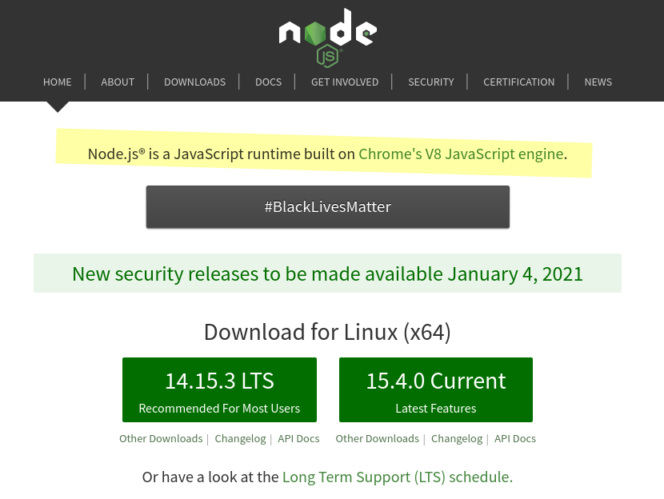
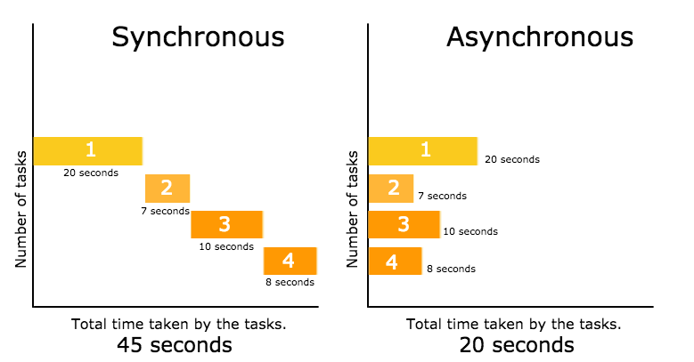
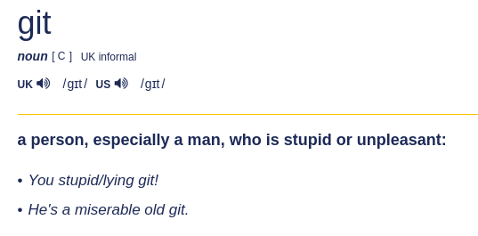
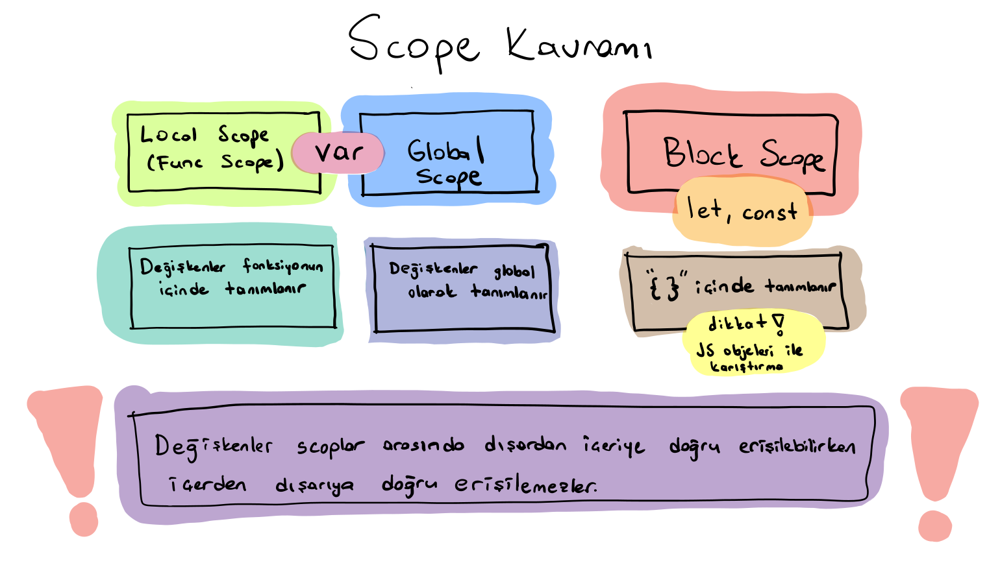
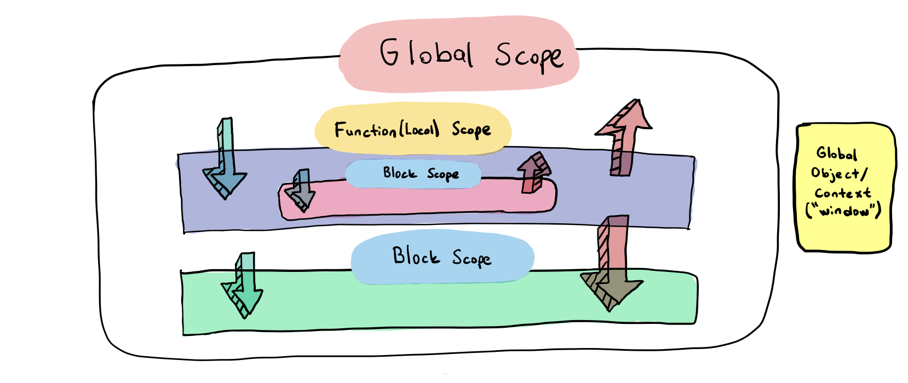
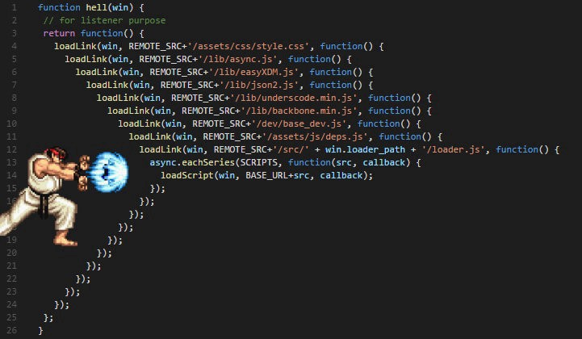

### `Kodluyoruz Earlybird Front-End Talent Bootcamp`

## `GÜN 1 - 2020.12.19`
> Tanışma ve derslerin başlangıçı

Bu bölümde;

- **[NodeJS nedir?](#nodejs-nedir)**
- [**Versiyon kontrol sistemi Nedir?**](#versiyon-kontrol-sistemi-nedir)
- [**Git Nedir**](#git-nedir)
- [**GIT != GITHUB**](#git-nasıl-kullanılır)
- [**JS Temelleri**](#js-temelleri)
  - [Hello world](#hello-world)
  - [Var, let, const](#var-let-const)
  - [Template-literals](#template-literals)
  - [Functions](#fonskiyonlar)
  - [Spread operator](#spread-operator)
  - [Desctructing](#object-destructuring)
  - [Callbacks](#callbacks)
  - [Fetch](#fetch) 

konularından bahsedeceğiz.

## NodeJS nedir?

**NodeJS, server-side, runtime environment** uygulamalar geliştirebileceğimiz, **Javascript** ile kod geliştirilmesine imkan sağlayan “Google Chrome’un v8 Javascript Engine” üzerinde çalışan bir platformdur. **2009** yılında [Ryan Dahl](https://tr.wikipedia.org/wiki/Ryan_Dahl) üzerinde çalışması ile hayat bulmuştur.

[**github.com/nodejs/node**](https://github.com/nodejs/node)

<p align="center">
    
    <br>
    <em>
        <a href="https://nodejs.org/en/">Node.js is a JavaScript runtime built on Chrome's V8 JavaScript engine.<a> 
    </em>
</p>

> **V8 Google tarafından geliştirilen, Chrome web browserlarının da üzerinde çalıştığı C, C++ ve javascript dilleri ile kodlanan bir enginedir. Tek amacı Javascript kodunu makine koduna çevirmektir.**

**Tek bir thread** ile bloklanmadan çalışabilme imkanı sunması, onun getirdiği en büyük avantajlardan bir tanesidir. Çünkü thread sayısı arttıkça thread'lerin kontolü de bir o kadar zorlaşır.

**Asenkron mimari**: JavaScript’in olay güdümlü (event-driven), asenkron yapısı ise bunu oldukça kolaylaştırıyor. Veritabanı, başka bir web servise erişim vb. konularda, buralardan cevap gelene kadar beklemek yerine yeni istekleri hazırlayabilirsiniz.


<p align="center">
    
    <br>
    <em>
        Görselin kaynağı<a href="https://adrianmejia.com/asynchronous-vs-synchronous-handling-concurrency-in-javascript/"> Adrian Mejia<a> 
    </em>
</p>


**Npm package manager** sayesinde, node ve npm yükledikten sonra verimli, stabil web servisi geliştirme ortamını bizlere sunmaktadır. Ne yapmak isterseniz isteyin istediğiniz şey büyük ihtimalle modül olarak bulunmaktadır. Npm üzerinden yapacağınız arama ile istediğiniz paketi bulabilir ve kolaylıkla kullanmaya başlayabilirsiniz.[**[0]**](https://webmaster.kitchen/node-js-nedir-ve-avantajlari-nelerdir/)

> **NodeJS için yakın** [**tarihi geçmişi**](https://nodejs.dev/learn/a-brief-history-of-nodejs#a-little-bit-of-history).

NodeJS hakkında daha çok detaya ulaşmak için;
  - [**nodejs.dev/learn**](https://nodejs.dev/learn)
  - [**developer.ibm.com/node-js**](https://developer.ibm.com/languages/node-js/gettingstarted/)


## Babel nedir?

Babel tarayıcıların anlayamadağı yeni gelen js özellikleri eskisine çevirerek -tabi bize belli etmeden- tarayıcının bu kodları anlamasını sağlar dönüştüren dönüştürücü. Babel gibi bir başkası daha mevcut o da [sucres](https://github.com/alangpierce/sucrase)


## Versiyon Kontrol Sistemi nedir?
Versiyon kontol sistemleri herhangi bir proje üzerine çalışırken size yaptığınız değişiklikler ve yenilikler arasında boğulmadan temiz bir şekilde çalışabilme imkanı sunar.

Version kontol sistemleri ile çalışmayı öğrendikten sonra bir proje üzerinde zamanda geri gidebilir projenizin falanca zamanki halini o günkü hali ile inceleyebilir ya da projenizin o anki halini bozmadan üzerine yeni denemeler yapabilir ve bu denemeniz istediğiniz gibi olursa ana projenize bu özelliği ekleyebilirsiniz.

Bu söylediklerimi en başta gördüğümüz insan beyninin direk oluşturduğu versiyon kontrol sistemi ile yapmaya kalkmak bir yerde mantıklı olsa da bu yöntemle devam etmek bir yerden sonra sizi sinir krizlerine sokabilir hatta ve hatta projenizi geliştireceğim derken çalışır halinden de olmanıza sebep olablir.[**[1]**](https://hasantezcan.dev/blog/versiyon-kontrol-sistemi-git.html#:~:text=Versiyon%20Kontrol%20Sistemi%20Nedir?)

## Git Nedir?

[**Git**](https://git-scm.com/) özgür ve dağıtık bir version kontrol sistemidir. GIT, linux’ü geliştiren ekibin o zamanlar kullandıkları [**BitKeeper**](https://www.bitkeeper.org/) adlı proje yönetim araçının ücretsiz lisans anlaşmasının bitmesi ile Linus Toravalds ve ekibinin BitKeeper’ı kullanırken yaşadıkları sıkıntıları da göz ederek tasarladıkları 2005 yılında ortaya çıkan bir versiyon kontrol sistemidir.

Git ismi, Linus Torvalds tarfından Git’in ilk versiyonunun yayımlanması ile verilmişitir. Aslında Git kelimesi İngiliz ingilicesinde **“aptal”** anlamına gelen argo bir kelime. [**[2]**](https://hasantezcan.dev/blog/versiyon-kontrol-sistemi-git.html#:~:text=Git%20Nedir?)

<p align="center">
    
    <br>
    <em>
        <a href="cambridge.org/dictionary/english/git"> dictionary of cambridge<a> <b>git</b> meaning
    </em>
</p>


Ayrıca [Linus Torvalds](https://tr.wikipedia.org/wiki/Linus_Torvalds) “**GIT**” isminin açılımını şu şekilde ifade ediyor;

- Düzgün çalışıp iş gördüğünde ve sizi mutlu ettiğinde **Global Information Tracker** (Küresel bilgi takip sistemi)
- İstediğiniz gibi çalışmazsa ve sizi çıldırtırsa da **“Goddamn Idiotic Truckload of shit”**

## Git nasıl kullanılır?

Bu konuyu geçtiğimiz sene topluluk için yaptığım bir sunumda kaynak olsun diye yazıya geçirmiştim. Sizi direkt oraya yönlendiriyorum... [**hasantezcan.dev/versiyon-kontrol-sistemi-git**](https://hasantezcan.dev/blog/versiyon-kontrol-sistemi-git.html#:~:text=Git%20Nas%C4%B1l%20kullan%C4%B1l%C4%B1r?)

> **GIT != GITHUB**

Ayrıca github nasıl kullanılır kısmında ise github'ın hazırlamış olduğu [bu dokümana](https://guides.github.com/activities/hello-world/) göz atabilirsiniz. 

---

# JS Temelleri
Bu başlık altında en yaygın ve temel JS kavramlarını kısa kısa üzerinden geçerek bilgi edineceğiz.

## Hello world
Aldığım ilk algortima dersinde `"hello world!"` için yazılımcının Bismillah'ı demişti Mustafa Tosun hocam. Buradan ona selamlar olsun. Hadi başlayalım.

```js
console.log('Hello Node!');
```

## Var, let, const

Es6 ile birlikte değişkenlerimize hayat veren iki yeni tanımlayıcı ile tanıştık. **let** ve **const** 

"Ne gerek vardı kardeşim bunlara" derseniz; en amiyane tabirle bazı scope karışıklıkları ve tekrar tanımlanabilme ya da tanımlanmama gibi durumlara çare olması amacı ile eklendi diyebiliriz.

## Variable Declaration vs Initialization 
> **Yeniden Tanımlama ve Güncellenebilirlik**

### `var`

ES6 öncesi kullanılan tek tanımlama ifadesidir.
> Arkdaşlar bu arada geçtiğimiz haziranda -2020 Haziran- [**ES11**](https://en.wikipedia.org/wiki/ECMAScript#ES2020) duyurldu. Bunu kısa bir bilgi olarak geçmek istedim. 

Var ile tanımladığımız değişkenleri **tekrar tanımlayabiliriz.**

```js
var name = 'hasan';
console.log(name);

var name = 'alper';
console.log(name); 

// ekran çıktısı: 
hasan
alper
```

Şimdi de **let** ve **const** için bu bu değişken tanımlama durumlarına gözatalım.

### `let`

let ile değişken tanımlarken değişkene birden fazla defa değer atayabiliyoruz fakat birden fazla defa tanımlayamıyoruz.

```js
let surname = "Tezcan";
console.log(surname);

let surname = "Çün";
console.log(surname);

//ERROR - Uncaught SyntaxError: Identifier 'surname' has already been declared
```
ama yeniden tanımlama yapmadan değer değişikliği yapabiliriz.

```js
let surname = "Tezcan";
console.log(surname);

surname = "Çün";
console.log(surname);

// ekran çıktısı: 
Tezcan
Çün
```

### `const`
> **constant**

Const kavramı değişmez değişkenler olarak tanımlanabilir. Bu değişkenler tekrardan atanamazlar ve veri tipi değiştirilemez. 

Dipnot olarak, const tipinde değişkenler hala enumerable özelliğini taşımaktadır. Enumerable kavramı içeriğinin değiştirilebileceğini bize gösterir.

```js
const renk = "kırmızı"
renk = "mavi"

// "Uncaught TypeError: Assignment to constant variable."
```

Böyle bir kullanımda JS bize değişmez değişken hatası verecektir.

Fakat bir obje yapısının veya dizi yapısının içeriğini güncelleyebilirsiniz, yeni bir içerik ekleyebilirsiniz, çıkartabilirsiniz.


```js
const pokemons = ['bulbasaur', 'charmander', 'squirtle'];
pokemons.push('pikachu');

console.log(pokemons);

// [ 'bulbasaur', 'charmander', 'squirtle', 'pikachu' ]
```

gördüğünüzü gibi pikachu'yu const ile tanımlanmış pokemons dizisine ekleyebildik.

```js
const pokemons = ['bulbasaur', 'charmander', 'squirtle'];
pokemons = ['tavuk'];

console.log(pokemons);

// TypeError: Assignment to constant variable.
```
Tekrar tanımlamaya kaltığımızda demin de olduğu gibi JS bize değişmez değişken hatası verecektir.

## Scope
> **Kapsam Alanı**

### `var`

**Global Scope:** var ile fonksiyon dışında tanımlanan değişkenler **global scope** olarak isimlendirilir.

Global scope'lara bu dosya içindeki her yerden erişilebilir.

```js
var test='Merhaba Dünya!'; //global scope

var fonksiyon = () => {
    console.log(test); 
}

fonksiyon();

// Çıktı: Merhaba Dünya
```
**Local Scope:** Var ile bir değişkeni fonksiyon içerisinde tanımladığımız zaman da bunu local scope deriz.

Local scope'da tanımlı değişkenler fonksiyon dışından erişilemezler.

> **That from outer to inner works! but the other direction does not work!**

> Fonskiyon içi tanımlanmış değşkenleri fonksiyon dışına çağıramayız. Fakat global scope'ları local scope'lar içine çağırabiliriz.

```js
var fonksiyon=() => {
    var test='Merhaba Dünya!'; //local scope
}

fonksiyon();

console.log(test)

// Çıktı: Uncaught ReferenceError: aos is not defined
```
---

Block scope oluşturmak için `let` ve `const` tanımlayıcılarını kullanmamız gerekiyor. Aksi taktirde kendi **`block scope`**'larını yaratamayız.

let ve const için **block scope** geçerlidir. Süslü parantezler içinde tanımlandıklarında kendi block'ları içinde değerlendirilirler. 

### `let`

Farklı block'lar içinde yeniden tanımalanabilirken aynı block'lar içinde tekrar tanımlanamazlar.

```js
if(true) {
  let test="SCOPE A";
  console.log(test);
}

if(true) {
  let test="SCOPE B";
  console.log(test);
}

/*
    SCOPE A
    SCOPE B

    Farklı block'lar içerisinde tekrar tanımlanmışlar. 
    DECLARTION
*/
```

Aynı blok içerisinde tekrar tanımlanamaz, yalnızca güncellenebilir;

```js
if(true) {
  let test="SCOPE A";
  test="reAssigment";
  console.log(test);
}
/*
    reAssigment
    aynı block scope içinde let tanımladığımız test değişkenine tekrar değer atadık.
*/
```
### `const`

block scope içersinde bir kez tanımlanır hakkını doldurur.

```js
if (true) {
  // var myAge = 22 // global scope
  let myAge = 22 // block scope

  console.log(myAge)
}

{ // this is a block
  const myName = 'Hasan' // block scope
  console.log(myName)
}

// console.log(myAge)
// console.log(myName)

/*
    22
    Hasan
*/ 
```
Çıktısını verir ama sondaki log'ları yorum satırından kaldırırsak bize bu hatayı döner   
`"ReferenceError: myAge is not defined"`  
Bunun sebebi scopların dışardan içeriye erişilebilirken içeriden dışarıya erişilemez olmasıdır.


### **`let ve const`** **global scope**'muş gibi de davranabilir. **Nasıl mı?**

Yeni açtığınız bir js dosyasını düşünün bu sayfanın başında ve sonunda birer süslü parantez vardır.Sayfanın let ve const için bir block scope'u dur. Sayfanın en üstünde olduğundan bunu global scope gibi de kabul edebiliriz.

```js
const myName = 'Hasan' // block scope, similar to global scope

if(true){
    var myAge=22 // global scope
}

{ // this is a block
    const myName = 'Abbas' //block scope
    console.log(myName)
}

console.log(myAge)
console.log(myName)
}

/*
    Abbas
    22
    Hasan
*/
```

Block scope'lar ile çalışmak bizi kısıtladığından bu bizi daha temiz kod yazma yönünde yönlendirecektir. 

<p align="center">
    
    <br>
    <em>
        Scope Kavramı 
    </em>
</p>


<p align="center">
    
    <br>
    <em>
        Scope şeması 
    </em>
</p>

---

## Template Literals

Template Literal ES6 ile birlikte duyurulan string üretmek için yeni bir yöntemdir. Bununla birlikte, programlarımızdaki dinamik dizeler üzerinde daha fazla kontrol sahibi olmamızı sağlar.

backtick'lerin arasına bu şekilde yapılarla değişken çağırabiliyoruz.`${expression}` 

```js
let price = 19.99;
let tax = 1.13;

let total = `The total prices is ${price * tax}`;
```
eskiden olsa bunu yazmak için 

```js
let price = 19.99;
let tax = 1.13;

let total = "The total prices is " + price * tax;
```
daha fazla bilgi [**için**](https://css-tricks.com/template-literals/) 

---
## Fonskiyonlar

JavaScript'teki neredeyse her şey fonskiyonlarda gerçekleşir. Şimdi hızlı bir şekilde fonskiyonları nasıl tanımladığımıza bakalım.

### function declaration 
> **ES6 öncesi fonskiyonları bu şekilde tanımlardık.** Şimdilerde bu tanımlamaya normal fonskiyon tanımlaması diyoruz.

```js
function dosomething(foo) {
  // do something
}
```

### function expression
> **Fonksiyonlar değişkenler ile tanımlanabilirler. Bu tür fonskiyonlara "function expression" deriz.**

```js
const dosomething = function(foo) {
  // do something
}
```

### arrow function
Arrow function,  fonksiyon yazarken daha kısa bir söz dizimi kullanmamızı sağlar. Sadece bir gösterim performans olarak bir artısı yok. [devamı için](https://medium.com/@abdurrahmanarslanta/arrow-function-nedir-f4ef50cda66c)

```js
const dosomething = foo => {
  //do something
}
```

*arrow function'da parametreler*

```js
const dosomething = () => {
  //do something
}

const dosomethingElse = foo => {
  //do something
}

const dosomethingElseAgain = (foo, bar) => {
  //do something
}
```
ES6 ile birlikte fonskiyonlara bu şekilde varsayılan parametre verebilirsiniz.

```js
const dosomething = (foo = 1, bar = 'hey') => {
  //do something
}
```

...  
...  
...  
henüz tamamlanmadı...  
...  
...  
...  

## Spread operator

Spread türkçe karşılık olarak yaymak, yayılmış demek. Bu operatörde tam anlamıyla bunu yapıyor aslında.

Spread operatörü ile iterable nesneleri tek tek öğelerine bölebiliyoruz. iterable nesneden kastım ise Array Map Set DOM NodeList vb.

> **Array Kopyalama örneği**

```js
let fruits = ['elma', 'armut'];
let fruits_copy = [...fruits];

console.log(fruits_copy); // Çıktı -> ["elma", "armut"]

fruits.push('çilek');

console.log(fruits_copy); // Çıktı -> ["elma", "armut"]
```

> **Obje Kopyalama**

Yukarıdaki işlemin aynısını objeler içinde yapabiliriz. Örneğin;

```js
const user = {
    name: "Hasan",
    surname: "Tezcan"
}

const userCopy = {...user}

console.log(userCopy)
user.age = 22;
console.log(userCopy)
```

> **Dizileri Birleştirmek**

İki ve ya daha fazla diziyi birleştirmek, dizinin başına ya da sonuna yeni değer ekleyerek bir dizi oluşturmak içinde bu operatör kullanılır. Örneğin;

```js
const maleNames = ["Alper", "Hasan"]
const femaleNames = ["Çiğdem", "Rümeysa"]

const names = [...maleNames, ...femaleNames]

console.log(names) // Çıktı -> ["Alper", "Hasan", "Çiğdem", "Rümeysa"]
console.log(['başında', ...names, 'sonunda'])
```

---

## Object destructuring

```js
const user = {
    id: 42,
    is_verified: true
};

const {id, is_verified} = user;

console.log(id); // 42
console.log(is_verified); // true
```

...  
...  
...  
henüz tamamlanmadı...  
...  
...  
...  

---

## Callbacks

JavaScript varsayılan olarak synchronous çalışan tek çekirdekli bir dildir. Bu da yeni bir thread oluşturup paralelde işlem yapamayacağı anlamına gelir. **Peki Asynchronous kod nedir ve nasıl çalışır?**

Asynchronous işlem yapmak çok dakik olmak gerek tek başınıza bir yığın işin üstesinden herbirine doğru zamanı ayırıp parça parça halletmek demek.  
  
Callback'ler bir değeri bir fonksiyondan başka bir fonksiyona geçirmek için kullanılan basit fonksiyonlardır ve sadece event gerçekleştiğinde çalışırlar.

Bunu yapabiliriz çünkü JavaScript, değişkenlere atanabilen ve diğer işlevlere aktarılabilen birinci sınıf işlevlere sahiptir (higher-order functions denir)

```js
function uyan(callback) {
	console.log('Uyan');

	setTimeout(() => {
		callback();
	}, 2000);
}

function yuzunuYika() {
	console.log('Yüzünü yıka');
}

uyan(yuzunuYika);

```

**CallStack** setTimteout, setInterval gibi fonksiyonların içinde sonrasında sırası ile çalışması için atıldığı queue.


### Callback'lerdeki sorun
Callback'ler basit durumlar için harikadır.

Ancak her callback, koda bir iç içelik düzeyi ekler ve çok sayıda callback oluşmaya başladığında, kod çok hızlı bir şekilde karmaşıklaşmaya başlar:

```js
window.addEventListener('load', () => {
  document.getElementById('button').addEventListener('click', () => {
    setTimeout(() => {
      items.forEach(item => {
        //your code here
      })
    }, 2000)
  })
})
```

Burada sadece 4 seviyeli bir iç içelik söz konusu ,şimdiden cok karışık görünmüyor mu?

Biraz daha karmaşıklaştıktan sonra işin gideceği yer burası..

<p align="center">
    
    <br>
    <em>
        Callback Hell (cehennemi)
    </em>
</p>

> **Peki bu cendereden nasıl kurtulabiliriz?**

## Callback'e alternatifler
ES 6 ile birlikte JS bize callback'lere ihtiyaç duyulmadan asynchronous çalışan özellekler tanıttı.

Bunlar; 
  - Promises (ES2015)
  - Async/Await (ES2017)

---

## Fetch
Bir fetch denemesi yapalım. Axios'u kullanacağız. Bunu seçmemizin özel bir nedeni yok aşinalık gibi isimlendirebiliriz.

Fetch ile axios'un en bilinen belirgin farkları fetch'in JSON'u parse etmesi gerekmesi axios bunu otomatik şekilde hallettmekte. 

```js
// fetch
fetch('https://jsonplaceholder.typicode.com/todos/1')
  .then(response => response.json())
  .then(json => console.log(json))
```

fetch'de json parse etmemız gerkıyor

```js
//axios
axios.get('/user?ID=12345')
  .then(function (response) {
    // handle success
    console.log(response);
  })
  .catch(function (error) {
    // handle error
    console.log(error);
  })
  .then(function () {
    // always executed
  });
```
Örnek bir axios kullanımı..

```js
const axios = require("axios");
    axios
        .get("https://jsonplaceholder.typicode.com/users")
        .then((response) => response.data)
        .then((users) => [...users, { name: "Kenan" }])
        .then((data) => console.log(data))
        .catch((e) => console.log(e))
        .finally(() => console.log("Finally"));
```
<p align="center">
    
    <br>
    <em>
        İlk günden bi kare
    </em>
</p>

..   
..      
..    


## Kaynaklar :

- https://nodejs.dev/learn
- https://webmaster.kitchen/node-js-nedir-ve-avantajlari-nelerdir/
- https://hasantezcan.dev/blog/versiyon-kontrol-sistemi-git.html
- https://cagatay.me/ecmascript6-nedir-nas%C4%B1l-kullan%C4%B1l%C4%B1r-neden-kullanmal%C4%B1y%C4%B1z-3-a1d092b7d261
- https://ui.dev/var-let-const/
- https://ahmetonursolmaz.com.tr/javascript-var-let-ve-const-farki/
- https://css-tricks.com/template-literals/
- https://flaviocopes.com/javascript-functions/
- https://prototurk.com/makaleler/javascript-es6-spread-operatoru#array-kopyalama
- https://flaviocopes.com/javascript-object-destructuring/
- https://flaviocopes.com/javascript-callbacks/#callbacks