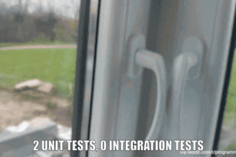
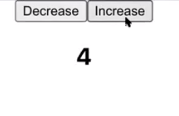
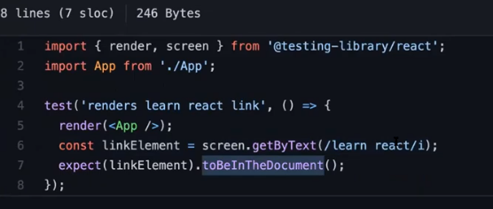
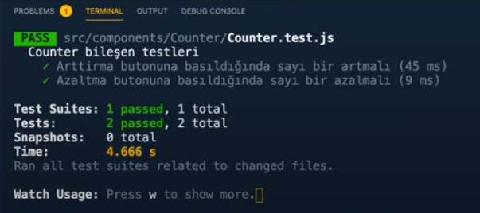
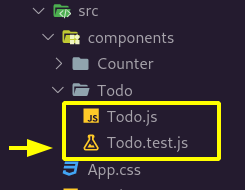
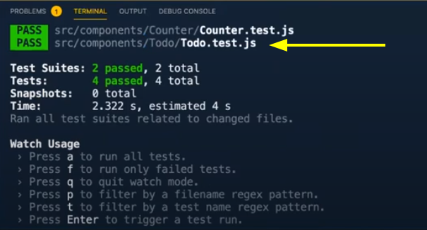

### `Kodluyoruz Earlybird Front-End Talent Bootcamp`

## `GÜN 6 - 2021.01.24`
> 

Bu bölümde;

- [React Testing Library](#react-testing-library)
	- [**🤔 Ne Yaptık Burada?**](#-ne-yaptık-burada)
	- [**Bir Başka Örnek Yapalım!**](#bir-başka-örnek-yapalım)
- [React Native](#react-native)

konularından bahsedeceğiz.

---


<p align="center">
    
    <br>
    <em></em>
</p>

**Integration Test:** Birimlerin birbiri arasındaki işleyişini test eden test türü. 

**Unit test**:   
- [Unit Test mi? Integration Test mi?](https://medium.com/devopsturkiye/unit-test-mi-integration-test-mi-34ddea054696) - Suat Köse - Jul 22, 2018  
...  
...  
...  

> [React Uygulamalarında TDD](https://oguzkilic.medium.com/react-uygulamalar%C4%B1nda-tdd-48f93335d8fb) - Oğuz Kılıç - Oct 31, 2017

# React Testing Library
> https://testing-library.com/

Basit bir counter yapalım ve sonrasında bunun için bir test yazalım.

```js
import { useState } from "react";

function Counter() {
	const [count, setCount] = useState(0);

	return (
		<div>
			<button onClick={() => setCount(count - 1)}>Decrease</button>
			<button onClick={() => setCount(count + 1)}>Increase</button>

			<h2>{count}</h2>
		</div>
	);
}

export default Counter;
```

<p align="center">
    
    <br>
    <em></em>
</p>

Şimdi ise bu componet'in testini aynı module css dosyasını oluştururken kullandığımız yaklaşım ile `Counter` dizini içinde oluşturalım. Böylece `Counter dizini` altında sadece onun ile ilgili olan `test, css vs.` dosyaları mevcut olacak.

<p align="center">
    
    <br>
    <em></em>
</p>

```js
import { render, screen } from "@testing-library/react";
import userEvent from "@testing-library/user-event";

import Counter from "./Counter";

describe("Counter bileşen testleri", () => {
	let increaseBtn, decreaseBtn, count;

	beforeEach(() => {
		render(<Counter />);
		increaseBtn = screen.getByText("Increase");
		decreaseBtn = screen.getByText("Decrease");
		count = screen.getByText("0");
	});

	it("Arttirma butonuna basıldığında sayı bir artmalı", () => {
		userEvent.click(increaseBtn);
		expect(count).toHaveTextContent("1");
	});

	it("Azaltma butonuna basıldığında sayı bir azalmalı", () => {
		userEvent.click(decreaseBtn);
		expect(count).toHaveTextContent("-1");
	});
});
```

## **🤔 Ne Yaptık Burada?**  
Öncelikle yazacağımız bu test Counter componet'i için olduğundan bunu bu şekilde **tarif ediyoruz (describe).** 

`BeforEach` burada test'e başlamadan önce yapılmasını istediğimiz şeylerin yapıldığı yer. Bu sebeple test edeceğimiz öğeleri burada deklare ediyoruz. `render(<Counter />)` tabi counter componetini render edelim ki içindeki öğelere ulaşabilelim. 

```js
render(<Counter />);
		increaseBtn = screen.getByText("Increase");
		decreaseBtn = screen.getByText("Decrease");
		count = screen.getByText("0");
```
> **`screen` sayfadaki öğelere ulaşabilmemize olanak tanıyor.**

İşte bu noktadan sonra işlevsel testlerimizi yazmaya başlayabiliriz. 

`Arttırma butonuna basıldığında sayı bir artmalı` testini yazarken `increaseBtn`'a basıldığında `count` öğesinin değeri `1` olmalıdır. Diyerek istediğimiz yani beklediğimiz sonucu belirtiyoruz bunu koda dokünce ortaya şöyle bir şey çıkıyor.

```js
it("Arttirma butonuna basıldığında sayı bir artmalı", () => {
		userEvent.click(increaseBtn);
		expect(count).toHaveTextContent("1");
	});
```

aynı durumu azaltma butonu içinde yapıyoruz.

- Her `it` ile başlayan tanım **bir test'i temsil etmekte** bu tanımları `it` yerine `test` ifadesi ile başlayarak da yapabilirsiniz.

<p align="center">
    
    <br>
    <em></em>
</p>

Burada olduğu *-TEST tanımlarken `it` yerine `test` kullanılmış-* gibi ayrıca sayfada varlığını kontrol etmek için `toBeInDocument()` methodundan faydalanabilirsiniz.


Yazdığımız testleri çalıştırmak için..

```bash
yarn test
```

<p align="center">
    
    <br>
    <em></em>
</p>

## **Bir Başka Örnek Yapalım!**

Şimdi de basit bir to-do uygulaması hazırlayalım ve onun testlerini yazalım.

```js
// Todo.js
import { useState } from "react";

function Todo() {
	const [title, setTitle] = useState("");
	const [todos, setTodos] = useState(["selam"]);

	return (
		<div>
			<label>
				Title
				<input value={title} onChange={(e) => setTitle(e.target.value)} />
			</label>
			<button onClick={() => setTodos([...todos, title])}>Ekle</button>

			{todos.map((item, key) => (
				<div key={key}>{item}</div>
			))}
		</div>
	);
}

export default Todo;
```

<p align="center">
    
    <br>
    <em>Basit to-do uygulamamız</em>
</p>

Şimdi gelin testini yazalım.   
> Bu örneğe [buradan](../pratice/day-10/1-testing) ulaşabilirsiniz. 
```js
// Todo.test.js
import { render, screen } from "@testing-library/react";
import userEvent from "@testing-library/user-event";

import Todo from "./Todo";

describe("Todo bileşen testleri", () => {
	let button, input;

	beforeEach(() => {
		render(<Todo />);
		button = screen.getByText("Ekle");
		input = screen.getByLabelText("Title");
	});

	it("Button ve input elemanları sayfaya yüklenmeli", () => {
		expect(button).toBeInTheDocument();
		expect(input).toBeInTheDocument();
	});

	it("Form gönderilince ilgili title listeye eklenmeli", () => {
		const title = "Test Title";
		userEvent.type(input, title);
		userEvent.click(button);

		expect(screen.getByText(title)).toBeInTheDocument();
	});
});
```

<p align="center">
    
    <br>
    <em>Testimizi componentimizin dizine ekledik.</em>
</p>

Bu test ile birlikte `button` ve `input` sayfada mı diye kontrol ediyoruz.

```js
it("Button ve input elemanları sayfaya yüklenmeli", () => {
		expect(button).toBeInTheDocument();
		expect(input).toBeInTheDocument();
	});
```
Sonrasında forma tıkladıktan sonra todo'muz eklendi mi diye bir test yapmak istersek;

```js
it("Form gönderilince ilgili title listeye eklenmeli", () => {
		const title = "Test Title";
		userEvent.type(input, title);
		userEvent.click(button);

		expect(screen.getByText(title)).toBeInTheDocument();
	});
```

Tanımladığımız `title` input'a ekleniyor ve click edildikten sonra o girdiyi ekranda görmek istediğimizi söylüyoruz.

<p align="center">
    
    <br>
    <em></em>
</p>

Evet.. Görüldüğü gibi test yazmak bu kadar basit. Gerisi sizin hayal gücünüze kalmış. İstediğiniz durumları [bu bağlantıdaki](https://testing-library.com/docs/example-react-router) methodları kullanarak test edebilirsiniz.

# React Native
> 1:46:40

<!-- ---

# Ek bilgi

- blabla

---
# Kaynakça 

1.  -->
