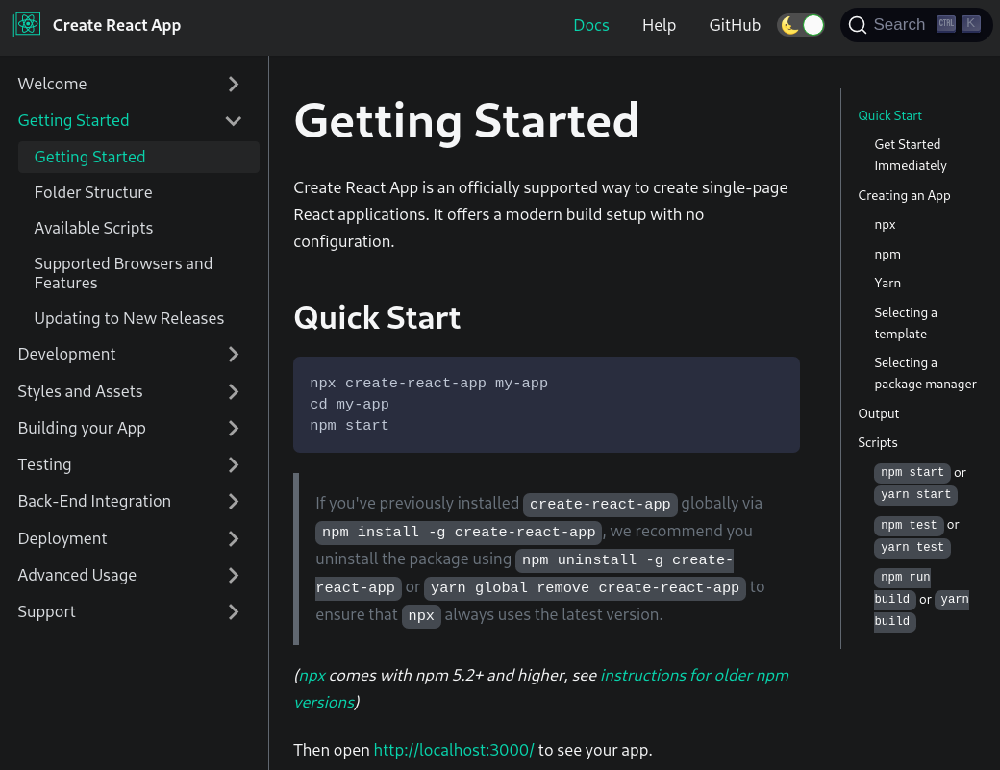
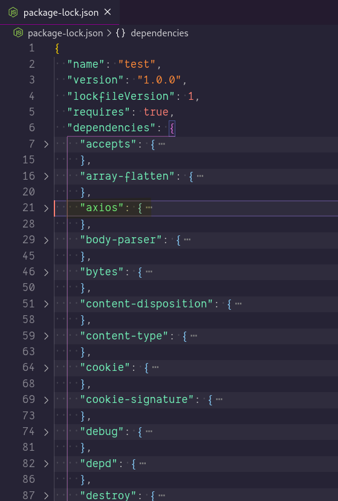
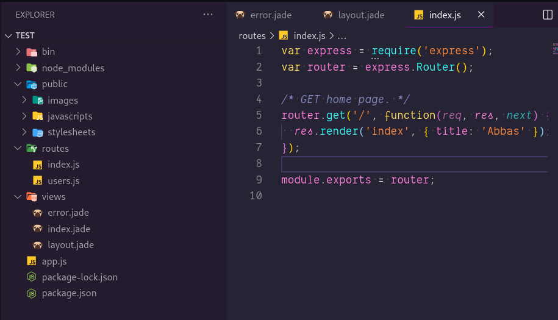
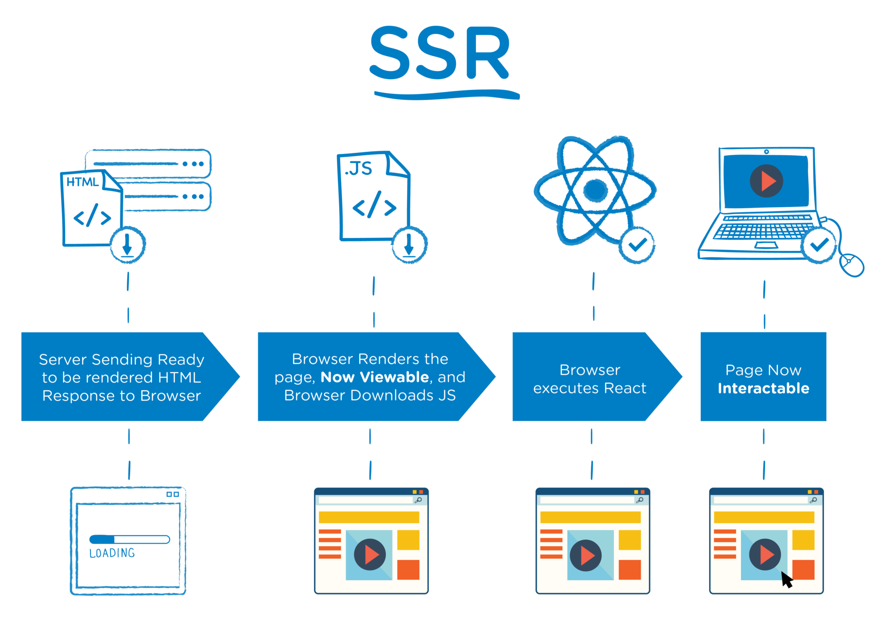
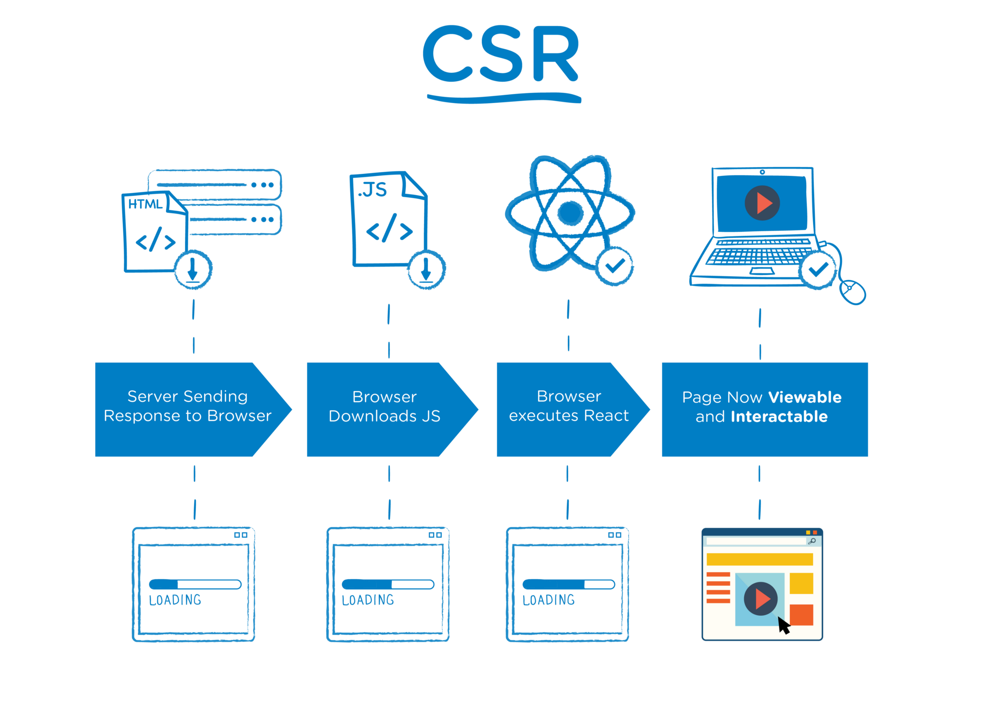

### `Kodluyoruz Earlybird Front-End Talent Bootcamp`

## `GÜN 2 - 2020.12.20`
> Paket yöneticileri, async-await then chain, Create React App ve Next.js

Bu bölümde;
- [JavaScript Paket yöneticileri](#javascript-paket-yöneticileri)
  - [npm](#npm)
    - [npm'e script ekleme](#npme-script-ekleme)
  - [npm ile npx arasındaki fark!](#npm-ile-npx-arasındaki-fark)
  - [yarn](#yarn)
  - [`yarn` ve `npm` arsındaki farklar!](#yarn-ve-npm-arsındaki-farklar)
    - [Npm vs Yarn commands](#npm-vs-yarn-commands)
    - [İkisi için de aynı olan komutlar](#i̇kisi-için-de-aynı-olan-komutlar)
  - [`package-lock.json` nedir?](#package-lockjson-nedir)
  - [`~`, `^`, `*` Bu işaretler ne manaya geliyor? (`SemVer`)](#---bu-işaretler-ne-manaya-geliyor-semver)
- [JS Modüller ile çalışmak](#js-modüller-ile-çalışmak)
  - [Modülleri dahil etmek](#modülleri-dahil-etmek)
  - [Module oluşturmak ve export etmek](#module-oluşturmak-ve-export-etmek)
  - [`Module.exports` ile `exports` arasındaki fark nedir?](#moduleexports-ile-exports-arasındaki-fark-nedir)
  - [Export default nedir?](#export-default-nedir)
- [Ek bilgiler](#ek-bilgiler)
  - [gereksiz çalışan portları kapatma](#gereksiz-çalışan-portları-kapatma)
  - [express generator](#express-generator)
- [ES6+ standartları ile export import](#es6-standartları-ile-export-import)
  - [nodemon](#nodemon)
  - [sucrase](#sucrase)
- [`async, await` vs `then chain`](#async-await-vs-then-chain)
- [Bir React Projesi başlatmak](#bir-react-projesi-başlatmak)
  - [create react app](#create-react-app)
  - [NextJs](#nextjs)
  - [Ne zaman next.js kullanmalıyız?](#ne-zaman-nextjs-kullanmalıyız)
  - [Ne zaman Create-React-App kullanmalıyız?](#ne-zaman-create-react-app-kullanmalıyız)
  - [Nedir bu `server-side-rendering` ve `client-side-redering` ?](#nedir-bu-server-side-rendering-ve-client-side-redering-)
- [Kaynakça](#kaynakça)

# JavaScript Paket yöneticileri
> [How JavaScript package managers work](https://www.freecodecamp.org/news/javascript-package-managers-101-9afd926add0a/) - Shubheksha Jalan

Basitçe söylemek gerekirse, bir paket yöneticisi, projenizin doğru çalışması için ihtiyaç duyduğu bağımlılıkları (sizin veya başka biri tarafından yazılan harici kod) yönetmenizi sağlayan bir yazılım parçasıdır.

Paket yöneticisi, yazılım paketlerini kurmak, kaldırmak ve yönetmek için kullanılır.

Paket yöneticisinin yaptığı şey, yazılım paketlerini tutarlı bir şekilde yükleme, yükseltme, yapılandırma ve kaldırma sürecini otomatikleştirmektir.

## npm
> **https://www.npmjs.com/**

Açılımı **Node Package Manager**'dır. Isaac [Z. Schlueter](https://twitter.com/izs) tarafından tamamen javascript dili kullanılarak geliştirilmiştir.

> “npm makes it easy for JavaScript developers to share and reuse code, and it makes it easy to update the code that you’re sharing” — npmjs.org

Yeni bir js projesine başladman önce bir js projesi künyesi oluşturmak isterseniz (önerilir); önce npm'i o dizine kurmalısnız.

```bash
npm init
```

npm sizden paket detaylarını sıra sıra isteyecektir. Bunları yavaş doldurabilir ya da hepsine yes (evet) deyip hızlıca geçebilirsiniz.


```bash
npm init -y
```

Paketi bu şekilde başlatırsanız bunun gibi bir çıktı alacaksınız;

```json
{
  "name": "test",
  "version": "1.0.0",
  "description": "",
  "main": "index.js",
  "scripts": {
    "test": "echo \"Error: no test specified\" && exit 1"
  },
  "keywords": [],
  "author": "",
  "license": "ISC"
}
```

> ### `npm cheat sheet:` **https://devhints.io/npm**

### npm'e script ekleme
> [Introduction to NPM Scripts](https://www.freecodecamp.org/news/introduction-to-npm-scripts-1dbb2ae01633/) - Mohammed Ajmal Siddiqui

**scripts** bölümü aslında bir [alias](https://github.com/hasantezcan/oyk-2018-yaz-gnu-linux-sistem-yonetimi-duzey-1/blob/master/Gun%202-Alias-MetinEditorleri-OrtamDegiskenleri_PATH-KabukAyarDosyalari/OYYK-Gun-2--Alias-MetinEditorleri-OrtamDegiskenleri_PATH-KabukAyarDosyalari.md#alias-takma-isimler) alanıdır. Buraya ek scriptler eklenebilir. 


`script`'leri tekrarlayan görevleri otomatikleştirmek için kullanıyoruz. 

*Örneğin,* projenizi ayağa kaldırmak, projenizin buildini almak ya da önceden yazdığınız bir betiği tek seferde hızlıca çalıştırmak için script'leri kullanabilirsiniz.

```json
"scripts": {
  "start": "node index.js",
  "say-hello": "echo 'Hello World!'"
  }
```

```bash
npm run say-hello
```
---

```json
"scripts": {
    "dev": "nodemon src/app.js",
    "build": "sucrase ./src -d ./dist --transforms imports",
    "start": "node dist/app.js"
```
> **sucrase**: yazdığınız kodları ES6+ standartları ile derler.  
> **nodemon**: yazdığınız kod yaptığınız değişiklikleri canlı olarak takip etmenizi sağlar.

## npm ile npx arasındaki fark!
> **https://aykutkardas.medium.com/npx-nedir-c6a604cde961**

`npx` kurulan paketleri package json'a eklemez! Sadece o an için kurar. İlerde aynı proje başka bir yerde ayağa kaldırıldığında npx ile kurulan paketleri kurmayacaktır.

Ör: `create react app` (npx ile kurmamız tavsiye edilir)

<p align="center">
    
    <br>
    <em>
       Create React App - <a href="https://create-react-app.dev/docs/getting-started"> Getting Started </a>  
    </em>
</p>

Fakat `npm` ile kurulan paketler `package json`'a eklenir. Ve proje tekrar kurulduğunda bu paketlerle birlikte kurulur.


## yarn
> [A Quick Introduction to the Yarn Package Manager](https://www.digitalocean.com/community/tutorials/js-yarn-package-manager-quick-intro) - Alligator.io


[**Yarn**](https://yarnpkg.com/), Facebook tarafından geliştirilen yeni ve açık kaynaklı JavaScript paket yöneticisidir. Yarn, `npm` paket yöneticisi ile tamamen uyumludur ve `npm` ile birlikte çalışabilir, ancak daha tehlikesiz, daha güvenli ve daha emniyetli bir alternatif olmayı amaçlamaktadır.  

Yeni veya mevcut projeler için tüm npm iş akışınızı çok az çabayla Yarn ile değiştirebilirsiniz. Yarn'da bağımlılıklar yarn.lock içinde saklanır. Bu dosya versiyon kontrol aracı ile takip edilmelidir. Ve bu dosya sadece yarn tarafından düzenlenir elle bir değişiklik yapmanız önerilmez. 


## `yarn` ve `npm` arsındaki farklar!
> [Yarn Vs NPM, Which One To Choose In 2020](https://www.javascriptwillrule.com/yarn-vs-npm-speed-tests) - Subin Sudhakaran  

- **Modül Kurulum Hızı'ı**  
  Yarn kullanarak bir paket kurduğunuzda (`yarn add packagename`), paketi diskinize cashler. Bir sonraki kurulumda, kurulum için gerekli tarball'ı (çok sayıda dosyanın tar uzantılı sıkıştırılmış hali) almak için HTTP isteği göndermek yerine cashle'diği paketi kullanılacaktır.

  Önbelleğe alınan modülünüz `~/.yarn-cache` içine alınacak ve registry adı önekini alacak ve modül sürümü ile sonradan eklenmiş olacaktır. 
  
  Yani express'in 4.4.5 sürümünü Yarn ile kurarsanız,  
  **`~/.yarn-cache/npm-express-4.4.5.`** gibi bir cashe'iniz olacak demektir.

- **Paralel Kurulum**
  Npm ile bir paketi kurarken başka bir paketi eklemek mümkün değil. Yeni bir paket eklemeden önce öbürünün tamamen bitmesini beklemelisiniz.

  Fakat `yarn` paket kurulumlarını paralel olarak gerçekleştirerek performansı artırır.
  
  > **Expres paketi için kurulum süreleri.** (bağımlılıklarala beraber 42 paket)
  ```bash
    npm: 9 seconds

    Yarn: 1.37 seconds
  ```

- **Yarn nodeJs'in 5. sürümü altında destek vermiyor.**

  Yarn `(released 2016)`, npm'e`(2010)` göre daha yeni bir paket yöneticisi olduğundan sürüm desteği npm kadar geniş değil.
  
  > **Bir projeye paket yüklemeye hangi paket yöneticisi ile başladıysanız onunla devam etmeniz önerilir. Diyelim `npm` ile birsürü paket kurulumu yaptınız ve bir sonraki paketi `yarn` ile kurdunuz. Projenin ilerleyen zamanlarında bu gittiğimiz yol bize sorun yaratabilir.**
  
  > **Projede hangi paket yöneticisine sahip olduğunuzu öğrenmek isterseniz proje dizininize bakmalısınız. `Npm` kullanıyorsanız `package.json.lock` olacaktır. Eğer `yarn` kullanıyosanız `yarn.lock`'ı proje dizininizde görebilirsiniz.**

### Npm vs Yarn commands
> [Cheat Sheet: npm vs Yarn Commands](https://www.digitalocean.com/community/tutorials/nodejs-npm-yarn-cheatsheet) - William Le

|       **Command**        |               **npm**                |            **yarn**            |
| :----------------------: | :----------------------------------: | :----------------------------: |
|   Install dependencies   |            `npm install`             |             `yarn`             |
|     Install package      |       `npm install [package]`        |      `yarn add [package]`      |
|   Install dev package    |  `npm install --save-dev [package]`  |   `yarn add --dev [package]`   |
|    Uninstall package     |      `npm uninstall [package]`       |    `yarn remove [package]`     |
|  Uninstall dev package   | `npm uninstall --save-dev [package]` |    `yarn remove [package]`     |
|          Update          |             `npm update`             |         `yarn upgrade`         |
|      Update package      |        `npm update [package]`        |    `yarn upgrade [package]`    |
|  Global install package  |   `npm install --global [package]`   |  `yarn global add [package]`   |
| Global uninstall package |  `npm uninstall --global [package]`  | `yarn global remove [package]` |

### İkisi için de aynı olan komutlar
> Yarn'ın değiştirmemeye karar verdiği bazı komutlar

|          **npm**           |          **yarn**          |
| :------------------------: | :------------------------: |
|         `npm init`         |        `yarn init`         |
|         `npm run`          |         `yarn run`         |
|         `npm test`         |        `yarn test`         |
| `npm login` (and `logout`) | `yarn login` (and`logout`) |
|         `npm link`         |        `yarn link`         |
|       `npm publish`        |       `yarn publish`       |
|     `npm cache clean`      |     `yarn cache clean`     |

---

## `package-lock.json` nedir?
> - https://docs.npmjs.com/cli/v6/configuring-npm/package-lock-json  

> Bilinen ilk .lock dosyası (en azından benim bildiğim) https://rubyinrails.com/2013/12/10/what-is-gemfile-lock/

`package-lock.json` `package.json`'dan farklı olarak kullandığınız paketlerin bağımlılıklarını ve versiyonlarını `checksum`'ları ile saklar. 

> **checksum:** sağlama toplamı

`...lock.json` dosyaları kullanıcılar tarafından değiştirilmez. Bu dosyaları npm (ya da hangi paket yöneticisi kullanıyorsanız). tarafından tarafından oluşturulur ve düzenlenir.

---

*Örneğin* projenize sadece express ve axios kurduğunuzu düşünün bu durumda `package.json` içinde sadece bu iki bağımlılığı göreceksiniz.

```diff
{..
  ...
  "license": "ISC",
  "dependencies": {
+    "axios": "^0.20.0",
+    "express": "^4.17.1"
  }
}
```

ama `package-lock.json` içine baktığınızda express'in çalışabilmesi için gerekli olan tüm pakatler ve bu paketlerin versiyon sınırlarını göreceksiniz. 

<p align="center">
    
    <br>
    <em>
       package-lock.json dependencies 
    </em>
</p>

npm install komutunu çalıştırdığınız anda `package-lock.json` da güncellenir ve `package.json`'a ayak uydurur.


- Tutarlı bir yükleme ve uyumlu bağımlılıklar sağlamak için `package-lock`'ı kullanmalısınız

- `package-lock` dosyanızı versiyon kontrol ile takip etmelisiniz. *(`.gitignore` içne koyMAMALSINIZ!)*

- `package-lock`'ı her seferinde silmenize gerek yok! `npm install`ı çalıştırmak `package.lock`'ı sizin için tekrar oluşturacaktır.

---

> - [Everything You Wanted To Know About package-lock.json But Were Too Afraid To Ask](https://medium.com/coinmonks/everything-you-wanted-to-know-about-package-lock-json-b81911aa8ab8) - James Quigley 

!! Bu kaynakta verilen bir kısım verilen şu an geçerli değil.

> ...."Example: A module does not exist in the package-lock, but it does exist in the package.json. As a user who looks to package.json as the source of truth, I would expect for my module to be installed. However since the module is not present in package-lock, it isn’t installed, and my code fails because it cannot find the module."...

> Bu örnekte bahsedilen durumu deneyip aksinin olduğunu gördükten sonra şu şekilde bir cevap verdim. **"That information is not valid anymore. If the package exists on package.json even if not exist in package-lock.json when you will run the npm install the package-lock.json file will update with the package that doesn't exist before"** 

## `~`, `^`, `*` Bu işaretler ne manaya geliyor? (`SemVer`)
> [What Do the ~, ^, and * Mean in package.json?](https://gunnariauvinen.com/what-do-the-tilde-carrot-and-asterick-mean-in-package-dot-json/)

Bu işaretleri dil ya da framework'lerden bağımsız şekilde herhangi bir paketin versiyonu yanında görmeniz pek mümkün.

Bunlar **`SemVer`** yani [Semantic Versioning](https://semver.org/) ilgili semboller. Semantik programlama nedir kısa bir özet yapmak gerekirse. Üçlü versiyonlama sistemine Semantik Versiyonlama denir. **`x.y.z` major version x, minor version y, and patch version z.**

- **x** `MAJOR` Önceki sürümle uyumsuz API değişiklikleri yaptığınızda,
- **y** `MINOR` Önceki sürümle uyumlu bir davranış eklediğinizde,
- **z** `PATCH` Önceki sürümle uyumlu bir hata düzeltmesi yaptığınızda

- `~` karakteri, herhangi bir PATCH numarasıyla eşleşirken hem major hem de minor sürüm numaralarını düzeltir.

  > **`2.3.1 =< ~2.3.1 < 2.4.0`**

- `^` karakteri, major sürüm numarasını kilitleyen, ancak minor ve patch sürümlerini daha esnek hale getirir.

  > **`2.2.3 < ^2.2.3 < 3.0.0`**

- `*` karakteri, çok sık kullanılmaz. O major sürümü için tüm minor ve patch'leri kabul eder. 

  > **`1.0.0 < 1.* < 2.0.0`**

---

<p align="center">
    
    <br>
</p>

# JS Modüller ile çalışmak
> - [Understanding module.exports and exports in Node.js](https://www.sitepoint.com/understanding-module-exports-exports-node-js/) - James Hibbard - Nov 2019   
> - [export](https://developer.mozilla.org/en-US/docs/Web/JavaScript/Reference/Statements/export#re-exporting_aggregating) - MDN

Programlamada modüller, projeler arasında paylaşılabilen ve yeniden kullanılabilen bağımsız işlevsellik birimleridir.

Kendimiz yazmak zorunda olmadığımız işlevselliklerle uygulamalarımızı geliştirmek için kullanabildiğimiz için geliştiriciler olarak hayatımızı kolaylaştırırlar.

Ayrıca kodumuzu düzenlememize ve ayırmamıza izin vererek anlaşılması, hata ayıklaması ve bakımı daha kolay uygulamalara yol açar.

## Modülleri dahil etmek
> **require:** ihtiyacı olmak

Node.js, kodumuza yüklemek zorunda kalmadan kullanabileceğimiz bir dizi yerleşik modülle birlikte gelir.

Bunu yapmak için, modülü `require` anahtar kelimesi ile çağırılması yeterlidir.

```js
const fs = require('fs');
const folderPath = '/home/jim/Desktop/';

fs.readdir(folderPath, (err, files) => {
  files.forEach(file => {
    console.log(file);
  });
});
```

> CommonJS'de modüllerin eşzamanlı olarak yüklendiğini ve oluştukları sıraya göre işlendiğini unutmayın.

## Module oluşturmak ve export etmek
Şimdi kendi modülümüzü nasıl oluşturacağımıza ve modülümüzün başka bir yerinde kullanmak üzere dışa aktaracağımıza bakalım. 

Bir `user.js` dosyası oluşturarak ve aşağıdakileri ekleyerek başlayalım:

```js
// user.js
const getName = () => {
  return 'Hasan';
};

module.exports.getName = getName;
```
Şimdi aynı klasörde bir `index.js` dosyası oluşturalım ve içine şunları ekleyelim:

```js
// index.js
const user = require('./user');

console.log(`User: ${user.getName()}`);
```
`user.js` içinde oluşturduğumuz getName fonksiyonunu `index.js` içinde `require` (ihtiyacı olmak) ile çağırarak user değişkenine atadık ve sonrasında user içinden `getName` fonksiyonuna ulaştık. 

export etmek istediğimiz birden fazla fonskiyon olsayıdı.

```js
// user.js
const getName = () => {
  return 'Hasan';
};

const getLocation = () => {
  return 'Denizli';
};

exports.dateOfBirth = '19.08.1998';

exports.getName = getName;
exports.getLocation = getLocation;
```
birden fazla fonksiyonu bu şekilde `export` edip `index.js` içinde;

```js
// index.js
const { getName, getLocation, dateOfBirth } = require('./user');

console.log(
  `${getName()} lives in ${getLocation()} and he was born on ${dateOfBirth()}.`
); 
// Hasan lives in Denizli and he was born on 19.08.1998
```
Burada `user.js` içinden export ettiğimiz fonksiyonları destruct ederek kullandık.

## `Module.exports` ile `exports` arasındaki fark nedir?

exports aslında module objesinin bir alt argümanıdır.

bir module objesini log ettiğimizde şunu görürüz;

```js
//console.log(module);
Module {
  id: '.',
  exports: {},
  parent: null,
  filename: '/home/jim/Desktop/index.js',
  loaded: false,
  children: [],
  paths:
   [ '/home/jim/Desktop/node_modules',
     '/home/jim/node_modules',
     '/home/node_modules',
     '/node_modules' ] }
```
Gördüğünüz gibi `exports`, `module` altında bulunan bir property'dir.

```js
exports.foo = 'foo';
console.log(module);

Module {
  id: '.',
  exports: { foo: 'foo' },
  ...
```

Görüldüğü gibi `module.exports` ile `exports` aynı işi yapmakta (en azından varsayılan olarak).

## Export default nedir?

default olarak export ettiğimiz fonksiyon tanımlandığında varsayılan olarak çalışır. Default olarak eklenmeyen fonksiyonları kullanmak istersek onları tanımlayarak kullanmamız gerekir. 

```js
import React, { useState } from 'react';
```

Burada soldaki React default olarak export edilmiş. useState ise normal şekilde export edilmiş diyebilirz.

---

```js
// user.js
const getName = () => {
  return 'Hasan';
};

const getLocation = () => {
  return 'Denizli';
};

const dateOfBirth = '19.08.1998';

module.exports.default = getName;
module.exports {
  getLocation,
  dateOfBirth
}
```

```js
// index.js
const getName { getLocation, dateOfBirth } = require('./user');

console.log(
  `${getName()} lives in ${getLocation()} and he was born on ${dateOfBirth()}.`
); 
// Hasan lives in Denizli and he was born on 19.08.1998
```
----
# Ek bilgiler

## gereksiz çalışan portları kapatma

3000 portu ya da herhangi port'da açık kalmış bir servis var ise o servisi **`npx kill-port 8080`** ile kapatabilirsiniz. - 
> [Stackoverflow](https://stackoverflow.com/a/62406427/10694425)

## express generator
> https://expressjs.com/en/starter/generator.html

Express generator ile hılzı bir uygulama iskeleti oluşturabilirsiniz.


<p align="center">
    
    <br>
    <em>
       express generator file structure
    </em>
</p>

---

# ES6+ standartları ile export import

[Biraz önce](#js-different-module-formats) ES6 öncesi export import nasıl yapılır görmüştük şimdi ise bu işlerin es6 ile birlikte nasıl değiştiğini göreceğiz.

`require` yerine `import` 

`module.export` yerine `export`

```js
const name = "Hasan";
const surname = "Tezcan";
const fullName = `${name} ${surname}`;

export { name, surname, fullName };
```

```js
import { name, surname, fullName } from "./myModule";

console.log(name, surname, fullName);
```

## nodemon
> https://github.com/remy/nodemon

Yazdığınız kod'a yaptığınız değişiklikleri canlı olarak takip etmenizi sağlar.

## sucrase
> https://github.com/alangpierce/sucrase

**Sucrase**, [babel'a](https://github.com/babel/babel) aleternatif olarak kullanılabilcek bir compalier. Desteklenen ortamlarınız belirli özellikleri yerel olarak desteklemediğinde, Sucrase bu özellikleri desteklenen bir sürüme indirmenize yardımcı olacaktır. 

Bu yazım ile yazdığınız kodlar

```js
// ES2020 nullish coalescing
function greet(input) {
  return input ?? "Hello world";
}
```
Bu şekle dönüştürülecek

```js
function greet(input) {
  return input != null ? input : "Hello world";
}
```
Nodemon ve sucrase kurulumu.

---
# `async, await` vs `then chain`
> **Promises, async/await**

 **Bu aşağıda gördüğünüz iki kod praçası da aynı işi yapmakta. `Hangisi daha derli toplu görünüyor?` `Aralarındaki fark nedir?`**

```js
axios
	.get(`${ENDPOINT}/users`)
	.then((response) => response.data)
	.then((users) => {
		axios
			.get(`${ENDPOINT}/posts`)
			.then((response) => response.data)
			.then((posts) => {
				axios
					.get(`${ENDPOINT}/albums`)
					.then((response) => response.data)
					.then((albums) => console.log(albums));
			});
	})
	.catch((e) => {
		console.log(e);
  });
```
> Burada belli bir sırada istek yapılması istendiğinden sıranın sağlanması için `then`'ler kullanılmış. Tabi araka arakaya 3 istek yapılmak istenmesi burada bir `then chain`'e yol açmış.

Bu sıralı yapılacak istekler daha farklı şekilde yapılabilir mi?

```js
async function getData() {
	try {
		const { data: users } = await axios.get(`${ENDPOINT}/users/1`);
		const { data: posts } = await axios.get(`${ENDPOINT}/posts/1`);
		const { data: albums } = await axios.get(`${ENDPOINT}/albums/1`);
		console.log(users, posts, albums);
	} catch (e) {
		console.log(e);
	}
}
```
ES6 ile birlikte gelen async await yapısı ile birbirini beklemesi gereken istekleri bu şekilde sıraya sokabilir. Önceki kodda var olan karmaşadan kurtulmuş olursunuz.

`Callback`'ler içinde hata yakalamalarını `catch` ile yapabiliyorduk. `Async await` yapısında hata yakalaması yapmak için de bir `try catch` yapısı kurmamız gerekiyor.

---
# Bir React Projesi başlatmak
React Js'i bir çok şekilde kullanma imkanınız mevcut. En temelde yapmanız gerekten tek şey React'ı proje dizininize dahil etmek. 

Fakat React Js'i dahil etmekten sonra bir proje oluşturma yolunda yapmanız gereken bir çok konfigurasyon olacak. Her proje başlangıçında bu ayarlamaları tekrar tekrar yapmamak bi yerden sonra baş edilebilir olmaktan çıkıyor. Bu sebeple hem bu ayarları önceden hazırlamış hem de daha iyi optimize ayarlar ile bunu yapmış olan proje başlatıcılardan faydalanırız.

Proje başlatıcıları sizin için öncesinde bir çok ayarlamayı hazırlamış, gerekli tüm bağımlılıkları halletmiş şekilde size gelirler ve sizinde yapmanız gereken tek şey. Projeye başlamak olur...

Şimdi gelin bu proje başlatıcılarını tanıyalım.

## create react app
> https://create-react-app.dev/

Bir ReactJS uygulamasını sıfırdan kurmak uzun ve karmaşık bir süreç olabilir. Babel, tüm eklentileri olan Webpack, kütüphaneleri test etme vb. Gibi her şeyi düşünmelisiniz. Ayrıca çözülmesi birkaç saat sürebilen bazı sorunları da beraberinde getirebilir.

Ancak neyse ki, birçok durumda kullanılabilecek hızlı ve kolay bir çözüm var ve bu, React Uygulaması Oluşturma aracı. Basit bir ReactJS uygulaması oluşturmak ve onunla çalışmaya başlamak için bunu bilgisayarınıza kurmanız ve basit komutu çalıştırmanız yeterlidir.

Create React App, tek komutla basit bir konfigürasyonla yeni bir tek sayfalı uygulama oluşturarak yeni bir ReactJS projesinin önyüklenmesine yardımcı olan, Facebook geliştiricileri tarafından oluşturulan bir araçtır.

> ### Create React App'in avantajları

- **İyileştirilmemiş. (It’s unopinionated.)**
  İstediğiniz kütüphaneleri kullanabilirsiniz, kural veya öneri yoktur. Tercih ettiğiniz routing kütüphanesi kullanabilirsiniz.
-  **Client-side'da render edilir. (İstemci tarafında oluşturulur)** 

> ### Create React App'in dezavantajları

- **Özelleştirmesi zahmetlidir**
  Uygulamanızı özelleştirmenin belirli bir yolu yoktur. Webpack yapılandırmanızı özelleştirmeniz gerekiyorsa, tek seçeneğiniz craco veya eject gibi üçüncü taraf bir araç kullanmaktır.

- **SEO tarafında başarısız**
 CRA ile oluşturudğumuz uygulamlar istemci tarfında render edildiğinden dolayı google tarafından indexlenmesi kolay olmuyor bu durum da bizi SEO açısından başarısız kılıyor.  

## NextJs
NextJS'yi Create-React-App ile karşılaştırmak neredeyse haksızlıktır çünkü NextJS çok daha fazlasıdır. CRA, React uygulamaları oluşturuken kullanılan bir iskeletken (template) NextJS başlı başına bir **Framework**'tür. Kutudan çıkar çıkmaz size sserver-side rendering, static-site generation, serverless functions ve çok daha fazlasını sunar. Performanslı web uygulamaları oluşturmak için ihtiyacınız olan her şeyi size veren bir araç kutusudur.

> ### NextJs'in avantajları

- **It blazing fast.**
  Sunucu tarafında işleme ve statik site oluşturma sayesinde, NextJS uygulamaları çok hızlı. NextJS, bizim için birçok performans optimizasyonuyla ilgilenir ve bize varsayılan olarak performanslı olarak gelir.

- **Kolay Deploy edilebilir**
  Vercel (NextJS'nin arkasındaki şirket), fullstack React uygulamalarının deployment'ını kolaylaştırır. Yalnızca birkaç tıklama ile profesyonel bir pipeline'a (dağıtım hattına) sahip olursunuz. Ve bunları github ile beraber çalışacak şekilde monitorize edebilirsiniz.

- **API desteği mevcuttur**
  NextJS, uygulamalarımızda API'ler oluşturmanın hızlı ve kolay bir yolunu sağlıyor.

- **Özelleştirmesi gayet kolaydır.**
  extJS, babel veya webpack yapılandırmamızı özelleştirmemize izin verir. Web paketi yükleyicileri veya babel eklentileri eklemek oldukça kolaydır.


> ### Create React App'in dezavantajları

- **Bağnazıdır**
  NextJS kendi route sistemi dışında bir şey kullanmanıza izin vermez.


## Ne zaman next.js kullanmalıyız?

- **landing page hazırlarken**
  NextJS, landing page'ler gibi sunum sayfaları hazırlamada bir numaradır.

- **SEO sizin için önemliyse**
  Örneğin; E-ticaret siteleri oluştururken SEO her zamankinden daha önemlidir. Sayfaları server-side'da hazırladığı için  NextJS SEO konusunda oldukça başarılıdır.

- **Client'da yük oluşturmamak için**
  Uygulamamızı sunucu üzerinde oluşturmak, istemcinin render yükünü ortadan kaldırmaktadır. Daha yavaş cihaz kullanan client'lar için bu, çok daha hızlı yükleme sürelerine yol açabilir.

## Ne zaman Create-React-App kullanmalıyız?

- **Üye bazlı bir sisteminiz varsa**
  Uygulamanız yalnızca kimliği doğrulanmış kullanıcılar tarafından kullanılabiliyorsa, SSRfaydalarının çoğunu kaybeder. Bu kullanım örneği için, istemci tarafından oluşturulan uygulamalar gayet iyi çalışır ve barındırılması daha kolay ve daha ucuzdur.

- **Web uygulamaları oluştururken**
  Web uygulamaları genel olarak SSR'dab daha az yararlanır. Genellikle tekrar eden kullanıcılar tarafından kullanılırlar ve önbelleğe almayı, SSR maliyeti veya sıkıntısı olmadan onlara ışık hızında yükleme süreleri sağlamak için kullanabiliriz.

## Nedir bu `server-side-rendering` ve `client-side-redering` ?

<p align="center">
    
    <br>
    <em>
       Server-side rendering. <a href="https://medium.com/walmartglobaltech/the-benefits-of-server-side-rendering-over-client-side-rendering-5d07ff2cefe8"> (Image by Alex Grigoryan) </a>
    </em>
</p>

`Server-side rendering`'de kullanıcı web sitesine erişmek istediğinde (bir istekte bulunduğunda) Sunucu, kullanıcıya özel verileri alarak bir HTML sayfası hazırlar ve bunu internet üzerinden kullanıcının makinesine gönderir. Tarayıcı daha sonra içeriği analiz eder ve sayfayı görüntüler. Veritabanından veri alma, bir HTML sayfası oluşturma ve istemciye gönderme işleminin tamamı yalnızca milisaniyeler içinde gerçekleşir.

<p align="center">
    
    <br>
    <em>
       Client-side rendering. <a href="https://medium.com/walmartglobaltech/the-benefits-of-server-side-rendering-over-client-side-rendering-5d07ff2cefe8"> (Image by Alex Grigoryan) </a>
    </em>
</p>

`client-side rendering`'de içerik JavaScript kullanılarak oluşturulur. Tüm içeriği sunucudan HTML dokümanını olarak almak yerine ilk yüklemede sunucu üzerinden sadece taslak bir html dokümanı alır ve sitenin geri kalanını tarayıcı üzerinde oluşturur. 

Client-side rendering ile birlikte;

- Sayfa ilk yüklenirken biraz yavaştır. Ancak bundan sonra sonraki her sayfa yüklemesi çok hızlıdır.
- Sunucu ile sadece run-time verilerini almak için iletişim kurar.
- Sunucuya yapılan her çağrıdan sonra tüm kullanıcı arayüzünü yeniden yüklemenize gerek yoktur. Sadece güncellenen verinin olduğu kısmı günceller.

Server-side rendering sağlayan Next.js şunları sağlar;

- Çok daha iyi SEO
- HTML içeriğinin tamamı kaynak kodda mevcuttur; bu, arama motorunun hemen isteyebileceği, tarayabileceği ve dizine ekleyebileceği anlamına gelir, bu da arama sonuçlarında gerçekten görünme ve sıralama için daha hızlı zaman sağlar.
- Ancak yinelenen sunucu istekleri, sonraki sayfa yüklemelerini CSR'ye göre daha yavaş hale getirir.
  
**Ayrıca bu kaynaklara da göz atabilirsiniz;**
- [Next.js VS Create-React-App](https://medium.com/alienbrains/next-js-vs-create-react-app-bbf3ca2d9891) - Rohit Mondal
- [Why I Migrated From Next.js to Create React App](https://medium.com/better-programming/why-i-migrated-from-next-js-to-create-react-app-7e74834e8431) - Jake Prins
- [How to Create a React Development Build From Scratch](https://medium.com/swlh/react-without-create-react-app-setting-up-a-dev-build-from-scratch-fefd5d9d6baa) - Mike Pottebaum
- [What is Nextjs and Why Should You Use it in 2021?](https://dev.to/pagepro_agency/what-is-nextjs-and-why-should-you-use-it-in-2021-1h5d) - omgrabski


# Kaynakça  

- [Everything You Wanted To Know About package-lock.json But Were Too Afraid To Ask](https://medium.com/coinmonks/everything-you-wanted-to-know-about-package-lock-json-b81911aa8ab8) - James Quigley
- [What Do the ~, ^, and * Mean in package.json?](https://gunnariauvinen.com/what-do-the-tilde-carrot-and-asterick-mean-in-package-dot-json/) - Gunnari Auvinen
- [How JavaScript package managers work](https://www.freecodecamp.org/news/javascript-package-managers-101-9afd926add0a/) - Shubheksha Jalan
- [Introduction to NPM Scripts](https://www.freecodecamp.org/news/introduction-to-npm-scripts-1dbb2ae01633/) - Mohammed Ajmal Siddiqui
- [Cheat Sheet: npm vs Yarn Commands](https://www.digitalocean.com/community/tutorials/nodejs-npm-yarn-cheatsheet) - William Le
- [A Quick Introduction to the Yarn Package Manager](https://www.digitalocean.com/community/tutorials/js-yarn-package-manager-quick-intro) - Alligator.io
- [Understanding module.exports and exports in Node.js](https://www.sitepoint.com/understanding-module-exports-exports-node-js/) - James Hibbard - Nov 2019 
- [export](https://developer.mozilla.org/en-US/docs/Web/JavaScript/Reference/Statements/export#re-exporting_aggregating) - MDN
- [What Is Create React App?](https://www.blog.duomly.com/what-is-create-react-app/)
- [What’s The Difference Between NextJS and Create-React-App?](https://medium.com/frontend-digest/whats-the-difference-between-nextjs-and-create-react-app-11b55650a612) - Malcolm Laing - Oct 2020
