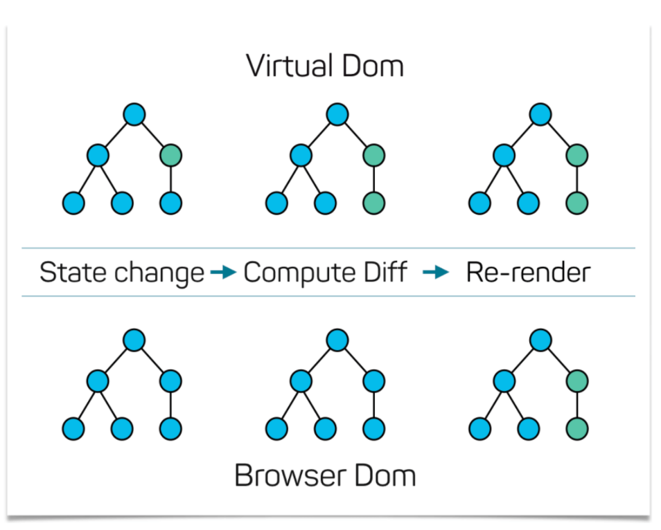
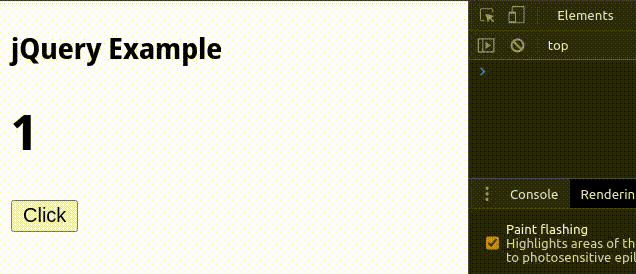
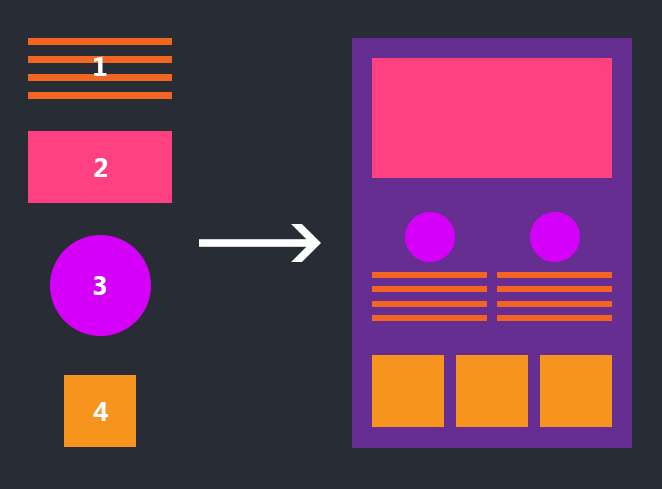
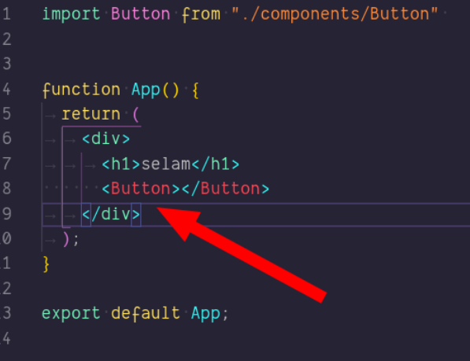
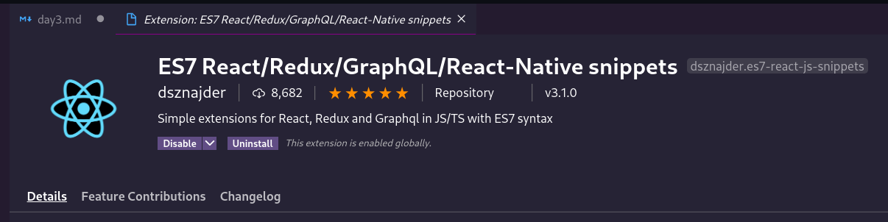
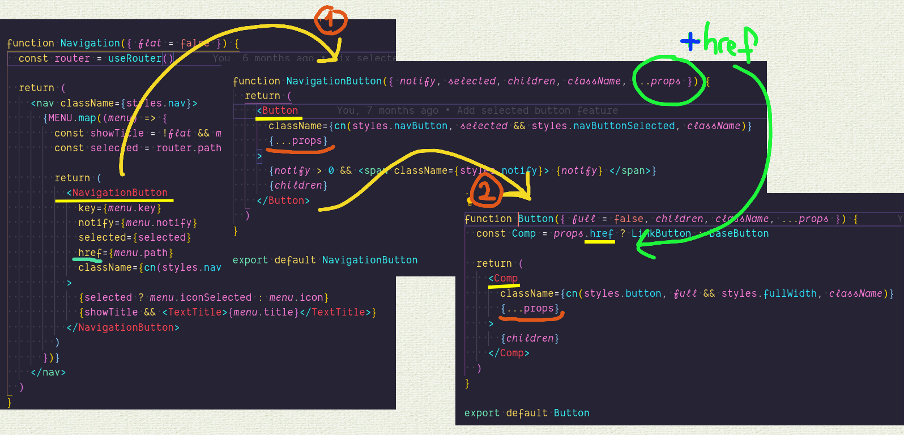
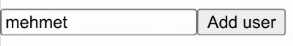
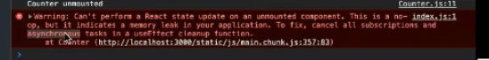

### `Kodluyoruz Earlybird Front-End Talent Bootcamp`

## `GÜN 3 - 2020.12.26`
> React'a giriş temeller ile tanışma

Bu bölümde;

- **[Neden React'ı kullanmalıyız?](#neden-reactı-kullanmalıyız)**
- [**React Nasıl Ortaya Çıktı?**](#react-nasıl-ortaya-çıktı)
- [**Component Nedir?**]()
- [**React'ın Temelleri**]()
  - [**Props**](#props)
    - [prop type](#proptypes)
    - [prop childre](#propschildren)
    - [default props](#defaultprops)
    - [...props nasıl kullanılır?](#props-nedir)
  - [**Öğeleri map etmek (unique key)**](#reactda-item-listelemek-unique-key)
  - [**State**]()
    - [prevState](#prevstate)
    - [Global state managment - REDUX contex API](#global-state-management)
  - [**JSX'de koşula bağlı element render etme**](#jsx-içinde-koşula-bağlı-element-render-etmek)
  - [**Hook**](#hooks)
    - [useEffect](#useeffect)
    - [dependency array](#dependency-array)

konularından bahsedeceğiz.

---

İnsanlar bir şeylere başlarken çoğu zaman neden bunu yaptığını sorgulamazlar. Onları yönlendiren belli başlı sebeplere inanırlar ve peşinden giderler. Bu sebepler; herkesin o şeyi yapıyor/kulanıyor olması olabilir, reklamının iyi yapılmış ve alternatifleri değerlendirilmeden en iyisinin o olduğuna inanmışlık olabilir. Lafına güvendiği birinin tavsiyesi olabilir ya da elindeki kaynakların ona yetmesi olabilir. 

Bu yaklaşım birbirinden bağımsız bir çok konu için geçerlidir. *(dizi, film, meslek seçimi, düşünce seçimi ya da kullanılan araç/alet seçimi şekilde)*   

Eee, bizim de konumuz bir web geliştirme aracı olan  **`React`**.   
O zaman soru geliyor..   
**Neden React?** 

## Neden `React`'ı kullanmalıyız?

> Aslında böyle sorular sorumak yerine direk konuya girmek, bir an evvel detaylardan bahsetmek bir çok kişinin istediği şey. Ama bu kısa girişte, yazının devamında konuşacağımız onca şeyin niye anlatıldığını sağlam bir temele oturtmak için bunu girişi gerekli buluyorum.

Evet, bu soruyu ben de google amcaya soruduğumda bir çok yanıt aldım. Genelde bu yanıtlar eski bir yöntem ile -yeni diyebiliceğimiz- React'ın kıyaslaması şeklinde. Tabi bu işlerde yeni iseniz eskiden ne kullanıldığı hakkında bir bilginiz olmadığından bu kıyaslamalı örnekler sizde diğerlerine nazaran çok daha az etki gösteriyor. Direkt yenisini öğrenmek ile başlıyorsunuz. Ama yinede ufak bi kıyaslama ile React'ı diğerlerinden ayıran temel bir farka değinelim.

### Virtual DOM

React bize en temelde virtual DOM diye bir kavram ile geliyor.   
React hali hazırda olan **DOM**'un yani **document object model**'i daha da yanisi tarayıcıda görüğünüz sayfayı *-ve onun içeriğinin-* bir kopyasını Virtual DOM'da tutuyor. Bunu yapmasının sebebi ise sayfada yapılacak güncellemelerin kontrolünü sağlamak. Bu iki kopya arasında değişikleri takip edip sadece değişen kısımları ekranda da güncellemek.

<p align="center">
    
    <br>
    <em>
        <a href="https://mfrachet.github.io/create-frontend-framework/vdom/intro.html">Virtual DOM</a>
    </em>
</p>

Hadi bunu kısa bir demo ile görelim.

> Google chorme içinde dev tools adlı bir bölüm ve onun altında sayfada gerçekleşen değişklikleri daha net görmemizi sağlayan [**paint flashing**](https://developer.mozilla.org/en-US/docs/Tools/Paint_Flashing_Tool) isimli bir seçenek var bunu açtığınızda sayfada o an neresi güncellenirse size bunu net bir şekilde gösteriyor şimdi bu araçtan faydalanıp bir demo yapacağız.

Şimdi ekrana bir buton koyup bu butona basıldığında ekrandaki 1 numarasını 2 yapan bir kod yazacağız. Bunu bi jQuery ile bir de React ile yapacağız ve Virtual DOM'un nasıl bir fayda sağladığını direk görmüş olcağız.


<p align="center">
    
    <br>
    <em>
        jQuery obje güncellendiğinde <a href="./_data/practice/day3/1-jquery-vs-react/jquery.html">kodu</a>
    </em>
</p>

<p align="center">
    
    <br>
    <em>
        React obje güncellendiğinde <a href="./_data/practice/day3/1-jquery-vs-react/src/App.js">kodu</a>
    </em>
</p>

Burada da gördüğünüz gibi React sayıyı 1'den 2'ye çevirdikten sonra 2 elementini tekrar güncellemiyor çünkü orada bir değişiklik yok ama jQuery'de böyle bir yapı olmadığından 1'i 2 yaptıktan sonra bile tekrar tekrar 2'yerine 2 yazmaya devam ediyor.

### **`React gerekmedikçe dom'u güncellemez!`**

> **NOT:** React örneğinde sayfanın tamamında gözüken yeşillenme sadece ilk virtual DOM oluşurken meydana geliyor. 

Bu react'ın jQuery'a karşı güçlü olduğu noktaydı. Peki diğerleri yani Vue, Angular için durum nasıl.

Bu saydıklarımızdan Vue'de de Virtual DOM uygulaması bulunmakta. Ama React'ın başka özellikleri/artıları da mevcut. Bunlara yeri geldikçe değincek olsak da şimdi bir kaç başlıla bunlaradan bahsedelim.

- JSX
- React Native
- Single-Way data flow
- Reusable Components
- Redux & Other Libraries
- Community Support & Developer Tools

Vue ile React arasındaki farklara değinen güzel bir yazıda şuarada mevcut merak edersiniz buyurun efenimm [mindk.com/react-vs-vue/](https://www.mindk.com/blog/react-vs-vue/) 

> **Dahda fazla detay için:**
> - [Why did we build React? - **reactjs.org**](https://reactjs.org/blog/2013/06/05/why-react.html)
> - [When Does a Project Need React? - **css-tricks**](https://css-tricks.com/project-need-react/)
> - [What and Why React.js](https://www.c-sharpcorner.com/article/what-and-why-reactjs/)
> - [When to Use React and Why](https://www.intertech.com/react-tutorial-when-to-use-react-and-why/)
> - [Nedir Bu React? Neden Kullanmalıyız, Nasıl başlarız, Neler Yapabiliriz](https://medium.com/t%C3%BCrkiye/nedir-bu-react-neden-kullanmal%C4%B1y%C4%B1z-nas%C4%B1l-ba%C5%9Flar%C4%B1z-neler-yapabiliriz-f473e3ae0a7e)
> - [ReactJs Nedir ve Neden Kullanmalıyız?](https://www.mobilhanem.com/reactjs-nedir-neden-reactjs-kullanmaliyim/?__cf_chl_jschl_tk__=764adb4a83bd31511e01f7c1c91394c7af0d13a1-1609533257-0-AUpb1gz6c7kusV_3b6SqHUlqi1MU7PZxbO8tFUrm661u8918ml73BNhhC_qBoyF6golNsC9afFwrpKkGttRZ7MXNHblYPY8TbeMp--3DN70IbdL1wBw57xeJ4ndkILIv80WFaJ6loMwNinY9McPZIjegixyMiFBqATFTiYPajlNBA-PDIm-ImD7OPwsie6Pn17pyu9FcNzwDr8LtD288ncAkXscrwwdNCdcJkDk0uH2remaY0Dq0pouordvKSML1LFX6hJ3UNSo1lmlOQ-PGhZrD01KmVEpP5tqtJcBaQKePtLuZ6HM9ferAsd8Bkqs-JIvGuKQbhlnsW0c6MkmLyLCmlchgpHuVmGcb-eKdgd8S)

---

Biraz da react'ın tarihçesinden bahsedelim.

## React Nasıl Ortaya Çıktı?

React, "FaxJS" adlı ilk React prototipini yayınlayan Facebook'ta yazılım mühendisi **Jordan Walke** tarafından oluşturuldu. [[1]](https://github.com/jordwalke/FaxJs) [[2]](https://blog.risingstack.com/the-history-of-react-js-on-a-timeline/) PHP için bir HTML component kitaplığı olan [XHP](https://en.wikipedia.org/wiki/XHP)'den etkilendi. İlk olarak 2011'de [Facebook News Feed](https://en.wikipedia.org/wiki/News_Feed)'de ve daha sonra 2012'de Instagram'da kullanıldı.[[3]](https://www.youtube.com/watch?v=A0Kj49z6WdM) Mayıs 2013'te **JSConf ABD'de** açık kaynak olarak yayınlandı. [[4]](https://www.youtube.com/watch?v=GW0rj4sNH2w)

Android, iOS ve [UWP](https://en.wikipedia.org/wiki/Universal_Windows_Platform) geliştirmeye olanak tanıyan [**React Native**](https://en.wikipedia.org/wiki/React_Native) ise Şubat 2015'te Facebook'un düzenlemiş olduğu React Conf'te duyuruldu ve Mart 2015'te açık kaynaklı hale getirildi.

Facebook, 18 Nisan 2017'de kullanıcı arayüzleri oluşturmak için React Fiber adında yeni bir temel react algoritması duyurdu.

26 Eylül 2017'de [React 16.0](https://reactjs.org/blog/2017/09/26/react-v16.0.html) yayınlandı.

16 Şubat 2019'da React 16.8 duyuruldu. [React Hooks!](https://reactjs.org/docs/hooks-intro.html)

10 Ağustos 2020'de React ekibi, React geliştiriciye dönük API'de büyük değişiklikler olmaksızın ilk büyük sürüm olarak dikkat çeken [React v17.0](https://reactjs.org/blog/2020/08/10/react-v17-rc.html)'yi duyurdu.

> Bu bilgiler wikipedia [react history](https://en.wikipedia.org/wiki/React_(web_framework)#History) bölümünden alınmıştır.

---

## Web Component'leri Nedir?
Component kavramı React özelinde bir konu değil. Web componentleri yıllardır var olan bir uygulama ve buna bir çok framework kütüphane içinde benzerleri ile karşılaşabilirsiniz. 

Componentler ile küçük parçarlardan bir bütünü inşa ediyoruz. Ve bu tekrar kullanıbilir şekilde tasarlıyoruz. Aynı işi yapan bölümleri tek bi seferde oluşturup tekrar tekrar o parçalari kullanıyoruz. [[5]](https://css-tricks.com/an-introduction-to-web-components/), [[6]](https://developer.mozilla.org/en-US/docs/Web/Web_Components)


<p align="center">
    
    <br>
    <em>
         <a href="https://www.techdiagonal.com/wp-content/uploads/2019/08/React-components-blog-image.jpg">Components</a>
    </em>
</p>

React bize [tekrar tekrar kullanılabilien](https://reactjs.org/docs/components-and-props.html) component'leri üretmemize yardımcı olur. [[7]](https://reactjs.org/docs/components-and-props.html)

---

**NOT:** React içinde kullanlan componetler büyük harf ile oluşturulmalı bu şekilde html elemenlarından ayırmış oluyoruz. 

<p align="center">
  
</p>

 

## JSX Nedir ?

İlk olarak JSX'i HTML kodları ile javascript kodlarının bir karşımı gibi düşünebilirsiniz. Ama bu doğru değil. 

JSX yazarken html tag'leri kullanak sanki HTML yazdığınızı düşünsenizde yazdığınız kod bir javaScript kodu oluyor siz sadece bunu html gibi görüyorsunuz. JSX size bu ilizyonu sağlayarak javaScript ile html elemanları üretiyor.

Siz bunu yazdığınızda kodunuz arkaplanda ....
```js
//JSX
ReactDOM.render(
  <div id="test">
    <h1>A title</h1>
    <p>A paragraph</p>
  </div>,
  document.getElementById('myapp')
)
```

buna dönüşüyor!

```js
// Plain JS
ReactDOM.render(
  React.createElement('div', { id: 'test' },
    React.createElement('h1', null, 'A title'),
    React.createElement('p', null, 'A paragraph')
  ),
  document.getElementById('myapp')
)
```

Bu dönüşümü sağlayan ise [Babel](https://babeljs.io/). Projenizine Babel'i kurduktan ve ayarladıktan sonra JSX yazmanın keyfini sürebilirsiniz. Ya da [`create-react-app`](https://github.com/facebook/create-react-app) kullanark projenizi başlatabilir önceden hazırlanmış -babel dahil- konfügre edilmiş paketlerle çalışmaya başlayabilirsiniz.  

### **Peki JSX içinede JS kullanabiliryor muyuz?**

Evet, JSX yazımı içinde yalın JS kodları çalıştırmanıza izin verir. JS çalıştırmak istediğiniz yeri süslü parantezler `{}` ile çevreleyip kullanabilirsiniz.

```jsx
const paragraph = 'A paragraph'
ReactDOM.render(
  <table>
    {rows.map((row, i) => {
      return <tr>{row.text}</tr>
    })}
  </table>,
  document.getElementById('myapp')
)
```

### **`className` ve `htmlFor`**

JSX'in aslında bir html kodu olmanığını sadece çevilirdikten sonra bu çıktıları verdiğini konuşmuştuk. Bu yüzden html yazarken kullandığımız bazı ifadeleri JSX yazarken biraz değiştirerk yazıyoruz. Bunlardan en çok kullanları `for` ile `class` js için **ayrılmış tanımlar (reserved words**) olan bu iki ifade yerine `htmlFor` ve `className` ifadelerini kullanıyoruz.

ayrıca bilinmesi gerken bir ayrıtı daha var bu da componentler içinde belirtilen tüm elementler tek div içinde return edilmelidir. Eğer ifadelerinizi birden fazla div içinde hazırladıysanız [**React'ın Fragment özelliğini**](https://reactjs.org/docs/fragments.html) kullanabilirsiniz. 

> JSX için daha fazla detay için [[8]](https://flaviocopes.com/jsx/#introduction-to-jsx)

> [`Adem İlter`](https://twitter.com/ademilter)'den "JSX Nedir ne değildir? Çok kısa özet! Örneklerle.." [[9]](https://twitter.com/hasantezcann/status/1277191021001129984)

## ES7 Çok kullanılan snippet'lar

<p align="center">
  
</p>

| kısaltma | yatpığı iş    |
| :----: | :----------- |
| rfce     | export'lanmış fonksiyonel component oluşturur |
| imp     | `import moduleName from 'module'` TAB tuşu|

---
> **Ufak bir not:** Aslında dokümanı okunması daha keyifli bir blog gibi hazırlamak istiyorum fakat çok fazla konuya değindiğimiz için dokümanı hazırlamak çok fazla vaktimi alıyor. 

>Bu şekilde devam edip hem motiasyonumu hem de vaktimi kaybetmek yerine bu noktadan sonra dokümana özet çıkartıyor gibi devam edeceğim. Konu başlığı, özet bir açıklama ve kullanım şeklinde.
---
# Props

Componentler arasında veri akışını sağlamak için kullanılır. 

```js
function App() {
  return (
    <div>
      <h1>En sevdiğim meyveler </h1>
      <MeyveYazar name="elma"/>  {/* 🍎 "elma" burada prop olarak gönderdiğimiz değerdir. */}
    </div>
  )
};
```

```js
function MeyveYazar(props) {
  return <p>en sevdiğim meyve {props.name}</p>
};

//ya da

function MeyveYazar({ name }) {
  return <p>en sevdiğim meyve { name }</p>
};

```

app componetimizden MeyveYazar compoentimize bu şekilde veri gönderiyoruz.


## PropTypes
> https://reactjs.org/docs/typechecking-with-proptypes.html

Prop'larınızın tipini ya da zorunlu olma durumlarını kontrol eder. 

```js
import PropTypes from 'prop-types';

function Greeting ({ name }){
    return (
      <h1>Hello, {name}</h1>
    );
}

Greeting.propTypes = {
  name: PropTypes.string.isRequired
};

export default Button
```

## defaultProps
Varsayılan prop değerleri atamak için kullanabiliriz.

```js
import PropTypes from "prop-types";

function Button(props) {
	return <button {...props}>{props.text}</button>;
}

Button.propTypes = {
	text: PropTypes.string.isRequired,
	disabled: PropTypes.bool,
};

Button.defaultProps = {
	text: "Click",
	disabled: false,
};

export default Button;

```
Not: Default props'ları destruct ederken varsayılan değer olarak da tanımlayabilirdik fakat o zaman react dev tool'da hata almazdık. React dev tool bizi tarayıcı üzerinde uyarıyor.

## Props.children
> React, how to transfer props to child components

Button elementinin içinde ne yazmış ise yazı olarak onu gönderiyor. Bu özelliği tüm elementlerde elementin içerğini göndermek için kullanabilirsiniz.
[[10]](https://flaviocopes.com/react-pass-props-to-children/)

```js
function Button({children, isDisabled}) {
  return (
    <div>
      <button disabled={isDisabled}>{children}</button>
    </div>
  );
}
```
---

## React inline css
> https://reactjs.org/docs/dom-elements.html#style

İkişer süslü parentez kullanıyoruz.

```js
// Result style: '10px'
<div style={{ height: 10 }}>
  Hello World!
</div>

// Result style: '10%'
<div style={{ height: '10%' }}>
  Hello World!
</div>
```

---

## React'da item listelemek (unique key)
> https://reactjs.org/docs/lists-and-keys.html#keys

React DOM'a bastığı eleman listelerken her eleman için bir unique key vermemiz gerkeiyor. React bu şekilde DOM'a bastığı elemanları takip edebiliyor.

```js
const todoItems = todos.map((todo) =>
  <li key={todo.id}>
    {todo.text}
  </li>
);
```

## ...props nedir?
Gönderilen tüm props'ları ifade eder. Component içinde kullanlıması gereken porp'ları **destruct** edip geri kalan propsları **...props**  olarak ifade edebiliriz.

<p align="center">
  
</p>

Örnekte navigationButtonda kullanmadığımız **href** props'u button componet'inde kullanılmış. Altı turuncu çizili **{..props}**'lar ise bir sonraki component'e o componet içinde bulunan tüm props'ları aktarmak için kullanılmış.

---

# State
> https://reactjs.org/docs/state-and-lifecycle.html
> https://reactjs.org/docs/hooks-state.html

props component'ler arası veri taşımak içindi. **State** ise component içinde durum tutmak akışları kontrol etmek için kullanılıyor.

```js
import React, { useState } from 'react';

function Example() {
  // Declare a new state variable, which we'll call "count"
  const [count, setCount] = useState(0);

  return (
    <div>
      <p>You clicked {count} times</p>
      <button onClick={() => setCount(count + 1)}>
        Click me
      </button>
    </div>
  );
}
```

buradaki count ve setCount state'imizi oluşturuken kullandığımız tanımlayıcılar. count direk değeri tutan değişken; setCount ise count üzerindeki değişiklikleri yapmamızı sağlayan fonksiyon. [[11]](https://reactjs.org/docs/hooks-state.html#tip-what-do-square-brackets-mean)

```js
<button onClick={() => this.setState({ count: this.state.count + 1 })}>
    Click me
  </button>
```

ayrıca functional componet'ler de state kullanmadan önce setState hook'unu o dosyaya dahil etmemiz gerekiyor. defautl olarak export edilmediği için de süslü parantezler içinde import ediyoruz.

---

```js
import React, { useState } from 'react';
```

### `Örnek:` iki state'i tek function ile handle etmek
Tuşa basıldığında state değiştirmek için button elementinin onClick eventine handleClick isimli bir fonksiyon yazıp setState işlemlerini onun içinde yapıyoruz.

```js
const handleClick = (type, value) => {
  if  (type === "name") {
    setName(value)
  } else if(type === "age") {
    setAge(value)
  }
}
```
ardından bunu button'ın onClick eventine veriyoruz.

```jsx
<button onClick={()=> handleClick("name", "Ayşe")}>Change name</button>
<button onClick={()=> handleClick("age", 24)}>Change age</button>
```
### `Örnek:` user'in sadece adını değiştrmek istersek

User array'ını spread operator'ü ile birlikte kopayalıyoruz ve sonra name'i yeni değeri ile güncelliyoruz.

```js
import {useState} from "react"

function App() {
  const [user, setUser] = useState({name: "Hasan", age: 22})


  const handleClick = () => {
    setUsers( ...user, name: "Abbas")
  }

  return (
    <div>
        {user.name} {user.age}
        <hr />
        <button onClick={handleClick}>Add user</button>
    </div>
  )
}

export default App
```

### `Örnek:` user state'ine yeni user eklemek

user isimli bir state oluşturp bu state içine iki tane user atıyoruz sonrasında bu user'lara button'a basığımızda bir yenisi eklensin istiyoruz.

```js
import {useState} from "react"

function App() {
  const [users, setUsers] = useState([
    {name: "Alper", age: 23},
    {name: "Hasan", age: 22}
  ])


  const handleClick = () => {
    setUsers([ ...users, {name: "Aykut", age: 22 }])
  }

  return (
    <div>
      {users.map((user, i) => (
          <li key={i}>{user.name}</li>
        ))}
        <hr />
        <button onClick={handleClick}>Add user</button>
    </div>
  )
}

export default App
```

> **`Önemli NOT:`** User'ı setUser ile değil de `.push` ile array'a yolladığımızda react uı'daki güncellemeyei takip edemez bu sebeple setUser'ı kullandık.


## prevState

setState bir callback fonskiyon ile beraber geliyor ve bu callback içinde state'in bir önceki değeri göderiliyor. Biz bunu bir önceki örnekte olduğu gibi yeni veri ile birleştirip set edebiliriz. [[12]](https://tr.reactjs.org/docs/hooks-reference.html#:~:text=prevState)
 
```js
import {useState} from "react"

function App() {
  const [users, setUsers] = useState([
    {name: "Alper", age: 23},
    {name: "Hasan", age: 22}
  ])


  const handleClick = () => {
    setUsers(prevState) => {
      return [ ...prevState, {name: "Aykut", age: 22 }]
    })
  }

  return (
    <div>
      {users.map((user, i) => (
          <li key={i}>{user.name}</li>
        ))}
        <hr />
        <button onClick={handleClick}>Add user</button>
    </div>
  )
}

export default App
```
> prevState kullanımı özet [[12]](https://tr.reactjs.org/docs/hooks-reference.html#:~:text=prevState)

```js
setState(prevState => {
  // Object.assign would also work
  return {...prevState, ...updatedValues};
});
```
---
### JSX içinde koşula bağlı element render etmek
> **Conditional Rendering** [[13]](https://reactjs.org/docs/conditional-rendering.html)

return içinde block şekilde if else yazamıyoruz fakat mantıksal operatörlerle koşul işlemlerini yapabiliyoruz.

```diff
import {useState} from "react"

function App() {
  const [isVisible, setIsVisible] = useState(true);
  const [users, setUsers] = useState([
    {name: "Alper", age: 23},
    {name: "Hasan", age: 22}
  ])


+  const handleClick = () => {
+    setUsers(prevState) => {
+      return [ ...prevState, {name: "Aykut", age: 22 }]
+    })
+  }

  const handleToggle = () => setIsVisible(!isVisible)

  return (
    <div>
+      <button className="aç-kapa" onClick={handleToggle}>Toggle {isVisible ? "off" : "on"}</button>

+     {isVisible && (
+       <>
+         {users.map((user, i) => (
+           <li key={i}>{user.name}</li>
+         ))}
+         <hr />
+         <button onClick={handleClick}>Add user</button>
+       </>
+     )}
    </div>
  )
}

export default App
```
> aç-kapa butonuna basıldığında user'ları listeleyen yapı görünür olacak tekrar basıldığında görünmez. 

> aç-kapa butonuna basıldığında isVisible değeri toggle olacak.

---

## React inputtan veri almak
Öncelikle inputdan alcağımız veriyi bir state'da tutmamız gerek.
**name** adında bir state oluşturuyoruz.

```diff 
import { useState } from "react";

function App() {
+  const [name, setName] = useState("");
  const [users, setUsers] = useState([
    {name: "Alper", age: 23},
    {name: "Hasan", age: 22}
  ])

  const handleClick = () => 
    setUsers(prevState) => [ ...prevState, {name: "Aykut", age: 22 }])
    
    
+  const handleChangeName = (event) => setName(event.target.value)

	return (
+		<div>
+      <input value={name} onChange={handleChangeName} />
+      <button onClick={handleClick}>Add user</button>
+		</div>
	);
}

export default App;

```


<p align="center">
  
</p>

butona bastıktan sonra input'un içini temizlemek için **hadleClick** içine name state'inin içini sıfırlıyoruz.

```js
 const handleClick = () => {
    setUsers(prevState) => [ ...prevState, {name: "Aykut", age: 22 }])
    setName("")
 }
```

**NOT:** Bir inputtan veri almak için her seferine yeni bir state mi acıcaz? 
- Hayır!  
  
Form'ları daha kolay kullanmamıza yarayan paketler mevcut bunlara ilerleyen derslerede değinceğiz. Örn: [**Formik**](https://formik.org/) 


## Global State Management
Ayrıca state'ler componetler arasında çok gel git yapmaya başladığında işler çığrında çıkabiliyor. Bu durmlarda state yönetim mekanizmalarına ihtiyaç duyarız. Bunlardan en kullanışlısı [contex API](https://reactjs.org/docs/context.html)
biraz daha karışık olarak bilinen [REDUX](https://redux.js.org/) mevcut.


---

## Neden artık class base component'lar kullanmıyoruz?!
..  
..  
..  
???

---

# React Hooks
> https://reactjs.org/docs/hooks-intro.html , [[14]](https://reactjs.org/docs/hooks-intro.html)  
> https://reactjs.org/docs/hooks-overview.html , [[15]](https://reactjs.org/docs/hooks-overview.html)

Hooks özelliği bir herhangi bir class yazmadan fonksiyonlar yardımıyla React’teki state ve lifecycle özelliklerinin kullanılmasını sağlar. Hook’lar class’lar içerisinde çalışmadığı için **fonksiyon component’ı içerisinde yer almalıdırlar**. React içerisinde halihazırda yer alan temel hook’lar olarak **state hook** ve **effect hook’u** örnek verebiliriz. [[16]](https://devnot.com/2018/react-hooks-nedir-ve-nasil-kullanilir/)

Hook oluştururken bazı class'ları [high order componet](https://reactjs.org/docs/higher-order-components.html)'ler ile sarmalayıp o şekilde dışarı aktarıyoruz. Bunlara da **hooks** diyoruz.

Hook'lar genelde prefix olarak **use** ifadesini kullanır.
Örn: **useState, useEffect** gibi..


## useEffect
> yan etikiler

Componet'in [yaşam döngüsünü (lifecycle)](https://reactjs.org/docs/state-and-lifecycle.html) takip ederek olan değişiklikleri ya ilk yükleme anlarını kontrol etmemize yarar. 

- Component'in DOM'a yüklendiği (mount olduğu) anı yakalayabilirim. - `componentDidMount`
- Component içindeki verinin güncelendiği anı yakalayabilirim.- `componentDidUpdate`
- Component'in DOM'dan kaldırıldığı (unmount) anı yakalayabilirim. - `componentWillUnmount`

```js
import React, { useState, useEffect } from 'react';

function Example() {
  const [count, setCount] = useState(0);

  // componentDidMount ve componentDidUpdate kullanımına benzer bir kullanım sunar:
  useEffect(() => {
    // tarayıcının başlık bölümünü değiştirmemizi sağlar
    document.title = `You clicked ${count} times`;
  });

  return (
    <div>
      <p>You clicked {count} times</p>
      <button onClick={() => setCount(count + 1)}>
        Click me
      </button>
    </div>
  );
}
```
[[17]](https://tr.reactjs.org/docs/hooks-effect.html)

sayfada birden fazla defa useEffect kullanabilirsiniz.

## dependency array

Dependency array **useEffect** hook'unun isteye bağlı kullanılan ikinci argumanıdır. 
Adından da anlaşılacağı üzere bir önceki render'da değiştirdiğimizi array'in bağımlılığıdır. [[18]](https://dennyscott.io/use-effect-dependency-array/#what-is-the-dependency-array)

useEffect standart olarak sayfadaki tüm state güncellemelerini dinler.

```js
function App() {
	const [name, setName] = useState("Burak");
	const [age, setAge] = useState(22);

	useEffect(() => {
		console.log("State updated");
  });

  return (
    ..
    ...
    ....
```
> Bu örnekte name ya da age state'inde bir değişiklik olduğunda "State updated" log'unu göreceğiz. Bu useEffect'in varsayılan olarak ekrandaki tüm state'leri dinlediğini gösterir.

Eğer sadece name state'inde bir değişklik olduğunda bunu bilmek istersek;
dependency array'e useEffect'in değişimini takip edeceği state'i parametre olarak vermeniz gerekir.

```js
function App() {
	const [name, setName] = useState("Burak");
	const [age, setAge] = useState(22);

	useEffect(() => {
		console.log("name state updated");
	}, [name]);

 return (
    ..
    ...
    ....
```
> **Bu sefer useEffect sadece name state'inde bir güncelleme olduğunda çalışacak.**

Eğer takip etmesin sadece mount olduğunda çalışsın istersek. Dependency array'i boş bırakabiliriz.

```js
function App() {
	const [name, setName] = useState("Burak");
	const [age, setAge] = useState(22);

	useEffect(() => {
		console.log("App component mounted");
  }, []);
  
   return (
    ..
    ...
    ....
```

Ayrıca istersek dependency array'e birden fazla state'i argüman olarak verebilir sadece o state'leri dinlemesini sağlayabiliriz.

```js
function App() {
	const [name, setName] = useState("Burak");
	const [age, setAge] = useState(22);

	useEffect(() => {
		console.log("age/name state updated");
	}, [age, name]);
  
   return (
    ..
    ...
    ....
```

Componet'in unmount olduğu halini de şu şekilde takip edebiliriz.

`return () => console.log("App component unmounted!");`

bu return'ü useEffect'in sonuna eklediğimizde unmount olduğunu anlayabiliriz.

Counter örneği;

```js
// Counter.js
import { useState, useEffect } from "react";

function Counter() {
	const [count, setCount] = useState(0);

	useEffect(() => {
		const interval = setInterval(() => {
			setCount((n) => n + 1);
		}, 1000);

		return () => clearInterval(interval);
	}, []);

	return (
		<div>
			<h1>{count}</h1>
		</div>
	);
}

export default Counter;
```

```js
// App.js
import { useEffect, useState } from "react";

import Counter from "./components/Counter";

function App() {
	const [isVisible, setIsVisible] = useState(true);

	return (
		<div className="App">
			<header className="App-header">
				{isVisible && <Counter />}

				<button onClick={() => setIsVisible(!isVisible)}>Toggle</button>
			</header>
		</div>
	);
}

export default App;
```

<p align="center">
  
</p>

Button toggle olduğunda component artık görünürlüğünü kaybediyor yani unmount oluyor. Biz de counter.js içindeki useEffect içinde componet artık unmount olduğundan onu güncellemeye devam etmek istemiyoruz bu sebeple `return () => clearInterval(interval);` diyerek intervali sıfırlıyoruz. Aksi halde bu yapmasak react bize şu hatayı göseterecektir.

<p align="center">
  
</p>

..  
..  
..  
..  
..  
..  
..  

---


## Ders içinde konuşulan diğer konular 

### neal.fun
> https://neal.fun/
Özgün hobi fikirlerinin var olduğu bir site

### react Query
> https://react-query.tanstack.com/
Performant and powerful data synchronization for React


## Kaynakça 

1. Walke, Jordan. ["FaxJS"](https://github.com/jordwalke/FaxJs). Retrieved 11 July 2019.
2.  Papp, Andrea (4 April 2018). ["The History of React.js on a Timeline"](https://blog.risingstack.com/the-history-of-react-js-on-a-timeline/). RisingStack. Retrieved 11 July 2019.
3.  ["Pete Hunt at TXJS"](https://www.youtube.com/watch?v=A0Kj49z6WdM)
4. [[JSConfUS 2013]](https://www.youtube.com/watch?v=GW0rj4sNH2w) Tom Occhino and Jordan Walke: JS Apps at Facebook
5. An Introduction to [Web Components](https://css-tricks.com/an-introduction-to-web-components/), css-tricks
6. [Web Components](https://developer.mozilla.org/en-US/docs/Web/Web_Components) MDN
7. React [reuseable components](https://reactjs.org/docs/components-and-props.html)
8. [Getting started with JSX](https://flaviocopes.com/jsx/#introduction-to-jsx) from flaviocopes
9. [Adem İlter](https://twitter.com/ademilter)'den [Çok kısa özet! JSX anlatımı](https://twitter.com/hasantezcann/status/1277191021001129984) 
10. React, how to transfer [props to child components](https://flaviocopes.com/react-pass-props-to-children/)
11. [What Do Squre brackets](https://reactjs.org/docs/hooks-state.html#tip-what-do-square-brackets-mean) while creating states
12. [prevState](https://tr.reactjs.org/docs/hooks-reference.html#:~:text=prevState)
13. React [Conditional Rendering](https://reactjs.org/docs/conditional-rendering.html)
14. [Introducing Hooks](https://reactjs.org/docs/hooks-intro.html) - Reactjs.org
15. [Hooks at a Glance](https://reactjs.org/docs/hooks-overview.html) - Reactjs.org 
16. [React Hooks Nedir ve Nasıl Kullanılır?](https://devnot.com/2018/react-hooks-nedir-ve-nasil-kullanilir/) - [Zafer Ayan](https://twitter.com/ZaferAyan)
17. useEffect örneği [tr.reactjs.org](https://tr.reactjs.org/docs/hooks-effect.html)
18. Understanding the [useEffect Dependency Array](https://dennyscott.io/use-effect-dependency-array/#what-is-the-dependency-array) 