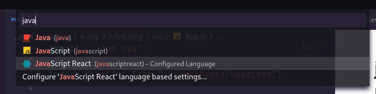
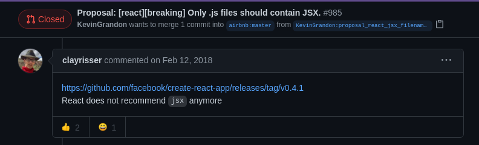
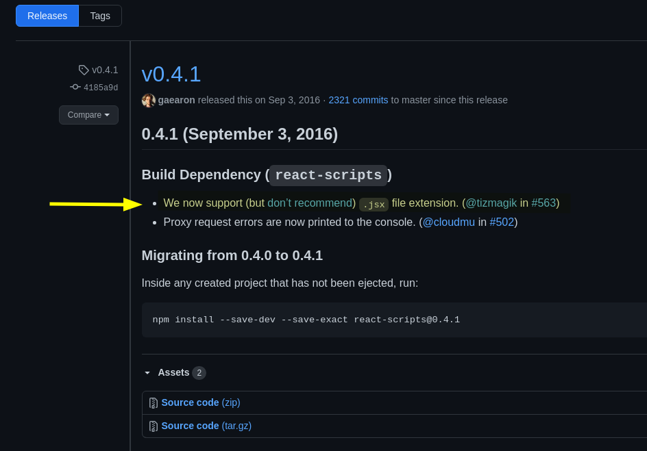
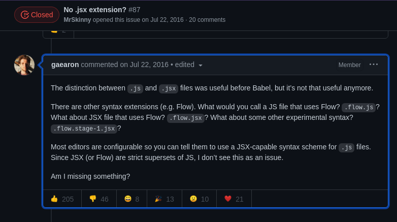
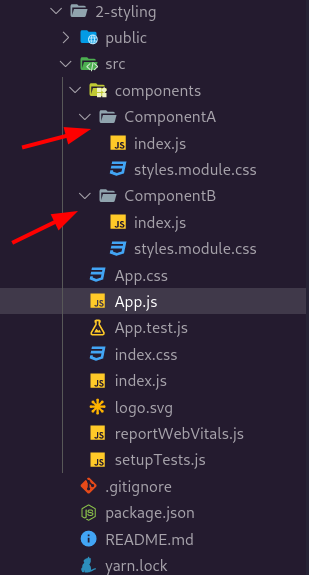

### `Kodluyoruz Earlybird Front-End Talent Bootcamp`

## `GÜN 4 - 2020.12.27`
> 

Bu bölümde;

- [Fetching Data from API and show those with React](#fetching-data-from-api-and-show-those-with-react)
- [js ile jsx arasındaki fark nedir?](#js-ile-jsx-arasındaki-fark-nedir)
- [`React.memo()`](#reactmemo)
- [React Styling and CSS](#react-styling-and-css)
  - [css module nedir?](#css-module-nedir)
  - [Css design systems](#css-design-systems)
  - [Ders içinde konuşulan diğer konular](#ders-içinde-konuşulan-diğer-konular)
    - [example](#example)
  - [Kaynakça](#kaynakça)

konularından bahsedeceğiz.

---

Temele git komutlarını özet şeklinde listeleyen faydalı bir kaynak (Türkçe) 
  - https://rogerdudler.github.io/git-guide/index.tr.html
  - https://rogerdudler.github.io/git-guide/files/git_cheat_sheet.pdf

# Fetching Data from API and show those with React
> **API'den Veri Almak ve React ile Olanları Göstermek**

Axios ile `https://jsonplaceholder.typicode.com/users` endponint'inden verileri çekip react ile ekrana yazdırmak istiyoruz.

Bunu operasyonu userList component'inde gerçekleştireceğiz. Bu sebeple App.js içinine userlist componentini tanımlayalım.

```js
// App.js

import "./App.css";

import UserList from "./components/UserList";

function App() {
	return (
		<div className="App">
			<UserList />
		</div>
	);
}

export default App;
```
Şimdi operasyonu yapacağımız componentin içini düzenleyelim.

```js
// UserList.js
import { useState, useEffect } from "react";

import Loader from "./Loader";
import UserListItem from "./UserListItem";
import axios from "axios";

function UserList() {
	const [loading, setLoading] = useState(true);
	const [users, setUsers] = useState([]);

	useEffect(() => {
		axios("https://jsonplaceholder.typicode.com/users")
			.then((res) => setUsers(res.data))
			.catch((e) => console.log(e))
			.finally(() => setLoading(false));
	}, []);

	return (
		<ul>
			<h1>Users</h1>
			<Loader text="Loading..." isVisible={loading} />

			{users.map((user) => (
				<UserListItem key={user.id} user={user} />
			))}
		</ul>
	);
}

export default UserList;
```

Burada endpointimizden verilerimizi componentler mount olduğunda çalışacak (tetiklenecek) bir **useEffect** içinde axios paketi yardımı ile çekiyoruz. Sonrasında aldığığmız verileri `users` isimli **state**'imiz içinde depoluyoruz.

`users` state'i içinde tuttuğumuz verileri map ederek; tekil verileri render edeceğimiz component olan `UserListItem` içine teker teker gönderiyoruz.

Şimdi `userListItem` componentine bir göz atalım.

```js
function UserListItem({ user }) {
	return (
		<li>
			{user.id} - {user.name} - @{user.username}
		</li>
	);
}

export default UserListItem;
```
Burada gelen tekil user'ların id name ve username'lerini list itemler halinde teker teker DOM'a gönderiyoruz. Mapde dönen tüm userlerın rendermesinden sonra DOM'da şöyle bir çıktı alıyoruz.


<p align="center">
    
    <br>
    <em>
        <a href="../practice4-day/1-fetching">Users data's rendering</a>
    </em>
</p>

---

# js ile jsx arasındaki fark nedir?

Github'da gezinirken bazı react projerlerde uzantıların normal js iken bazılarında jsx olarak yazılmış olduğunu görebilirsiniz. Bu farkın bi önemi var mı? .jsx ile js arasındaki fark nedir? Gelin bu sora bir cevap arayalım. 

vscode'da react componentlerinizi jsx uzatısı ile oluşturduğunuzda  fileicon'ları react logosu şeklini almakta. Öteyandan bazı tamamlamalar çalışmamakta. Js içinde html yazılmadığından h1 ya p gibi elementlerin tamamlamaları sadece .js yazdığınızda desteklenmiyor ama .jsx yazdığınızda destekleniyor.

Ben kendi kullanımda sırf bu sebeple başlarda hep jsx olarak dosyalarımı oluşturuyordum ya da vscode üzerinde bulunan change language mode ile js uzantısı ile oluşturduğum componet'lerde html tamamlamaları çalışsın diye her seferinde JavaScript React olacak şekilde o dosyanın dil modunu değiştiriyordum. Dediğim gibi eğer dosyanınz modunu jsx yaparsanız bu sorun zaten gündeme gelmiyordu. 


<p align="center">
    
</p>


<p align="center">
    
</p>

Ama sonrasında js uzantısı ile de istediğim html tamamlamalarını kullanabileceğim ve her seferinde language mod seçmemin gerekmeyeceği bir yöntem buldum. Yine vscode içide js uzantılı dosyalarıma react javascript ön tanımlı olarak davran şekilde bir ayar ile jsx ile js arasındaki farkı ben kendi dünyamda kaldırmış oldum.

<p align="center">
    
</p>

Peki bu fark niye var. Dikkatinizi çekerim burada js ya da jsx arasındaki fark kod çalışmıyor olduğundan falan değil. Sadece benim istediğim eklentilerin js olduğu zaman çalışamasından kaynaklıydı.

Şu ufak bir araştırma ile baktığımızda react jsx kullanabilirsiniz ama kullanmasanız daha iyi demiş. Aşağıya bıraktığım github issular üzerinden yapılmış konuşmaları irdeleyebilirsiniz. Ben kendimce dikkat çekenleri ve son noktaları ss'leyip linkledim.

<p align="center">
    
    <br>
    <em>
        <a href="https://github.com/airbnb/javascript/pull/985#issuecomment-364804411">React does not recommend jsx anymore</a>on Feb 12, 2018
    </em>
</p>

<p align="center">
    
    <br>
    <em>
        <a href="https://github.com/facebook/create-react-app/releases/tag/v0.4.1">We now support <strong>(but don’t recommend)</strong> .jsx file extension.</a> on Sep 3, 2016
    </em>
</p>

<p align="center">
    
    <br>
    <em>
        <a href="https://github.com/facebook/create-react-app/issues/87#issuecomment-234627904">The distinction between .js and .jsx files was useful before Babel, but it’s not that useful anymore.</a> on Jul 22, 2016
    </em>
</p>

<p align="center">
    
    <br>
    <em>
        <a href="https://github.com/facebook/create-react-app/issues/87#issuecomment-446254062">For future searchers: we support both .js and .jsx.</a> on Dec 11, 2018
    </em>
</p>

Tarayıcılar zaten jsx ile yazılan kodları direk çalıştıramazlar her türlü jsx kodu önce js kodlarına çevriliyor sonra çalıştırılıyor. Bu noktada jsx üzerinden direk çalışama gibi bir durum zaten mevcut değil.

> **A browser cannot execute JavaScript files containing JSX code. They must be first transformed to regular JS.** - [flaviocopes.com/jsx/](https://flaviocopes.com/jsx/)

Bu çevrilmeyi gerçekleştirken de kullanılan en yaygın yol babel ile çevirmeyi yapmak. Create react app'in varsayılanında da zaten babel kullanılmakta. Ama CRA kullanmak istemezseniz de babel'ı manuel olarak kurup kullanabilirsiniz.

Babel bu noktada sizin JSX syntax'ı ile yazdığınız kolay okunur js kodlarınızı yazması nispeteden daha karmaşık yalın js kodlarına dönüştürüyor.

```jsx
// with jsx sytanx
ReactDOM.render(
  <div id="test">
    <h1>A title</h1>
    <p>A paragraph</p>
  </div>,
  document.getElementById('myapp')
)
```
```js
// js
ReactDOM.render(
  React.createElement('div', { id: 'test' },
    React.createElement('h1', null, 'A title'),
    React.createElement('p', null, 'A paragraph')
  ),
  document.getElementById('myapp')
)
```

---

# `React.memo()`
> **https://reactjs.org/docs/react-api.html#reactmemo**

Component update olduğunda rerender edilmesini istemediğimiz alt componetlere tanımladığımız ve tekrar render edilmesini engellediğimiz performans nedenleri ile var olan bir araçtır.

```js
import "./App.css";

import { useState } from "react";
import Title from "./components/Title";

function App() {
	const [count, setCount] = useState(0);

	return (
		<div className="App">
			<h1>{count}</h1>
			<button onClick={() => setCount(count - 1)}>Decrease</button>
			<button onClick={() => setCount(count + 1)}>Increase</button>

			<hr />
			<Title text={count < 5 ? "Selam ben Title component" : "Yeni Başlık"} />
		</div>
	);
}

export default App;
```

Bu sayfaya baktığımızda count state'i her güncellendiğinde Virtual DOM bu component içinde bir farklılık olduğunu fark eder ve tüm component'i rerender eder.

Fakat biz bu component içindeki Title componetini tekarar render etmek istemezsek. Bu noktada react memo'dan faydalanabilriz.

```js
import { memo } from "react";

function Title({text}) {
	console.log("Title component re-render");
	return <h3>{text}</h3>;
}

export default memo(Title);
```
memo'yu react içinden çağırıyoruz ve export ederken memo ile birlikte export ediyoruz bu bu komponentden tasarruf edin manasına geliyor. 

```js
<Title text={count < 5 ? "Selam ben Title component" : "Yeni Başlık"} />
```
fakat app.js'deki bu ibareden ötürü count 5 den büyük olduğunda başka bir text içine gönderileceğinden bu component tekrar render edilecektir.

---

# React Styling and CSS
> **https://reactjs.org/docs/faq-styling.html**


## css module nedir?
> **https://css-tricks.com/css-modules-part-1-need/**

Sadece tek bir component için yazılan ve sonrasında render edilirken üretilen clas isimlerini uniuqe halde getiren bir yapı. Genel kullanım amacı css conflitchlerinin önüne geçmek.

css module'Ü kullanmak için ek bir şey kurmanıza gerek yok CRA (create react app) içinde otomatik olarak gelmekte.

<p align="center">
    
</p>

görüldüğü üzere her component için ayrı bir `styles.module.css` mevcut.

```js
import React from "react";

import styles from "./styles.module.css";

function ComponentA() {
	return (
		<div>
			<h1 className={styles.title}>Component A</h1>
			<p className={styles.description}>
				Lorem ipsum, dolor sit amet consectetur adipisicing elit. Est labore
				veritatis quidem quo voluptatum. Dolores earum corrupti dolore, debitis
				voluptate nisi, modi fuga alias tenetur quos voluptatem deserunt
				aspernatur tempore?
			</p>
		</div>
	);
}

export default ComponentA;
```

Burada örnek bir react module css kullanımı görülmekte.


## Css design systems

- https://chakra-ui.com/
- https://ant.design/
- https://tailwindcss.com/


..  
..  
..  
..  
..  
..  
..  

---


## Ders içinde konuşulan diğer konular 

### example 
> example
example

## Kaynakça 

1. https://reactjs.org/docs/react-api.html#reactmemo
2. https://css-tricks.com/css-modules-part-1-need/