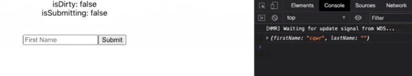
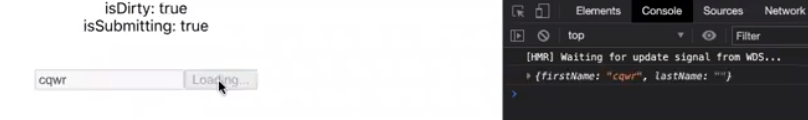
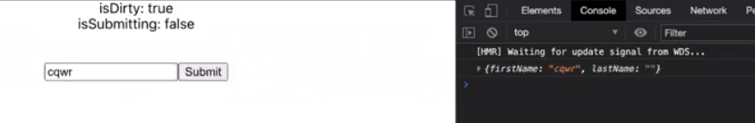
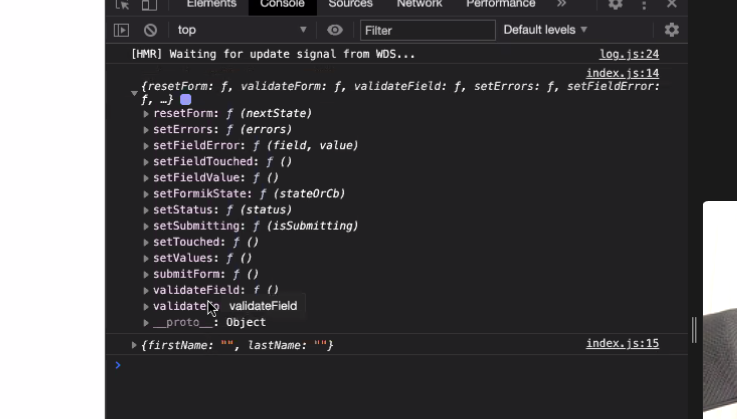
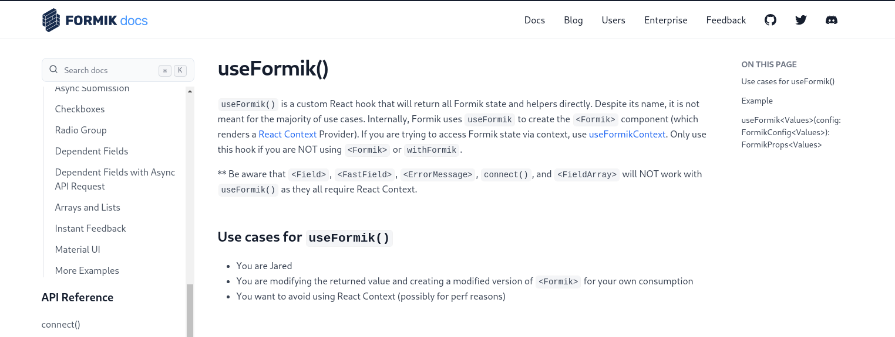
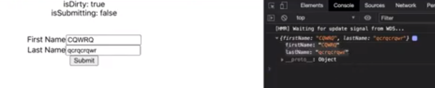
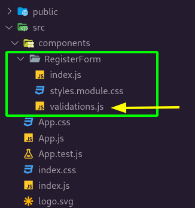
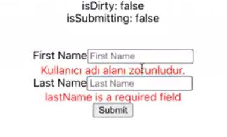
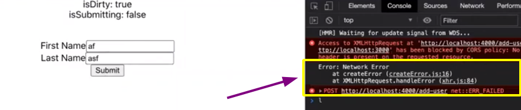
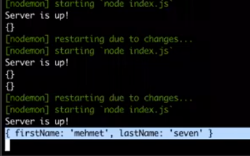

### `Kodluyoruz Earlybird Front-End Talent Bootcamp`

## `GÜN 5 - 2021.01.09`
> İlk backend'imizi hazırladık. 

Bu bölümde;

- [React Form Managment - Formik](#react-form-managment---formik)
- [Form Validation - Yupjs](#form-validation---yupjs)
- [System design paterns and concepts for WEB development](#system-design-paterns-and-concepts-for-web-development)
  - [Microservices vs Monolithic](#microservices-vs-monolithic)
  - [Monolotih apps and single page application apps](#monolotih-apps-and-single-page-application-apps)
  - [Dynamic Websites vs Static Pages vs Single Page Apps (SPAs)](#dynamic-websites-vs-static-pages-vs-single-page-apps-spas)
- [Formumuz için basit bir Backend yazıyoruz.](#formumuz-için-basit-bir-backend-yazıyoruz)
    - [cors](#cors)
  - [bodyparser](#bodyparser)
- [Ek bilgi](#ek-bilgi)
- [Kaynakça](#kaynakça)

konularından bahsedeceğiz.

---

> Ödev 2 örneğinde kullanılan js kütüphanesi "https://mavo.io/docs/js"

# React Form Managment - Formik

Formk, form işlemlerini yaparken bize yardımcı olan bir araçtır. Form işlemlerini manual olarak da yapmak pekala mümkündür. Manual stateler ile her input için tanımlar oluşturp bunu sağlayabiliriz fakat bi yerden sonra bu idare edilmesi zor hale gelmektedir. Bu sebplerden ötürü Formik gibi bu iş için özel oluşturulmuş araçlardan faydalanırız.

Gelin şimdi formik hakkında konuşalım.

```js
// Example - RegisterForm
import React from "react";

import { Formik } from "formik";

function RegisterForm() {
	return (
		<div>
			<Formik
				initialValues={{
					firstName: "",
					lastName: "",
				}}
				onSubmit={(values, bag) => {
					console.log(values);

          setTimeout{()=> {
            bag.setSubmitting(false )
          }, 1000}
				}}
			>
				{({ handleChange, handleBlur, handleSubmit, values, isSubmitting, dirty }) => (
					<form onSubmit={handleSubmit}>
            <div>isDirty: {dirty.toString()}</div>
            <div>isSubmitting: {isSubmitting.toString()}</div>
            <br/>
            <br/>
						<input
							id="firstName"
							name="firstName"
							placeholder="First Name"
							value={values.firstName}
							onChange={handleChange}
							onBlur={handleBlur}
							// disabled={isSubmitting}
						/>
						<button type="submit" disabled={isSubmitting}>
							{formik.isSubmitting ? "Loading..." : "Submit"}
						</button>
					</form>
				)}
			</Formik>
		</div>
	);
}

export default RegisterForm;
```

Burada örnek bir formik kullanımı görmektesiniz. 

```js
<Formik
  initialValues={{
    firstName: "",
    lastName: "",
  }}
```
`initialValues` içinde o form serisi içinde kullanacağımız field'ları yerleştiriyoruz bu alanda belirlediğimiz tanımlar ile inputlar içindeki `value`'lerIn aynı olması gereklidir.

```diff
<Formik
  initialValues={{
+		firstName: "",
    lastName: "",
  }}
  onSubmit={async (values) => {
    console.log(values);
  }}
>
  {({ handleChange, handleBlur, handleSubmit, values, isSubmitting }) => (
    <form onSubmit={handleSubmit}>
      <input
        id="firstName"
+			  name="firstName"
        placeholder="First Name"
        value={values.firstName}
        onChange={handleChange}
        onBlur={handleBlur}
        // disabled={formik.isSubmitting}
      />
```

<p align="center">
  
   <br>
	<em>initial</em>
</p>

<p align="center">
  
  <br>
	<em>while submitting</em>
</p>

<p align="center">
  
  <br>
	<em>after submitting</em>
</p>

**Nedir bu isDirty ve isSubmitting?**

`isDirty` input field'ın içi dolu mu boş mu bize onun değerini dönüyor. Bu sayede input field boşken submit button'u disabled edebiliriz. 

`isSubmitting` submit buton'a bastığımızda true oluyor gönderme işlemi bittikten sonra tekrar false oluyor. 

eğer input field içindeki `disabled` özelliğini isSubmitting'e göre ayarlarsanız gönderme işlemi esnasında input'u kitleyecektir.

```diff
	<input
    id="firstName"
    name="firstName"
    placeholder="First Name"
    value={values.firstName}
    onChange={handleChange}
    onBlur={handleBlur}
+   // disabled={isSubmitting}
  />
```

- bag içinde submitting esansında kullanabileceğimiz eşyalar var. "**Submitting çantası**"

<p align="center">
  
  <br>
	<em>bag</em>
</p>


> ## **Aslında bu formik'i kullanmanın uzun yöntemiydi.**

Formik hook'undan faydalanıp daha temiz sonuçlar elde edebiliriz.

<p align="center">
  
  <br>
	<em>
    <a href="https://formik.org/docs/api/useFormik">useFormik</a>
  </em>
</p>

```js
import React from "react";
import { useFormik } from "formik";

function RegisterForm() {
	const formik = useFormik({
		initialValues: {
			firstName: "",
			lastName: "",
		},
		onSubmit: (values, bag) => {
			console.log(values);

			setTimeout(() => {
				bag.setSubmitting(false);
			}, 1000);
		},
	});

	return (
		<div>
			<form onSubmit={formik.handleSubmit}>
				<div>isDirty: {formik.dirty.toString()}</div>
				<div>isSubmitting: {formik.isSubmitting.toString()}</div>
				<br />
				<br />
				<div>
					<label>First Name</label>
					<input
						id="firstName"
						name="firstName"
						placeholder="First Name"
						value={formik.values.firstName}
						onChange={formik.handleChange}
						onBlur={formik.handleBlur}
						disabled={formik.isSubmitting}
					/>
				</div>

				<div>
					<label>Last Name</label>
					<input
						id="lastName"
						name="lastName"
						placeholder="Last Name"
						value={formik.values.lastName}
						onChange={formik.handleChange}
						onBlur={formik.handleBlur}
						disabled={formik.isSubmitting}
					/>
				</div>

				<button type="submit" disabled={formik.isSubmitting}>
					{formik.isSubmitting ? "Loading..." : "Submit"}
				</button>
			</form>
		</div>
	);
}

export default RegisterForm;

```

<p align="center">
  
</p>


Bu gördüğümüz üzere daha temiz bir kullanım.


# Form Validation - Yupjs
> https://github.com/jquense/yup

Validation (doğrulama) işlemlerini bu örnekte `yup` ile yapacağız. Formik ile beraber çalışarak çok başarılı form tanımları yapabiliriz. 

<p align="center">
  
</p>

Validasyon tanımlarını o component içinde `validation.js` adında ayrı bir dosya içinde yapıyoruz.

```js
import * as yup from "yup";

const schema = yup.object().shape({
	firstName: yup.string().required("Kullanıcı adı zorunludur."),
	lastName: yup.string().required(),
	email: yup.string().email().required(),
	password: yup.string().min(5).max(10).required(),
	passwordConfirm: yup
		.string()
		.oneOf([yup.ref("password"), null], "Passwords must match"),
});

export default schema;
```

Örnek bir validasyon dosyası yukarda  mevcut. Buradaki tanımlar gibi girilen input'un değerlerini istediğiniz gibi şekillendirebilirsiniz.

<p align="center">
  
</p>

```diff
import React from "react";

import styles from "./styles.module.css";
import { useFormik } from "formik";
+ import validations from "./validations";

function RegisterForm() {
	const formik = useFormik({
		initialValues: {
			firstName: "",
			lastName: "",
		},
		onSubmit: (values, bag) => {
			console.log(values);

			setTimeout(() => {
				bag.setSubmitting(false);
			}, 1000);
		},
+   validationSchema: validations,
	});

	return (
		<div>
			<form onSubmit={formik.handleSubmit}>
				<div>isDirty: {formik.dirty.toString()}</div>
				<div>isSubmitting: {formik.isSubmitting.toString()}</div>
				<br />
				<br />
				<div>
					<label>First Name</label>
					<input
						id="firstName"
						name="firstName"
						placeholder="First Name"
						value={formik.values.firstName}
						onChange={formik.handleChange}
+						onBlur={formik.handleBlur}
						disabled={formik.isSubmitting}
					/>
+					{formik.errors.firstName && formik.touched.firstName && (
+						<div className={styles.error}>{formik.errors.firstName}</div>
+					)}
				</div>

				<div>
					<label>Last Name</label>
					<input
						id="lastName"
						name="lastName"
						placeholder="Last Name"
						value={formik.values.lastName}
						onChange={formik.handleChange}
+						onBlur={formik.handleBlur}
						disabled={formik.isSubmitting}
					/>
+					{formik.errors.lastName && formik.touched.lastName && (
+						<div className={styles.error}>{formik.errors.lastName}</div>
+					)}
				</div>

				<button type="submit" disabled={formik.isSubmitting}>
					{formik.isSubmitting ? "Loading..." : "Submit"}
				</button>
			</form>
		</div>
	);
}

export default RegisterForm;

```

```js
		{formik.errors.firstName && formik.touched.firstName && (
						<div className={styles.error}>{formik.errors.firstName}</div>
    )}
```
Bu kullanım ile **yup**'un bizim için belirlediği hata mesajlarını ekrana basıyoruz. `touched` imput'a dokunmak şartı ile çalışmasını sağlıyor. 

onBlur'da aynı amaca hizmet ediyor. Burada kullanıcı input'a veri girerken onu rahatsız etmeden input'dan ayrıldıktan sonra onu uyarmak!.

---

# System design paterns and concepts for WEB development
## Microservices vs Monolithic

[Microservices vs Monolithic](https://sterling.com/microservices-vs-monolithic/) - September 10, 2020 - Sterling

## Monolotih apps and single page application apps

[Single page application: from monolithic to modular](https://medium.com/thron-tech/single-page-application-from-monolithic-to-modular-c1d413c10292) - Oct 9, 2018 - Alessandro Grosselle

[Bir Sistem Birçok Platformda Nasıl Çalışıyor? Web-iOS-Android](https://www.youtube.com/watch?v=sgoSGVNmCps&t=455s) - Jan 11, 2021 - Uğur Arıcı

[SPAs vs MPAs/MVC - Are Single Page Apps always better?](https://www.youtube.com/watch?v=F_BYg2QGsC0) - Jul 25, 2017 - Academind


> - SPA ile MVC'yi kıyaslamak pek doğru değil. SPA MVC gibi bir sistem mimarisi değil. Bu sebeple kıyaslamayı şu şekild sürdürmek lazım. SPA vs MPA (Multi page applications)
> - SPA - Angular, React, Vue
> - MPA - Laravel, Rails, Node-Express

> - [Newyork times](https://www.nytimes.com/) bir MPA uygulama neden mi? Çünkü her linke bastığımızda sayfa yenileniyor baştan yapılandırıylıyor. Girdiğimiz her sayfa için serverdan yeni verileri çekiyor ve her seferinde sayfayı bizim için yüklüyor.

> - Ama [angular](https://angular.io/)'ın sitesi SPA bir uygulama nerden anlıyoruz sayfa hiç yenilenmeden içinde değişklikler yapıyor serverden bir seferde ihtiyacı olan her şeyi indiriyor ve sonrasında local'de onu kullanarak bize sayfalar üretiyor.

> - SPA'lere örnek olarak google ads, slack bu uygulamalar bu özelliklerinden dolayı sanki bir masa üstü program gibi çalışıyorlar.
> - SPA'lerde SEO büyük sorun yaratıyor. Her şeyi js ile ürettiğimiz için bunu arama motorların anlaması pek de kolay olmuyor.
> - Ve SPA'ler çalışmak için js'e gebeler js olmadan çalışmları mümkün değil.
> - Daha çok yeni versiyon tarayıcılar uygunlar eski versiyonlarda çalışmama ihtimallleri çok yüksek.

> - MPA'ler eski nesil tarıyıcı desteği daha iyi.
> - SPA'lere göre sayfa açma hızları daha yavaş.
> - SEO için çok daha ideal.

> [Bu yazı](https://clockwise.software/blog/single-page-applications-are-they-a-good-choice-for-your-project/) aradaki farkı gerçekten çok iyi özetlemiş. Burada  ufak bir SPA uygulama yapmak için [kaynak](https://www.youtube.com/watch?v=wR42ApafA0U) bırakıyorum.

[Common web application architectures](https://docs.microsoft.com/en-us/dotnet/architecture/modern-web-apps-azure/common-web-application-architectures%20) - 12/01/2020 - Microsoft  
[Common client-side web technologies](https://docs.microsoft.com/en-us/dotnet/architecture/modern-web-apps-azure/common-client-side-web-technologies) - 12/01/2020 - Microsoft
 
## Dynamic Websites vs Static Pages vs Single Page Apps (SPAs)
> [Dynamic Websites vs Static Pages vs Single Page Apps (SPAs)](https://www.youtube.com/watch?v=Kg0Q_YaQ3Gk)- Apr 16, 2019 - Academind

---
# Formumuz için basit bir Backend yazıyoruz.
### cors

3000 portundan(client) 4000 portuna(server) istek yaparken backend'imiz bize izin vermedi.

<p align="center">
  
</p>

Bu sorunu çözmek için CORS adında bir paketi (middleware'ı) backend serverimizie kurmamzı gerekiyor.

```diff
const express = require("express");
+ const cors = require("cors");

const app = express();

+ app.use(cors());

app.get("/users", (req, res) => {
	res.json([{ name: "Mehmet" }, { name: "Ahmet" }]);
});

app.post("/add-user", (req, res) => {
	res.json(req.body);
});

app.listen(4000, () => console.log("Server is up!"));

```

<p align="center">
  
</p>

## bodyparser
Request'de gelen body'de gelen verileri anlamlı şekilde kılmamıza yarıyan ara katman.

Request ile response arasında bulunan bir middleware.

[How bodyParser() works](https://medium.com/@adamzerner/how-bodyparser-works-247897a93b90) - Jul 2, 2015 - Adam Zerner

> You need to use bodyParser() if you want the form data to be available in req.body.

- [Express JS— body-parser and why may not need it](https://medium.com/@mmajdanski/express-body-parser-and-why-may-not-need-it-335803cd048c) - May 24, 2019 - Michael Majdanski

  - Express 4.16+ sürümünden sonra bodyparser express içine de konmuş. 
```diff
- app.use(bodyparser.json()); //utilizes the body-parser package

+ app.use(express.json()); //Used to parse JSON bodies
```

https://www.youtube.com/watch?v=nySS7ILaSQU olaynı alamak için izlenebilir.

```diff
const express = require("express");
const cors = require("cors");
+ const bodyParser = require("body-parser");

const app = express();

app.use(cors());
+ app.use(bodyParser.json());

app.get("/users", (req, res) => {
	res.json([{ name: "Mehmet" }, { name: "Ahmet" }]);
});

app.post("/add-user", (req, res) => {
	res.json(req.body);
});

app.listen(4000, () => console.log("Server is up!"));
```

bu adımlardan sonra formya yazdığımız veri backend serverimizin console'una düşütü. Yani veriyi backend'imize aktardık.

<p align="center">
  
</p>

Bu noktadan sonra elimize gelen bu veri ile istediğimiz her şeyi yapabiliriz. Bir database'e yazabiliriz bu veriyi manupile edebiliriz.

--- 
# Ek bilgi

- Hasura Türk developer eğitim 
  - [https://www.youtube.com/watch?v=lrYo_n-9LM8&t=0s](https://www.youtube.com/watch?v=lrYo_n-9LM8&t=0s)

---
# Kaynakça 

1. 
