### `Kodluyoruz Earlybird Front-End Talent Bootcamp`

## `GÜN 6 - 2021.01.10`
> 

Bu bölümde;

- [Fronted için deployment servisleri](#fronted-için-deployment-servisleri)
  - [Surge.sh](#surgesh)
  - [Netlify](#netlify)
    - [Custom DNS](#custom-dns)
    - [Netlify Redirect Hatası çözümü](#netlify-redirect-hatası-çözümü)
    - [ParcelJS Nedir?](#parceljs-nedir)
- [Backend Deployment](#backend-deployment)
  - [Digitalocean](#digitalocean)
    - [pm2](#pm2)
    - [Bu kodda bir güncelleme yapmak istersek nasıl yapabiliriz?](#bu-kodda-bir-güncelleme-yapmak-istersek-nasıl-yapabiliriz)
    - [Port ile ilgili bir sorunumuz oluyor mu 4000 portu dışında bir yerde çalışmasını nasıl sağlayabiliriz? - `Nginx`](#port-ile-ilgili-bir-sorunumuz-oluyor-mu-4000-portu-dışında-bir-yerde-çalışmasını-nasıl-sağlayabiliriz---nginx)
    - [Neden bu port yönlendirmesini yaptık?](#neden-bu-port-yönlendirmesini-yaptık)
    - [Özet](#özet)
    - [Bu deployment işlemlerini otomatize hale getirmek için](#bu-deployment-işlemlerini-otomatize-hale-getirmek-için)
    - [Bir backend server ayakta tutmak için ne kadar kapasitede bir sunucuya ihtiyacımız var?](#bir-backend-server-ayakta-tutmak-için-ne-kadar-kapasitede-bir-sunucuya-ihtiyacımız-var)
  - [Heroku deployment](#heroku-deployment)
    - [Port sorunu](#port-sorunu)
    - [Github Heroku deploy entegrasyonu](#github-heroku-deploy-entegrasyonu)
- [Travis CI ve Heroku Entegrasyonu](#travis-ci-ve-heroku-entegrasyonu)
  - [travis-ci.com vs travis-ci.org](#travis-cicom-vs-travis-ciorg)
  - [Bir test yazalım](#bir-test-yazalım)
- [Contex API](#contex-api)

konularından bahsedeceğiz.

---

# Fronted için deployment servisleri

Ürettiğimiz React projelerimizi internete açmak istediğimiz zaman bu projeleri uzak bilgisayarlarda her zaman çalışacak şekilde servis etmeliyiz. Bu işi yaparken kendi bilgisayarımızdan ngix gibi servisler ile bunu çözbilsek de 7/24 bilgisayarımızı bu işe ayıracamayağımızdan bu işi yapabilceğimiz servislere yöneliyoruz. Şimdi bu servislerden bir kaçını göreceğiz. 

> **Amaç React projemiziden çıkan build dosyasını yayınlamak.**

## Surge.sh
> **https://surge.sh/**

- Surge İle deploy yapmadna önce manuel build almamız gerekiyor.
- Kullanımı gayet basit.

<p align="center">
  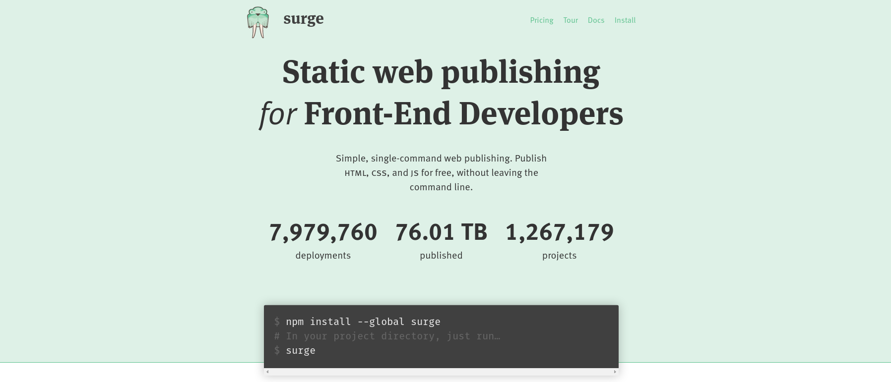
</p>

<p align="center">
  
</p>

## Netlify

Netlify'a tüm github repolarınıza erişsin diye izin verebilirsiniz. Ama isterseniz sadece istediğiniz repolara erişimini de sağlayabilirsiniz.

<p align="center">
  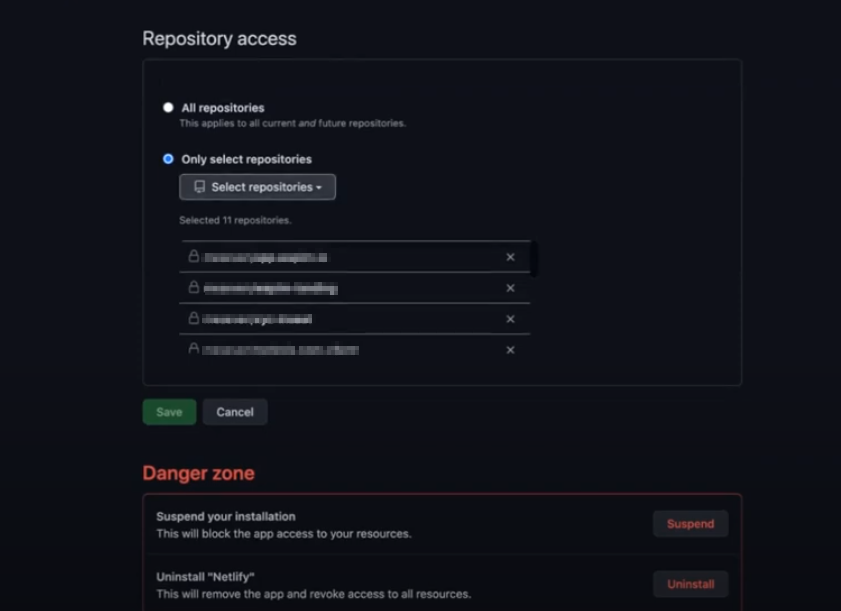
</p>

Netlifay'a izin verdiğiniz repolar sizin için listelenecek istediğiniz repoyu seçip ilerleyebilirsiniz.

<p align="center">
  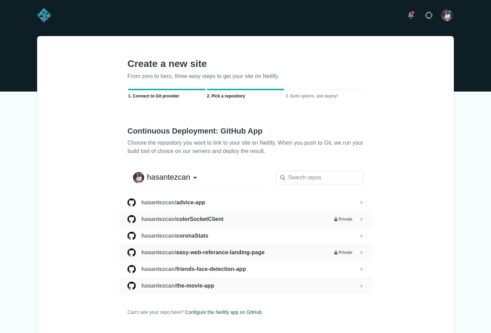
</p>

Projeneizi build etmek için kullandığınız komudu buraya girebilirsiniz ama genellikle default olan sizin işinizi görecektir.

<p align="center">
  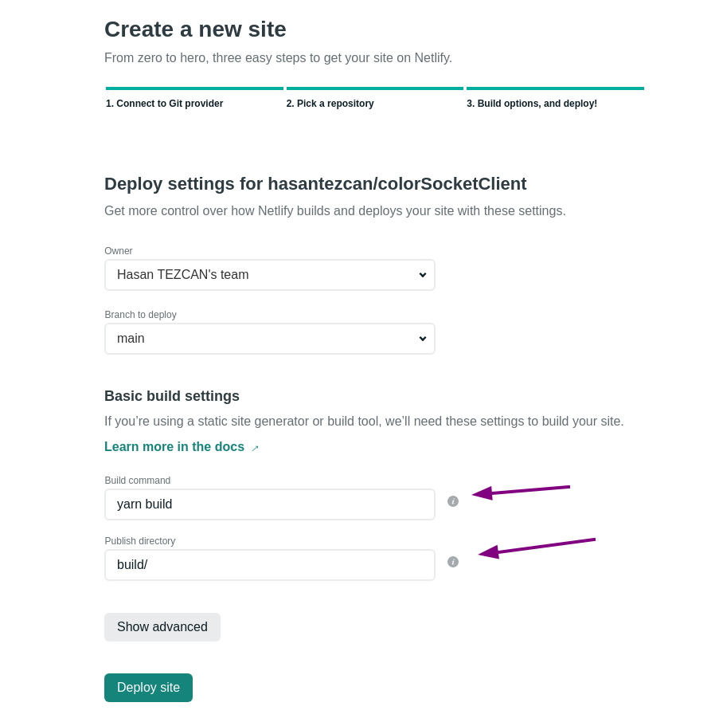
</p>

Projenizde kullnadığınız ENV variable'ları da buraya ekeleyebilirsiniz.

<p align="center">
  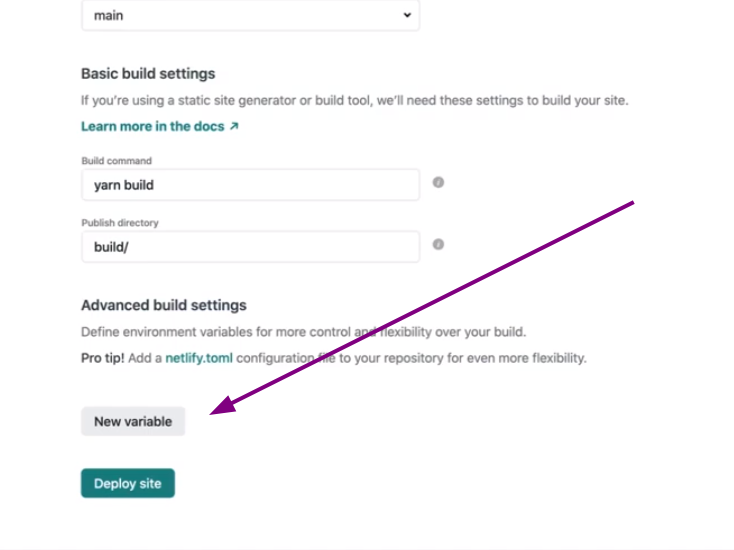
</p>

<p align="center">
  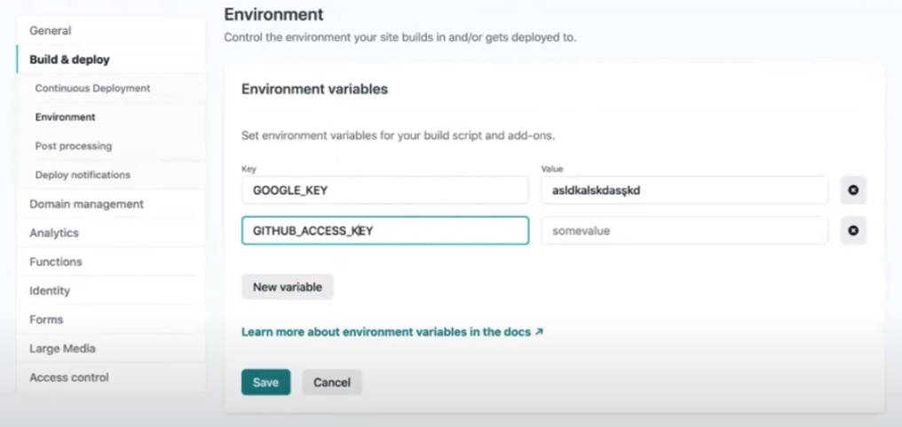
</p>

Bu işlem de bittikten sonra ilk deployunuz alınmaya başlayacak. Bundan sonrasında siz her commit attıktan sonra sizin için yeni bir deploy alıp paylaşılacak. Yapılan her deployun live halini de netlify üzerinde bulabilirsiniz.

<p align="center">
  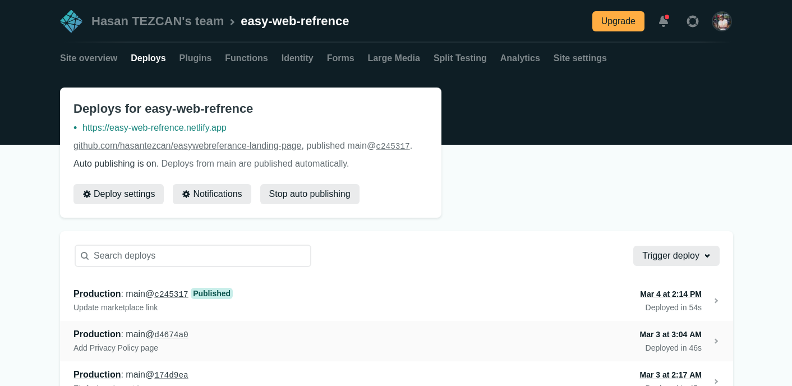
</p>

Ayrıca github üzerinde deployment durumlarını da sizin için monitör ediyor olacak.

<p align="center">
  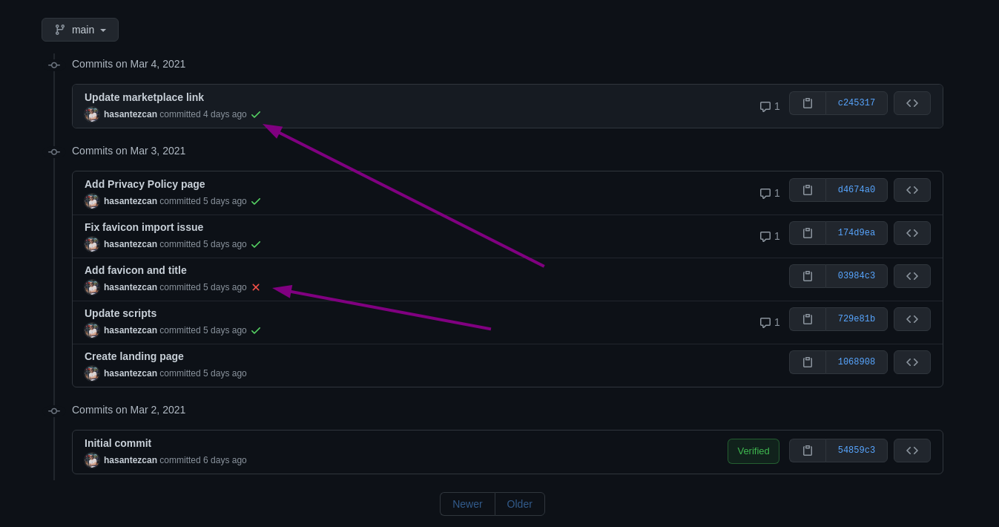
</p>

Ayrıca deployment'larınzdan custom olarak bildirim almak için de çözümleri mevucut.

<p align="center">
  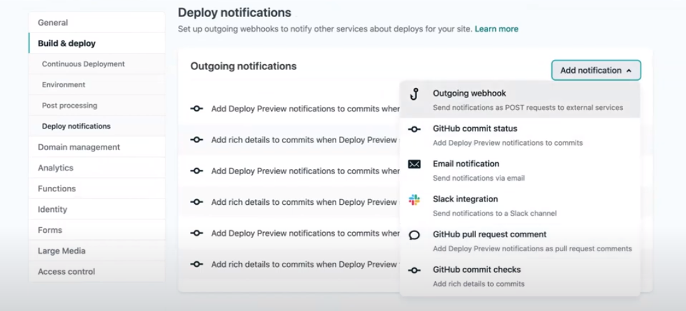
</p>

Web hook denemesi yapmak için kullanabilceğiniz bir servis. [**Hookbin**](https://hookbin.com/2qjGVgnMPOH9BBKGpZzp)

Bu servis ile webhook'ları test edebiliyoruz.

<p align="center">
  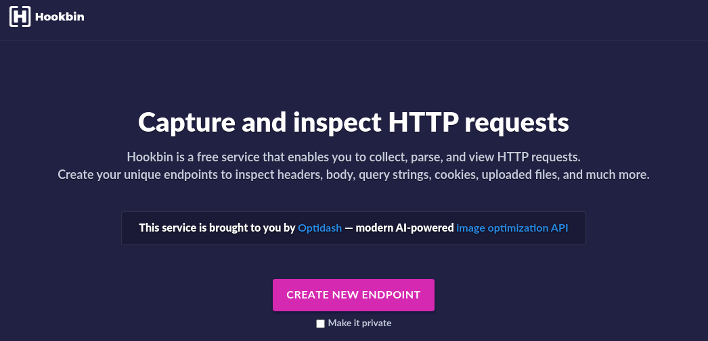
</p>

### Custom DNS

Netlify üzerine paylaşılan deploy'ları kendi domainiz içinde gösterebilirsiniz. Yapmanız gereken tek şey domain'inize gerekli DNS kaydlarını eklemek.

<p align="center">
  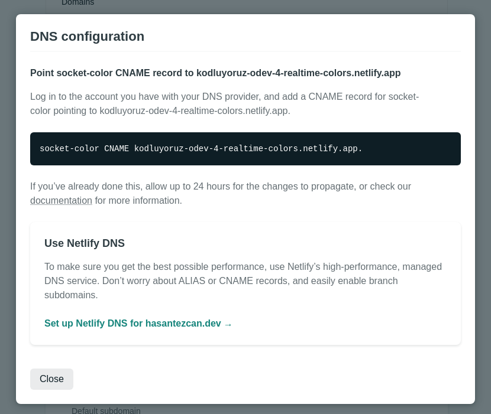
</p>

<p align="center">
  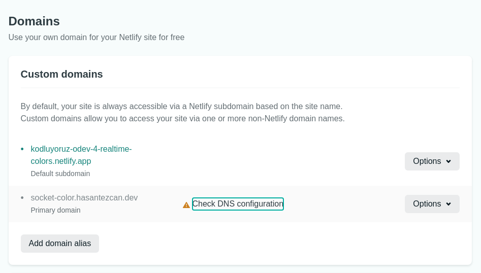
</p>

<p align="center">
  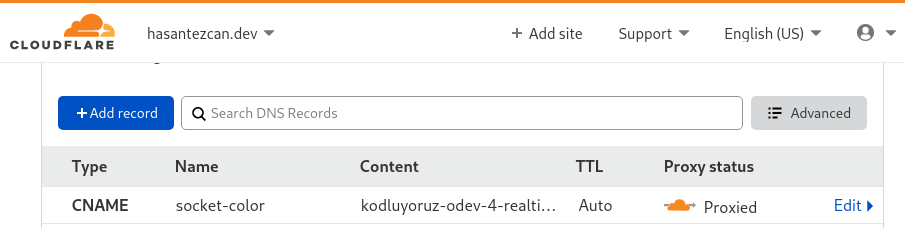
</p>

### Netlify Redirect Hatası çözümü

- https://github.com/netlify/cli/issues/794


### ParcelJS Nedir?
> **https://parceljs.org/**

Daha optimize deployment almamıza yarayan bir araç.

<p align="center">
  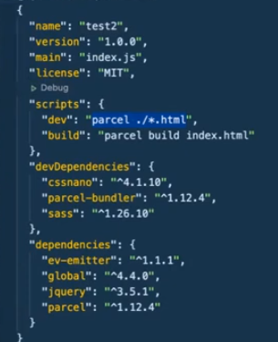
</p>

> **Adem ilter'in konu ile ilgili [`anlatım videosu.`](https://www.youtube.com/watch?v=D2dDbhWNBII)**


# Backend Deployment

## Digitalocean

Şimdi dün oluşturmuş olduğumuz backend'imizi digitalocean üzerine yükleyeceğiz. (deploy edeceğiz.)

Bunu yapmak için önce digitalocean üzerinden bir droplet açmamız gerkiyor. Bu kısımda en düşük opsiyonlar ile bir sunucu ayağa kaldırıyoruz. 

<p align="center">
    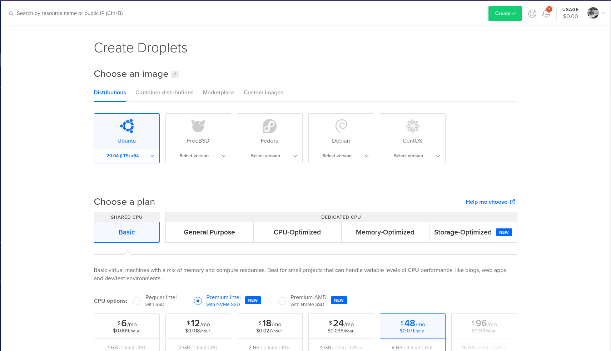
    <br>
    <em>5 dolarlık sunucuyu seçiyoruz.</em>
</p>

`ubuntu s` adında bir droplet hazırladık şimdi bu sunucu üzerinde çalışmaya başlayacağız.

<p align="center">
    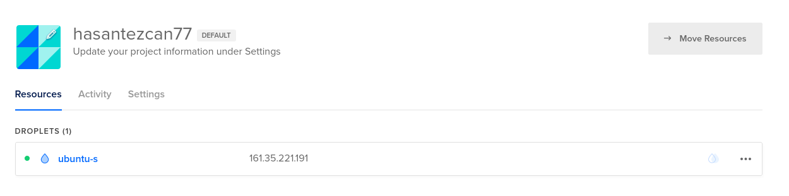
    <br>
    <em></em>
</p>

Dropletimizin ip'sine ssh ile terminal üzerinden şu şekilde bağlanıyoruz.

```bash
ssh root@161.35.221.191
```
Sunucumuz içinde `nodejs` kurulu değil.

<p align="center">
    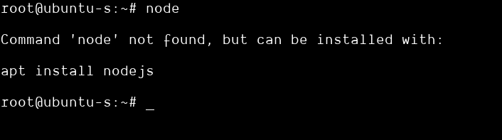
    <br>
    <em></em>
</p>

Sunucumuz içine nodejs'si kuruyoruz.

Kurulumu [buradaki](https://github.com/nodesource/distributions/blob/master/README.md#:~:text=Node.js%20v14.x:) referans ile gerçekleştiriyoruz 

```bash
# Using Ubuntu
curl -fsSL https://deb.nodesource.com/setup_14.x | sudo -E bash -
sudo apt-get install -y nodejs
```

Bu adımlardan sonra sunucumuz üzerindeh hem `node` ve hem de `npm` var olmuş oluyor.

```bash
root@ubuntu-s:~# npm -v
6.14.11
root@ubuntu-s:~# node -v
v14.16.0
```

Şimdi deploy etmek istediğimiz dosyaları sunucumuza yüklüyoruz. Yükleme işlemini yaparken git ile isteneilen repo clone edilebilir.

Ardından `npm install`'ı çalıştırarak gerekli paketleri sunucumuza kuruyoruz.

<p align="center">
    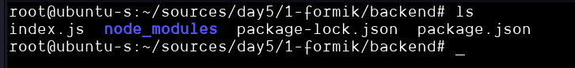
    <br>
    <em></em>
</p>

```bash
node index.js 
```
diyerek serverimizi çalıştırıyoruz. 

<p align="center">
    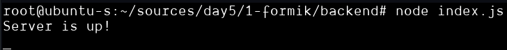
    <br>
    <em></em>
</p>

Test edelim...

<p align="center">
    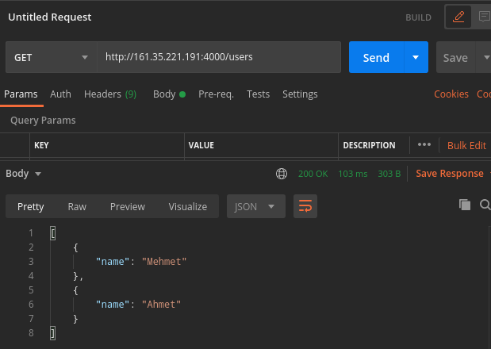
    <br>
    <em></em>
</p>

Evet sunucumuz çalışmakta.

***

### pm2

Fakat bi sorun var biz uzak sunucudan bağlantımızı kesince server çalışmayı durduracak. Bu durumun önüne geçmek için kullancağımız aracın ismi [**`pm2`**](https://pm2.io/)

Bu araç ile birlikte sunucudan çıksanız (terminal'i kapatsanız) bile görevler arka planda çalışamaya devam ediyorlar.

> pm2'yu kuruyoruz.

```bash
npm i -g pm2
```
- **`pm2 start index.js`** dediğimizde çalışmaya başlıyor

<p align="center">
    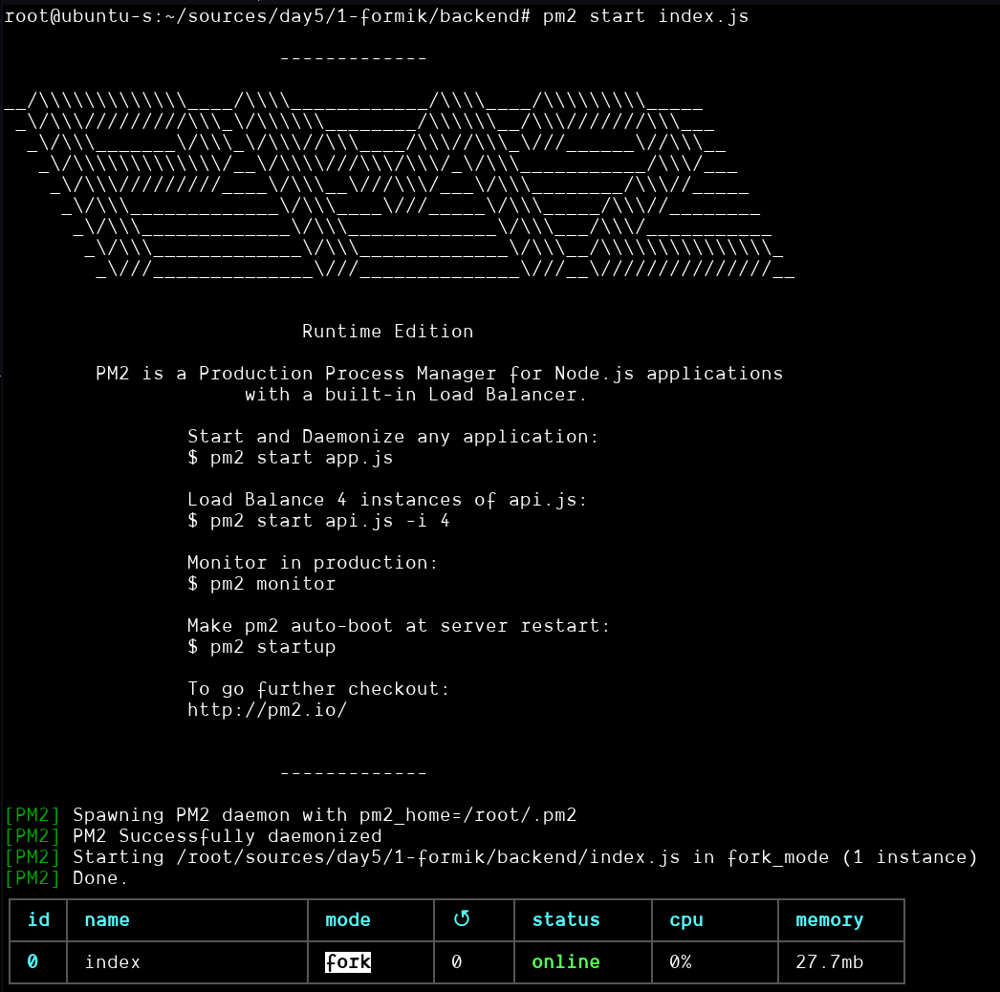
    <br>
    <em></em>
</p>

- **`pm2 status`** ile de o an çalışan prosessleri görebiliyorsunu.

<p align="center">
    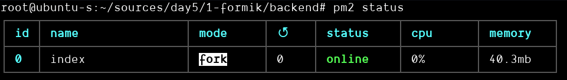
    <br>
    <em></em>
</p>

<p align="center">
    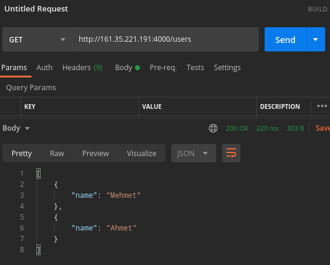
    <br>
    <em></em>
</p>

> **görüldüğü üzere hala çalışıyor.**


- **`pm2 logs`**
> servermizde alakalı bir log tuyor olacağız

<p align="center">
    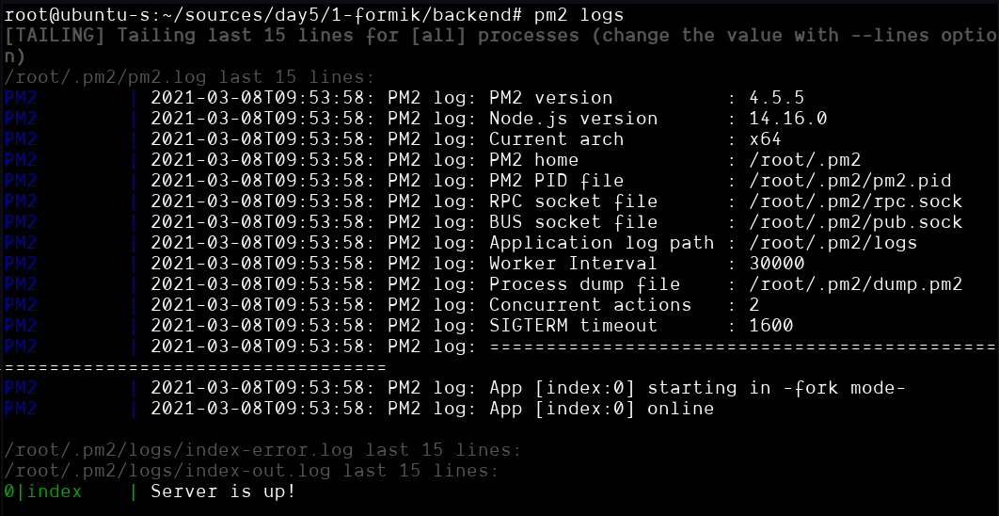
    <br>
    <em></em>
</p>

- **`pm2 stop index.js`**
> **process'i durdurmak istersek**

<p align="center">
    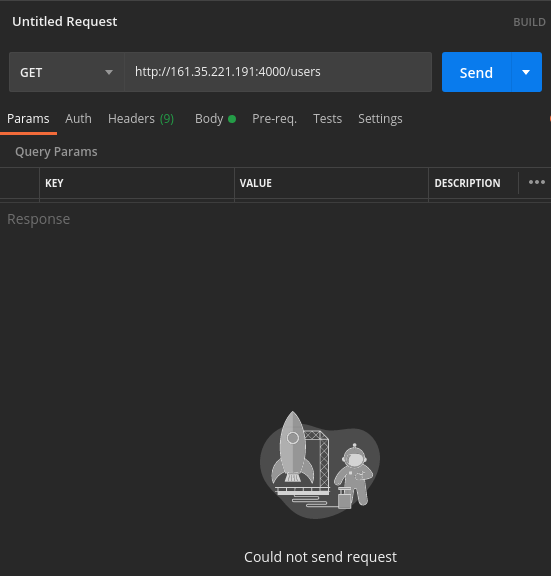
    <br>
    <em></em>
</p>

- **`pm2 start index.js --name prod`**  
> **bu şekilde tanımladığımızda farklı bir isimle görüntüleyebliyorz.**

<p align="center">
    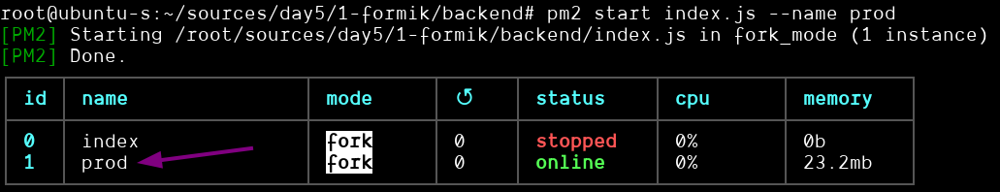
    <br>
    <em></em>
</p>


eğer kullanmadığınız process'leri silmek isterseniz; 

**`pm2 delete index`**
> **index = processin ismi**


<p align="center">
    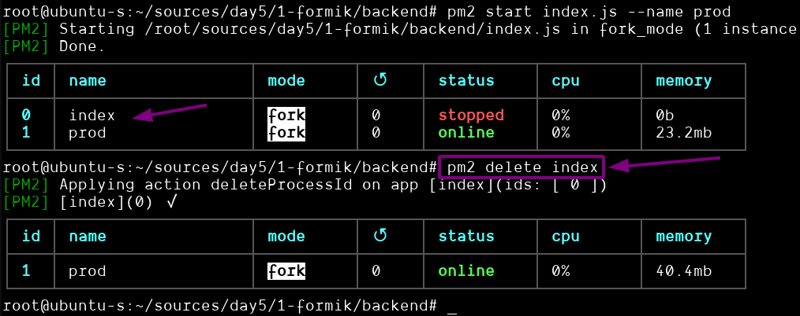
    <br>
    <em></em>
</p>


### Bu kodda bir güncelleme yapmak istersek nasıl yapabiliriz?

Ya kodu tekrar clone etmek gerekir ya da github actions ile bir otomasyon kurup kodunuz buraya otomatik olarak deploy edilmesini sağlayabiliriz.

### Port ile ilgili bir sorunumuz oluyor mu 4000 portu dışında bir yerde çalışmasını nasıl sağlayabiliriz? - `Nginx`

burdada bir reverse proxy kullanmamız gerek
 80 (http defautl port) protuna gelen istekleri 4000 portundan karşılamaız gerekiyor bunu **`nginx`** kullanarak halledebiliriz.

```bash
sudo apt install nginx
```
> [how-to-install-nginx-on-ubuntu](https://www.digitalocean.com/community/tutorials/how-to-install-nginx-on-ubuntu-18-04)

* nginx'i kurduktan sonra

<p align="center">
    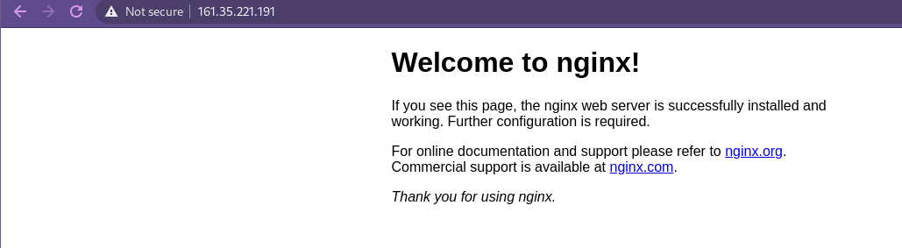
    <br>
    <em></em>
</p>

serverimizin (4000 portu) default path'de (80 portu) çalışmasını istiyoruz. Bunu yapabilmek için bir ayar yapmamız gerekiyor.


```bash
vi /etc/nginx/sites-available/default
```
> [how-to-set-up-a-node-js-application-for-production-on-ubuntu-16-04](https://www.digitalocean.com/community/tutorials/how-to-set-up-a-node-js-application-for-production-on-ubuntu-16-04)

> proxy o gibi davran demek

```bash
. . .
    location / {
        proxy_pass http://localhost:4000;
        proxy_http_version 1.1;
        proxy_set_header Upgrade $http_upgrade;
        proxy_set_header Connection 'upgrade';
        proxy_set_header Host $host;
        proxy_cache_bypass $http_upgrade;
    }
}
```
`/etc/nginx/sites-available/default` dosyası içindeki `location kısmını` bu şekidle güncelledik.

> https://gist.github.com/meseven/1bf1b903bd2c30e84d561ed889ce6698


```bash
root@ubuntu-s:~/sources/day5/1-formik/backend# nginx -t
nginx: the configuration file /etc/nginx/nginx.conf syntax is ok
nginx: configuration file /etc/nginx/nginx.conf test is successful
```

bir sorun var mı diye test ettik.

bu noktada nginx'i restart etmemiz gerek 

```bash
service nginx restart
```

ardından default port'da uygulamamızın çalıştığını görmekteyiz. 


<p align="center">
    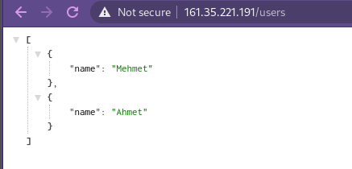
    <br>
    <em></em>
</p>


### Neden bu port yönlendirmesini yaptık?

DNS servisine 4000 portu ile bir A kaydı girmemiz mümkün olmadığından serverimizin 8080 yani default http portunda çalışmasını sağladık.


### Özet 

1- Digitalocean üzerinden bir droplet oluşturduk.

2- NodeJs'i sunucumuza yükledik.

3- Github'dan projeyi sunucumuz'a çektik. Ve npm paketlerinin kurulumunu yaptık.

4- Projeyi orda ayağa kaldırdırk. Serverimiz çalışıyordu.

5- Serverimiz sadece terminalimiz ayaktaiken çalışıyordu.

6- Bu sorunu gidermek için de pm2 adlı aracı kuruduk. Bu sayede server arka planda çalışabilir hale geldi.

5- Serverimiz 4000 protunda çalışıyordu bunu çözmek için ng

6- Bunu çözmek için nginx'i kurduk ve sunucumuzu default portu 4000 portuna yönlendirdik.


### Bu deployment işlemlerini otomatize hale getirmek için 

> https://dev.to/chathula/how-to-set-up-a-ci-cd-pipeline-for-a-node-js-app-with-github-actions-32h0

### Bir backend server ayakta tutmak için ne kadar kapasitede bir sunucuya ihtiyacımız var?

Buna deneme yanılma yöntemi ile karar verebilirsiniz. Digitalocean üzerinde sistemi monitör edebilir ve aşırıya kaçan noktalarada dikey bir genişlemeye gidebilirsiniz.

Ayrıca yatay genişleme yapmak için optimizasyona başvurabilirsiniz.
**Load blancer**'lar sizin bu noktada işinizi görecektir.

> https://mehmetseven.net/nginx-ve-nodejs-ile-load-balancing/

> Bu konu ile ilgili load balencer algoritmaları incelenebilir. (Round robin algoritması bknz açıklamsı: [hasantezcan.dev/round robin algoritması](https://hasantezcan.dev/blog/cpu-scheduling.html#:~:text=4.%20Round%20Robin%20Scheduling,%20%22RR%22))

----

## Heroku deployment
> **https://devcenter.heroku.com/articles/deploying-nodejs**  

Heroku ile yapcağımız deployment'ler nispeten digitalocean'a göre daha kolayca gerçekleşecektir.  

İçinde sadece backend'imizin buldunğu bir repo ile işe koyuluyoruz.

### Port sorunu

<p align="center">
    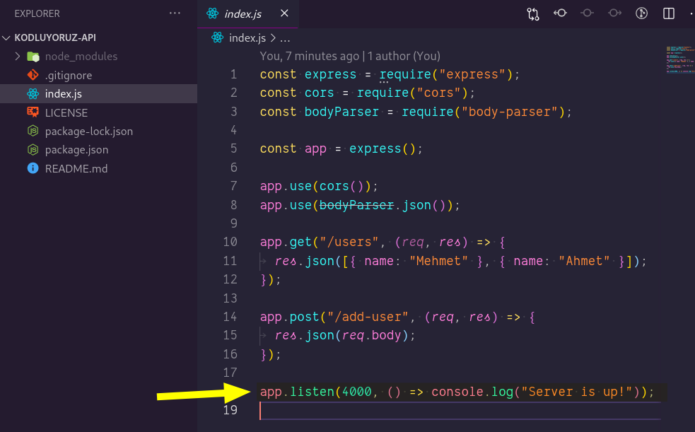
    <br>
    <em></em>
</p>

Bu hali ile deployment işlemini yaptığımızda heroku bize **"application error"** verecektir. Bunun sebebi projeyi hangi portta ayağa kaldıracağını bilememsidir. Yapacağımız güncelleme ile birlikte eğer bir ortam değişkeni varsa onu kullan yoksa 3000 portunu kullanması gerektiğini söyleyeceğiz.

```js
app.listen(process.env.PORT || 3000, () => console.log("Server is up!"));
```

<p align="center">
    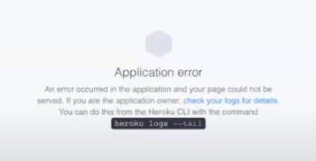
</p>

Bu hatayı çözdükten sonra deployment işlemine başlıyoruz.   
Herokuya deployment yapmanın iki yolu mevcut biri direk `CLI` üzerinden biri de `GUI` üzerinden. Biz şimdi bu örnekte `CLI` üzerinden bu işlemlere devam edeceğiz. 

Öncelikle herokuya login olmamız gerek. 
> Tabi önce bilgisyarınıza `herokunun CLI` uygulamasını yüklemelisiniz.   
> 
Ardından komut satırına;

```bash
heroku login
```

diyoruz ve bizi bir web sayfasına yönlendriyor ve oradan login olmamızı istiyor bu noktadan sonra login olmuş şekilde kendi hesabımız ile çalışabileceğiz.

<p align="center">
    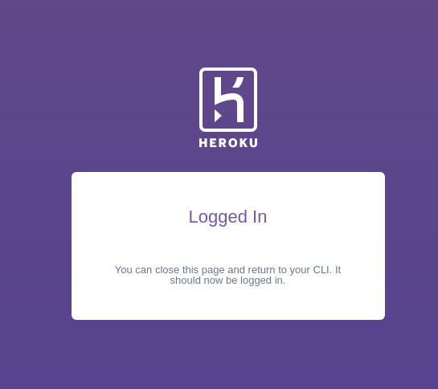
</p>

Ardından bu uygulamanın heroku içinde çalışabilmesi için bir app oluşturmamız lazım bunu yaparken terminal'e

```bash
$ heroku create
Creating app... done, ⬢ stormy-caverns-47195
https://stormy-caverns-47195.herokuapp.com/ | https://git.heroku.com/stormy-caverns-47195.git
```

yazıyoruz ve o bizim için gerekli tüm kurumları ayarlıyor.

Bize verdiği aderese gittiğimizde boş bir heroku projesi görmekteyiz 

<p align="center">
    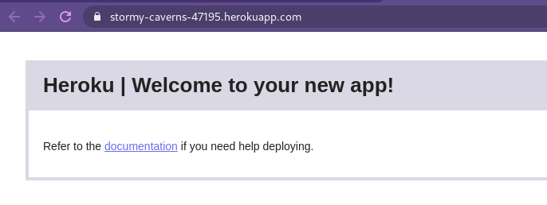
    <br>
    <em></em>
</p>

Bu arada bu adımı direk GUI izerinden de yapabilirdik.

<p align="center">
    
    <br>
    <em></em>
</p>

Gördüğümüz üzere şu an ayakta olan sadece boş bir proje şimdi kodlarımızı buraya göndermemiz gerekli.

```bash
$ git push heroku main

Enumerating objects: 13, done.
Counting objects: 100% (13/13), done.
Delta compression using up to 8 threads
Compressing objects: 100% (12/12), done.
Writing objects: 100% (13/13), 7.40 KiB | 2.47 MiB/s, done.
Total 13 (delta 3), reused 4 (delta 0), pack-reused 0
remote: Compressing source files... done.
remote: Building source:
remote: 
remote: -----> Building on the Heroku-20 stack
remote: -----> Determining which buildpack to use for this app
remote: -----> Node.js app detected
remote:        
remote: -----> Creating runtime environment
remote:        
remote:        NPM_CONFIG_LOGLEVEL=error
remote:        NODE_VERBOSE=false
remote:        NODE_ENV=production
remote:        NODE_MODULES_CACHE=true
remote:        
remote: -----> Installing binaries
remote:        engines.node (package.json):  unspecified
remote:        engines.npm (package.json):   unspecified (use default)
remote:        
remote:        Resolving node version 14.x...
remote:        Downloading and installing node 14.16.0...
remote:        Using default npm version: 6.14.11
remote:        
remote: -----> Installing dependencies
remote:        Installing node modules
remote:        added 52 packages in 1.047s
remote:        
remote: -----> Build
remote:        
remote: -----> Caching build
remote:        - node_modules
remote:        
remote: -----> Pruning devDependencies
remote:        audited 52 packages in 0.774s
remote:        found 0 vulnerabilities
remote:        
remote:        
remote: -----> Build succeeded!
remote: -----> Discovering process types
remote:        Procfile declares types     -> (none)
remote:        Default types for buildpack -> web
remote: 
remote: -----> Compressing...
remote:        Done: 32.6M
remote: -----> Launching...
remote:        Released v3
remote:        https://stormy-caverns-47195.herokuapp.com/ deployed to Heroku
remote: 
remote: Verifying deploy... done.
To https://git.heroku.com/stormy-caverns-47195.git
 * [new branch]      main -> main
```

Bu adamında localimizdeki kodu direkt herokuya push ediyoruz.

`heroku create` dediğimizde bizim için bir uzak repo oluşturmuşu ve şimdi biz bu repoya kodlarımı manuel olarak yüklemiş olduk.

> **Bu projeye bağlı uzak repoları görmek için** 

>```bash
>$ git remote -v
>
>heroku  https://git.heroku.com/stormy-caverns-47195.git (fetch)
>heroku  https://git.heroku.com/stormy-caverns-47195.git (push)
>origin  git@github.com:hasantezcan/kodluyoruz-api.git (fetch)
>origin  git@github.com:hasantezcan/kodluyoruz-api.git (push)
>```
> orgin olarak githubdaki repomuz tanımlanmış ayrıca herokunun da bu projeye bağlı olduğunu görmekteyiz. 

<p align="center">
    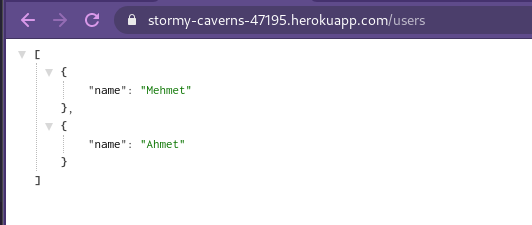
    <br>
    <em></em>
</p>

### Github Heroku deploy entegrasyonu

Bu deployment'i `github` ile entegre etmek isterseniz de `heroku GUI` üzerinden deployment kısmına github reponuzu bağlayarak github'a her commit attğınızda kodunuzun **aynı zamanda `heroku` üzerine de** `deploy olmasını` sağlayabilirsiniz.

<p align="center">
    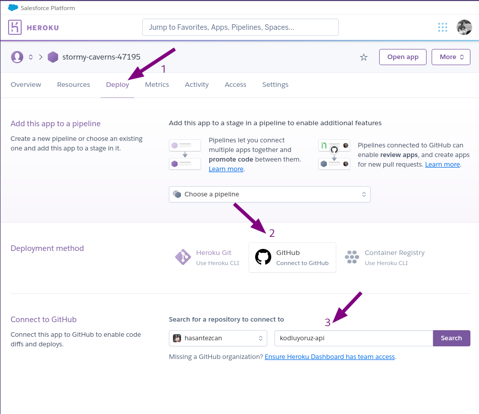
    <br>
    <em></em>
</p>

- Ayrıca bu kısım üzerinden **hangi brach'in** deploy olacağına da karar verebilirsiniz. 

<p align="center">
    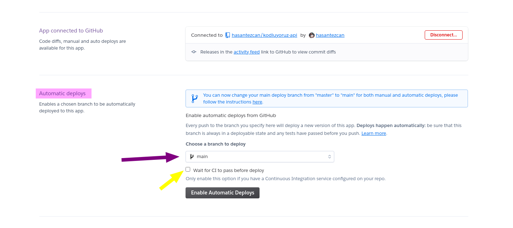
    <br>
    <em></em>
</p>

> **`Enable Automatic Deploys` tuşuna basmayı unutmayın!**

- Bir continues intergaration'unuz mevcutsa onu da beklemesini sağlayabilirsiniz. Böylece testler yapıldıktan (testleri geçtikten) sonra deploy işlemi gerçekleşecektir. 

Şimdi denemek için bir commit atalım.

<p align="center">
    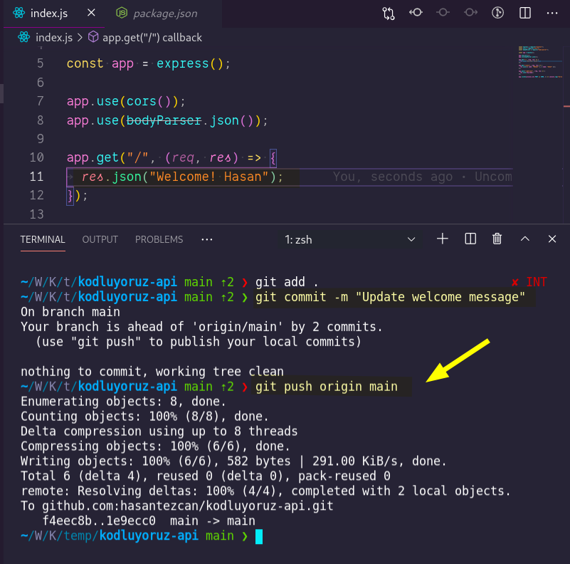
    <br>
    <em></em>
</p>

<p align="center">
    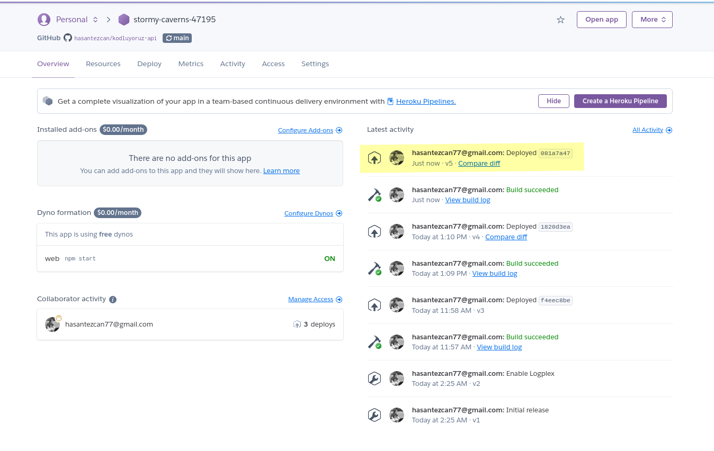
    <br>
    <em>Görüldüğü üzere otomaik olark deployumuz alındı</em>
</p>

**Kodumuz otomatik olarak canlıda!**
<p align="center">
    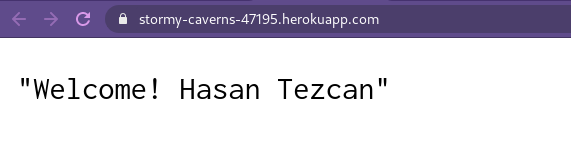
</p>

# Travis CI ve Heroku Entegrasyonu

Şimdi `Travis` kullanrak bir continues integration yapısı hazırlayacağız.

<p align="center">
    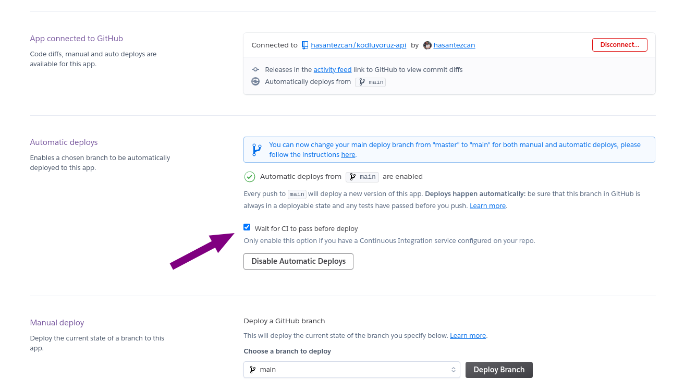
</p>

Bunun için önce heroku üzerinden `Wait for CI to pass before deploy` kısmını aktive ettik.

Ve projenin kök dizininde **`.travis.yml`** içine bir görev tanımı yazıyoruz.

```yml
language: node_js
node_js:
  - 8
before_install:
  - npm install
  - export NODE_ENV=production
```

<p align="center">
    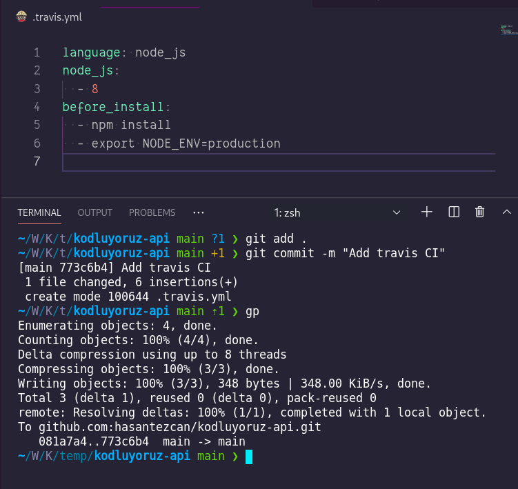
    <br>
    <em></em>
</p>

Travis'i **limitsiz olarak kullanmak için** reponuzu herkese açık hale getirmeniz gerekli. Ardından Travis üzerinden içinden etegrasyon kurmak istediğiniz repoyu aktif hale getirebilirsiniz.

<p align="center">
    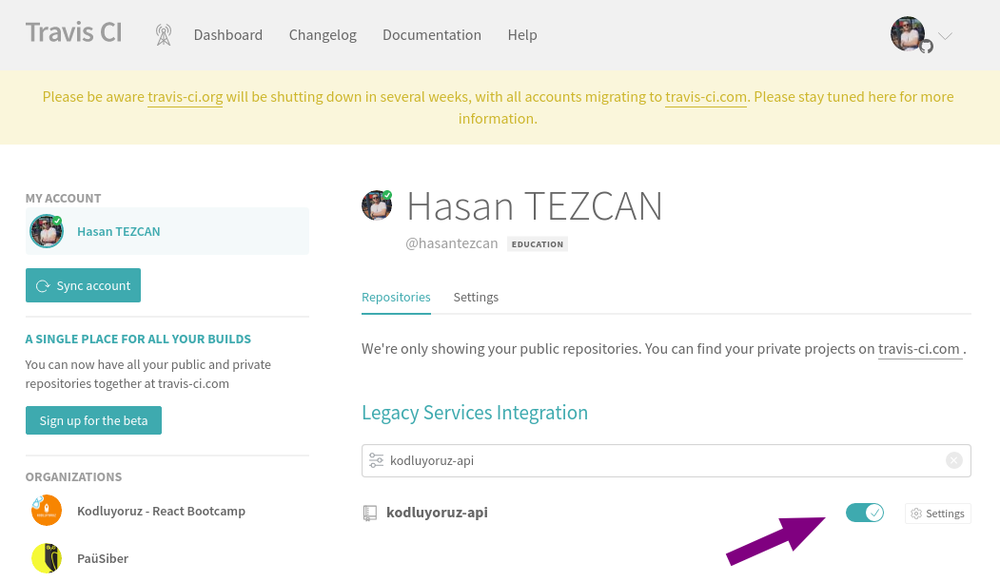
    <br>
    <em>Kodluyoruz-api projesini travis'e ekledik!</em>
</p>

## travis-ci.com vs travis-ci.org

Tam bu noktada fark ettiğim bir şey oldu. İki adet `travis-ci` sitesi mevcut. Birisi **`travis-ci.com`** diğeri **`travis-ci.org`**

2 Mayıs 2018 tarihinden itibaren Travis CI yapılarının ücretli version dışında gizli repolarda da travis-ci.com altında belli bir sınır dahilinde bedava çalışabilceğini [duyurmuş](https://docs.travis-ci.com/user/migrate/open-source-on-travis-ci-com/#:~:text=On%20May%202nd,%202018%20Travis%20CI%20announced%20that%20open%20source%20projects%20will%20be%20joining%20private%20projects%20on%20travis-ci.com!).  

`travis-ci.org` üzerinden ücretsiz şekilde private repolar ile çalışamıyorsunuz.   
**`travis-ci.com`** üzerinde ise **private repolar ile belli bir sınır dahilinde ücretsiz şekilde çalışabiliyorsunuz.** Bu sınır aşmanı dahilinde ücretli programlara yönelebilirsiniz. [(Travis CI bizlere her ay için private replarda `10000 bedava deploy kredisi` tanımlıyor.)](https://docs.travis-ci.com/user/travis-ci-for-private/) 

> **`Her` deployment'da `10 kredi` harcamış oluyorsunuz. Bu da ayda private repolarda `ücretsiz` olarak kullanabilceğiniz `1000 deployment`'a karşılık geliyor!**

<p align="center">
    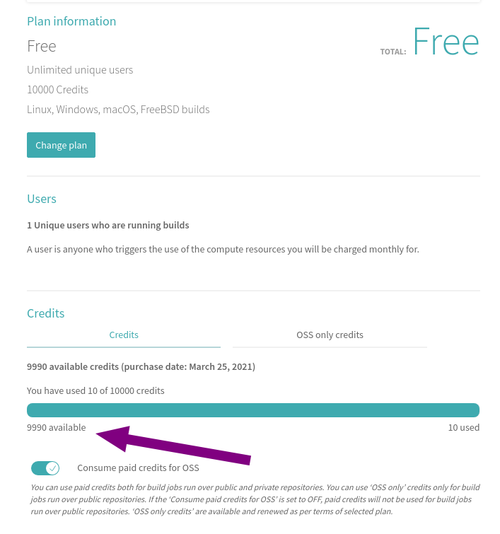
    <br>
    <em>Free plan kalan kredi ekranı</em>
</p>

- Fakat bu bedava planı seçmezseniz gizli repolarda CI'larınızı çalıştıramıyorsunuz illa bu free planı seçmeniz gerekiyor.

<p align="center">
    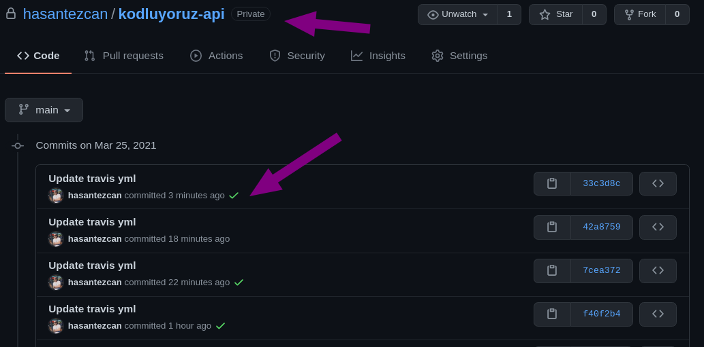
    <br>
    <em></em>
</p>

<p align="center">
    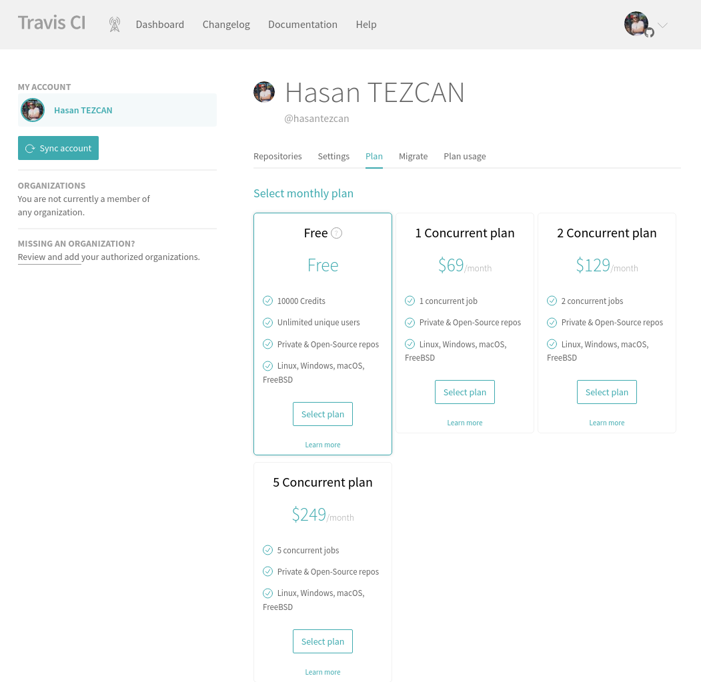
    <br>
    <em>Travis ödeme planları</em>
</p>

Ve bu dokümanı hazırladığım tarih itibari ile (25 Mart 2021) kısa süre sonra **`travis-ci.org`**'ın kapatılacağını ve tamamı ile **`travis-ci.com`**'a geçileceğini söylüyor. 

`.org` dan `.com`'a geçerken nasıl bir yol izleyeceğinize [**burada**](https://docs.travis-ci.com/user/migrate/open-source-repository-migration) ayrıntılı şekilde anlatmışlar. 

<p align="center">
    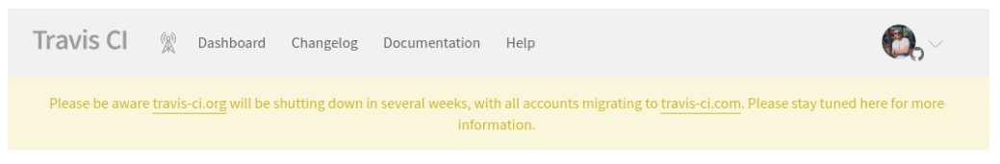
</p>

Ben de bu noktadan sonra travis.com üzerinde çalışmaya devam edeceğim...

## Bir test yazalım

Serverin ayakta olduğunu test eden bir test yazcağız.

```js
# test/index.test.js

const chai = require("chai");
const chaiHttp = require("chai-http");
const should = chai.should();
const server = require("../index");

chai.use(chaiHttp);

describe("Node Server", () => {
	it("should be have 200 status code", (done) => {
		chai
			.request(server)
			.get("/")
			.end((err, res) => {
				res.should.have.status(200);
				done();
			});
	});
});
```
Ve ayrıca `.travis.yml`'a testlerimizi çalıştıracak script'i de eklememiz gerekiyor.

```yml
# .travis.yml
script:
  - npm run test
```

tabiki bu script önceliklte packge.json içinde bulunmalı

```diff
## package.json

"scripts": {
		"start": "node index.js",
		"dev": "nodemon index.js",
+		"test": "./node_modules/.bin/mocha --exit --recursive"
	},
```

<p align="center">
    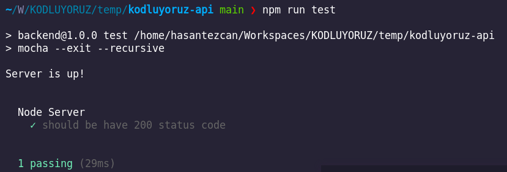
    <br>
    <em>Testimiz geçiyor!</em>
</p>

Testimizi çalıştırıdğımızda bir sorun olmadığını görmekteyiz. 

Fakat şimdi bu testi bozacağız ve test'de hata aldığımızda travis'in test geçmediğinde bizi uyardığını görebilelim!

Kodumuzu bu hali ile github'a gönderidiğimizde. Deploy olmadığını bize bildiren hatayı göreceksiniz. 

<p align="center">
    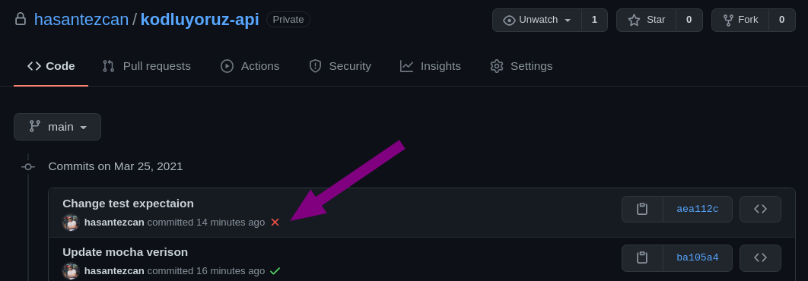
    <br>
    <em>Test geçmediği içi burada travis bizi uyarmakta!</em>
</p>

Travis'in sitesinde gittiğimzde ise testin geçmediğini görüyor olacağız.

<p align="center">
    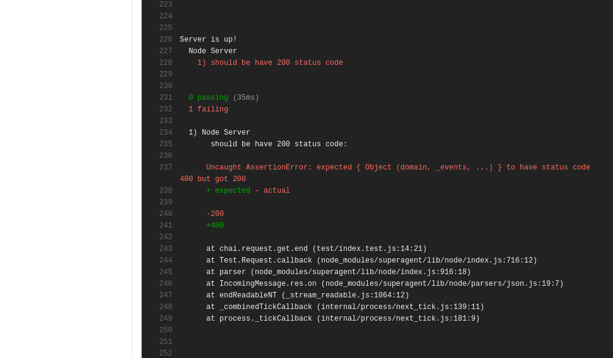
</p>

Ayrıca travis bize bir sorun olduğunu bildirmek için bir mail de atıyor. `Status: Broken` 

<p align="center">
    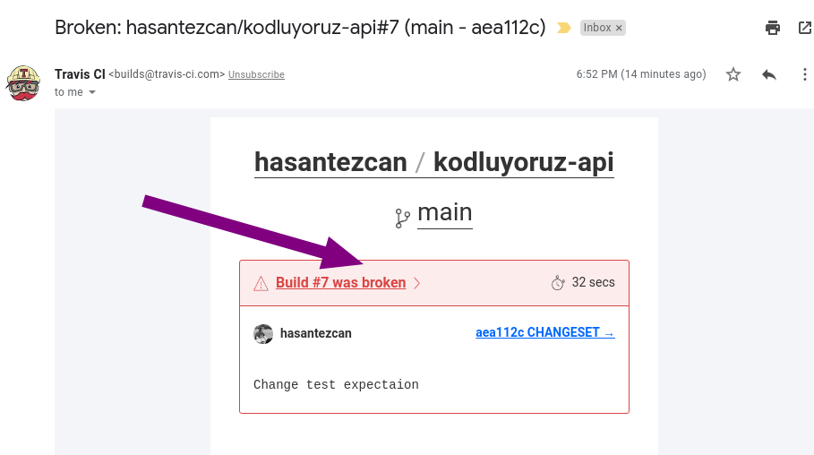
    <br>
    <em></em>
</p>

Testimizi düzenleyip tekar geçer hale getirdikten sonra kodu tekrar pushladığımızda ise bize sorun çözüldü adında bir mail atıyor. `Status: FIX`

<p align="center">
    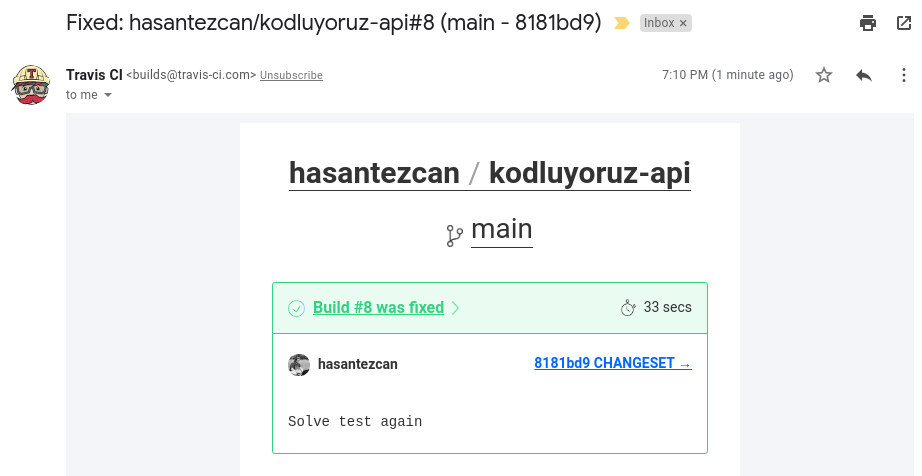
    <br>
    <em></em>
</p>


> Ayrıca Mehmet Hocannın [bu bloğuna](https://mehmetseven.net/github-travis-ci-heroku-entegrasyonu/) da bakabilirsin.
# Contex API


<!-- ---

# Ek bilgi

- blabla

---
# Kaynakça 

1.  -->
